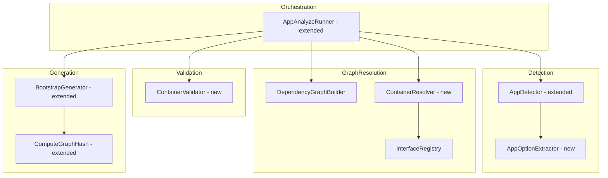
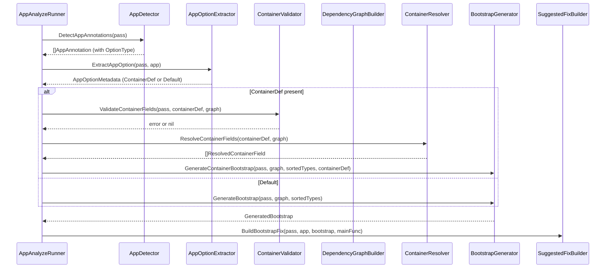
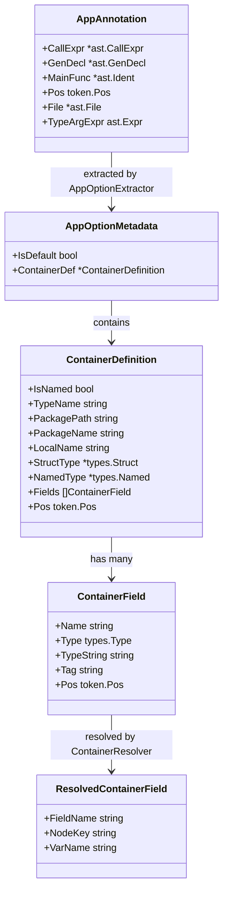

# Technical Design: app-with-container-def

## Overview

**Purpose**: This feature enables users to specify a user-defined container struct type via `annotation.App[app.Container[T]](main)`, causing the bootstrap IIFE to return an instance of `T` instead of the auto-generated anonymous struct. Users gain explicit control over which dependencies are exposed and how they are named.

**Users**: braider users who want a well-typed, predictable container struct as the output of the bootstrap IIFE, enabling downstream code to access resolved dependencies through known field names and types.

**Impact**: Extends the existing AppAnalyzer pipeline with container detection, validation, and container-aware bootstrap code generation. The default `app.Default` behavior remains unchanged.

### Goals

- Detect `app.Container[T]` in `annotation.App[app.Container[T]](main)` and extract the user-defined struct type `T`
- Validate container struct fields against the dependency graph (type resolution, named resolution via `braider` struct tags, ambiguity detection)
- Generate bootstrap IIFE returning the user-defined container struct instead of the default anonymous struct
- Maintain idempotent regeneration with hash-based change detection that accounts for container struct definitions
- Support both named struct types and anonymous struct types as the container type parameter

### Non-Goals

- Runtime container or service locator patterns (braider generates plain Go code only)
- Container field ordering optimization (fields follow the order defined in the user's struct)
- Container struct code generation (the user defines the struct; braider only generates the bootstrap IIFE)
- Nested container support (container fields reference flat dependencies, not other containers)

## Architecture

### Existing Architecture Analysis

The AppAnalyzer pipeline follows a linear flow:

1. **Detection** (`AppDetector.DetectAppAnnotations`) -- finds `annotation.App` calls
2. **Validation** (`AppDetector.ValidateAppAnnotations`) -- verifies main function reference
3. **Graph Construction** (`DependencyGraphBuilder.BuildGraph`) -- builds dependency graph from registries
4. **Topological Sort** (`TopologicalSorter.Sort`) -- orders dependencies
5. **Idempotency Check** (`BootstrapGenerator.CheckBootstrapCurrent`) -- compares hash
6. **Code Generation** (`BootstrapGenerator.GenerateBootstrap`) -- generates IIFE code
7. **Fix Emission** (`SuggestedFixBuilder.BuildBootstrapFix`) -- produces `SuggestedFix`

Key constraints to preserve:
- Two-analyzer coordination via global registries (DependencyAnalyzer scans first, AppAnalyzer generates)
- `SuggestedFix`-based code generation for `go vet -fix` integration
- Hash-based idempotency for preventing unnecessary rewrites
- Collision-safe import alias generation

### Architecture Pattern & Boundary Map



**Architecture Integration**:
- Selected pattern: Extension of existing linear pipeline with new steps inserted between graph construction and code generation
- Existing patterns preserved: Component-based architecture, `Injectable[T]` DI annotations, global registry coordination, `SuggestedFix` code generation
- New components rationale: `AppOptionExtractor` extracts container type from generic App call; `ContainerValidator` validates container fields against graph; `ContainerResolver` maps container fields to dependency keys
- Steering compliance: All new components follow the single-responsibility, interface-segregation patterns established in the codebase

### Technology Stack

| Layer | Choice / Version | Role in Feature | Notes |
|-------|------------------|-----------------|-------|
| Backend / Services | Go 1.25, `go/ast`, `go/types` | AST traversal for generic call detection; type introspection for container struct analysis | `ast.IndexExpr` unwrapping for generic form |
| Backend / Services | `golang.org/x/tools/go/analysis` | Analyzer framework, `SuggestedFix` emission | No version change |
| Infrastructure / Runtime | Standard `go vet` toolchain | `go vet -fix` applies generated code | No change |

## System Flows

### Container Bootstrap Generation Flow



## Requirements Traceability

| Requirement | Summary | Components | Interfaces | Flows |
|-------------|---------|------------|------------|-------|
| 1.1 | Extract type parameter T from `app.Container` | AppDetector, AppOptionExtractor | `AppDetector.DetectAppAnnotations`, `AppOptionExtractor.ExtractAppOption` | Detection |
| 1.2 | Support named and anonymous struct type parameters | AppOptionExtractor | `AppOptionExtractor.ExtractAppOption` | Detection |
| 1.3 | Extract anonymous struct field definitions from AST | AppOptionExtractor | `AppOptionExtractor.ExtractAppOption` | Detection |
| 1.4 | Default behavior with `app.Default` | AppOptionExtractor | `AppOptionExtractor.ExtractAppOption` | Detection |
| 1.5 | Distinguish `app.Container[T]` from `app.Default` via `AppContainer` marker interface | AppOptionExtractor | `AppOptionExtractor.ExtractAppOption` | Detection |
| 2.1 | Accept struct type parameter | ContainerValidator | `ContainerValidator.Validate` | Validation |
| 2.2 | Reject non-struct type parameter | ContainerValidator | `ContainerValidator.Validate` | Validation |
| 2.3 | Detect unresolved field types | ContainerValidator | `ContainerValidator.Validate` | Validation |
| 2.4 | Resolve fields with `braider:"name"` struct tag | ContainerResolver | `ContainerResolver.ResolveFields` | Resolution |
| 2.5 | Reject `braider:"-"` struct tag | ContainerValidator | `ContainerValidator.Validate` | Validation |
| 2.6 | Reject empty `braider:""` struct tag | ContainerValidator | `ContainerValidator.Validate` | Validation |
| 2.7 | Detect ambiguous field resolution | ContainerValidator | `ContainerValidator.Validate` | Validation |
| 3.1 | Generate IIFE with return type T | BootstrapGenerator | `BootstrapGenerator.GenerateContainerBootstrap` | Generation |
| 3.2 | Qualified type name for named struct return type | BootstrapGenerator | `BootstrapGenerator.GenerateContainerBootstrap` | Generation |
| 3.3 | Anonymous struct type literal for return type | BootstrapGenerator | `BootstrapGenerator.GenerateContainerBootstrap` | Generation |
| 3.4 | Topological order initialization for container fields | BootstrapGenerator | `BootstrapGenerator.GenerateContainerBootstrap` | Generation |
| 3.5 | Transitive dependency initialization | BootstrapGenerator | `BootstrapGenerator.GenerateContainerBootstrap` | Generation |
| 3.6 | Return statement populating container fields | BootstrapGenerator | `BootstrapGenerator.GenerateContainerBootstrap` | Generation |
| 3.7 | Hash comment for idempotency | BootstrapGenerator, ComputeGraphHash | `BootstrapGenerator.GenerateContainerBootstrap` | Generation |
| 3.8 | `_ = dependency` reference in main | AppAnalyzeRunner, SuggestedFixBuilder | `SuggestedFixBuilder.BuildBootstrapFix` | Fix Emission |
| 4.1 | Imports for dependency constructors | BootstrapGenerator, CollectImports | `CollectImports` | Generation |
| 4.2 | Imports for Variable expressions | BootstrapGenerator, CollectImports | `CollectImports` | Generation |
| 4.3 | Imports for container field type packages | BootstrapGenerator, CollectImports | `CollectContainerImports` | Generation |
| 4.4 | Import for named container struct package | BootstrapGenerator, CollectImports | `CollectContainerImports` | Generation |
| 4.5 | Collision-safe alias generation | CollectImports, generateAliases | `CollectImports` | Generation |
| 5.1 | Skip regeneration when hash matches | BootstrapGenerator | `BootstrapGenerator.CheckBootstrapCurrent` | Idempotency |
| 5.2 | Regenerate when hash differs | BootstrapGenerator | `BootstrapGenerator.CheckBootstrapCurrent` | Idempotency |
| 5.3 | Hash includes container field definitions | ComputeGraphHash | `ComputeContainerHash` | Idempotency |
| 6.1 | Unresolved interface field diagnostic | ContainerValidator, DiagnosticEmitter | `DiagnosticEmitter.EmitContainerFieldError` | Validation |
| 6.2 | Unresolved concrete field diagnostic | ContainerValidator, DiagnosticEmitter | `DiagnosticEmitter.EmitContainerFieldError` | Validation |
| 6.3 | Circular dependency diagnostic | TopologicalSorter, DiagnosticEmitter | existing `EmitCircularDependency` | Sorting |
| 6.4 | Non-struct container parameter diagnostic | ContainerValidator, DiagnosticEmitter | `DiagnosticEmitter.EmitContainerTypeError` | Validation |
| 6.5 | Source position in diagnostics | DiagnosticEmitter | all emit methods | All |
| 7.1 | Standalone `app.Container[T]` option | AppOptionExtractor | `AppOptionExtractor.ExtractAppOption` | Detection |
| 7.2 | Mixed options via anonymous interface embedding | AppOptionExtractor | `AppOptionExtractor.ExtractAppOption` | Detection |

## Components and Interfaces

| Component | Domain/Layer | Intent | Req Coverage | Key Dependencies | Contracts |
|-----------|--------------|--------|--------------|------------------|-----------|
| AppDetector (extended) | detect | Detect `annotation.App[T](main)` calls including generic form | 1.1 | analysis.Pass (P0) | Service |
| AppOptionExtractor (new) | detect | Extract and classify App option type parameter | 1.1-1.5, 7.1-7.2 | analysis.Pass, AppAnnotation (P0) | Service |
| ContainerValidator (new) | detect | Validate container struct fields against dependency graph | 2.1-2.7, 6.1-6.2, 6.4 | Graph, InterfaceRegistry (P0) | Service |
| ContainerResolver (new) | graph | Map container struct fields to dependency graph node keys | 2.3, 2.4, 2.7, 3.4-3.6 | Graph, InterfaceRegistry (P0) | Service |
| BootstrapGenerator (extended) | generate | Generate container-aware bootstrap IIFE | 3.1-3.7, 4.1-4.5, 5.1-5.3 | Graph, CodeFormatter (P0) | Service |
| ComputeGraphHash (extended) | generate | Include container field definitions in hash computation | 5.1-5.3 | Graph (P0) | Service |
| CollectImports (extended) | generate | Include container type and field type imports | 4.1-4.5 | Graph (P0) | Service |
| DiagnosticEmitter (extended) | report | Emit container-specific error diagnostics | 6.1-6.5 | Reporter (P0) | Service |
| AppAnalyzeRunner (extended) | analyzer | Orchestrate container detection, validation, and generation | All | All components (P0) | Service |

### Detection Layer

#### AppDetector (extended)

| Field | Detail |
|-------|--------|
| Intent | Detect `annotation.App` calls in both non-generic and generic forms |
| Requirements | 1.1 |

**Responsibilities & Constraints**
- Unwrap `*ast.IndexExpr` from `call.Fun` to reach the underlying `*ast.SelectorExpr` for generic `annotation.App[T](main)` calls
- Preserve the type argument expression (`IndexExpr.Index`) in the `AppAnnotation` for downstream option extraction
- Maintain full compatibility with the non-generic `annotation.App(main)` call form (existing testdata)

**Dependencies**
- Inbound: AppAnalyzeRunner -- invokes detection (P0)
- Outbound: analysis.Pass -- provides AST and type info (P0)

**Contracts**: Service [x]

##### Service Interface

```go
// AppAnnotation gains a new field for the type argument expression.
type AppAnnotation struct {
    CallExpr     *ast.CallExpr
    GenDecl      *ast.GenDecl
    MainFunc     *ast.Ident
    Pos          token.Pos
    File         *ast.File
    TypeArgExpr  ast.Expr      // The type argument expression from App[T]; nil for non-generic form
}
```

- Preconditions: `pass` contains type-checked files
- Postconditions: Each detected App call has `TypeArgExpr` set if generic, nil if non-generic
- Invariants: `isAppCall` returns true for both `annotation.App(main)` and `annotation.App[T](main)`

**Implementation Notes**
- Integration: Extend `isAppCall` to handle `*ast.IndexExpr` by checking `indexExpr.X` as a `*ast.SelectorExpr`; store `indexExpr.Index` in `TypeArgExpr`
- Validation: No new validation logic needed; existing `ValidateAppAnnotations` works unchanged since `MainFunc` extraction is independent of generics
- Risks: `*ast.IndexListExpr` (multi-type-arg) is not needed for `App[T]` (single type param) but could be handled defensively

#### AppOptionExtractor (new)

| Field | Detail |
|-------|--------|
| Intent | Extract and classify the App option type parameter into Default or Container with struct definition |
| Requirements | 1.1-1.5, 7.1-7.2 |

**Responsibilities & Constraints**
- Resolve the type argument `T` in `App[T]` using `pass.TypesInfo`
- Check whether `T` implements `annotation.AppContainer` marker interface (from `internal/annotation`)
- For `app.Container[T]`, extract the inner type parameter `T` (the user-defined struct type)
- Support mixed options via anonymous interface embedding: search embedded interfaces for `AppContainer`
- Extract struct field definitions (name, type, struct tag) from both named and anonymous struct types

**Dependencies**
- Inbound: AppAnalyzeRunner -- invokes after detection (P0)
- Outbound: analysis.Pass -- type resolution (P0)

**Contracts**: Service [x]

##### Service Interface

```go
// AppOptionMetadata holds the extracted App option classification.
type AppOptionMetadata struct {
    IsDefault    bool                // true when app.Default or no type arg
    ContainerDef *ContainerDefinition // non-nil when app.Container[T] detected
}

// ContainerDefinition represents the user-defined container struct.
type ContainerDefinition struct {
    IsNamed       bool              // true for named struct types, false for anonymous
    TypeName      string            // Fully qualified type name (empty for anonymous)
    PackagePath   string            // Import path of the named type (empty for anonymous)
    PackageName   string            // Package name (empty for anonymous)
    LocalName     string            // Unqualified type name (empty for anonymous)
    StructType    *types.Struct     // The underlying struct type
    NamedType     *types.Named      // The named type (nil for anonymous)
    Fields        []ContainerField  // Ordered field definitions
    Pos           token.Pos         // Position for diagnostics
}

// ContainerField represents a single field in the container struct.
type ContainerField struct {
    Name       string     // Field name
    Type       types.Type // Field type
    TypeString string     // String representation of the field type
    Tag        string     // braider struct tag value (empty if no braider tag)
    Pos        token.Pos  // Position for diagnostics
}

// AppOptionExtractor extracts App option metadata from type arguments.
type AppOptionExtractor interface {
    // ExtractAppOption extracts the App option from the detected annotation.
    // Returns AppOptionMetadata with either IsDefault=true or ContainerDef populated.
    ExtractAppOption(pass *analysis.Pass, app *AppAnnotation) (AppOptionMetadata, error)
}
```

- Preconditions: `app.TypeArgExpr` is non-nil for generic calls, nil for non-generic calls
- Postconditions: Returns `IsDefault=true` for `app.Default` or non-generic; returns `ContainerDef` for `app.Container[T]`
- Invariants: Exactly one of `IsDefault` or `ContainerDef != nil` is true

**Implementation Notes**
- Integration: Uses the same `types.Implements` pattern as `OptionExtractor.extractTypedInterface` for detecting `AppContainer`
- Validation: If type argument is present but does not implement `AppOption`, emit diagnostic and return error
- Risks: Anonymous struct fields with aliased import types require careful type string rendering

#### ContainerValidator (new)

| Field | Detail |
|-------|--------|
| Intent | Validate that all container struct fields can be resolved to registered dependencies |
| Requirements | 2.1-2.7, 6.1-6.2, 6.4 |

**Responsibilities & Constraints**
- Verify the container type parameter is a struct type (reject non-struct with diagnostic)
- For each field, validate that its type matches a registered dependency (via graph nodes and `InterfaceRegistry`)
- Handle `braider:"name"` struct tags for named dependency resolution
- Reject `braider:"-"` struct tags with diagnostic (excluding fields is not permitted in container structs)
- Reject empty `braider:""` struct tags with diagnostic (ambiguous intent)
- Detect ambiguous resolution (multiple candidates for a field type without a disambiguating struct tag)

**Dependencies**
- Inbound: AppAnalyzeRunner -- invokes after graph construction (P0)
- Outbound: Graph, InterfaceRegistry -- dependency resolution (P0)
- Outbound: DiagnosticEmitter -- error reporting (P1)

**Contracts**: Service [x]

##### Service Interface

```go
// ContainerValidator validates container struct definitions against the dependency graph.
type ContainerValidator interface {
    // Validate checks all container fields are resolvable.
    // Returns a list of validation errors (empty if valid).
    // Each error includes position information for IDE navigation.
    Validate(
        pass *analysis.Pass,
        containerDef *ContainerDefinition,
        g *graph.Graph,
    ) []ContainerValidationError
}

// ContainerValidationError represents a single container validation error.
type ContainerValidationError struct {
    Pos       token.Pos
    FieldName string
    Message   string
}
```

- Preconditions: `containerDef` has been extracted; `g` is a fully constructed dependency graph
- Postconditions: Returns empty slice if all fields are resolvable; returns one error per invalid field
- Invariants: Validation is purely read-only; does not modify the graph or container definition

### Graph Layer

#### ContainerResolver (new)

| Field | Detail |
|-------|--------|
| Intent | Map container struct fields to dependency graph node keys for code generation |
| Requirements | 2.3, 2.4, 2.7, 3.4-3.6 |

**Responsibilities & Constraints**
- For each container field, resolve the dependency graph node key using type matching and optional `braider` struct tag name
- For interface-typed fields, use `InterfaceRegistry.Resolve` to find the implementing node
- For named fields (`braider:"name"`), construct composite key `TypeName#Name` and look up in graph
- Return an ordered list of resolved container fields with their dependency variable names
- Determine which graph nodes are needed (container fields plus their transitive dependencies) for topological sort filtering

**Dependencies**
- Inbound: AppAnalyzeRunner -- invokes after validation (P0)
- Outbound: Graph, InterfaceRegistry -- node lookup and interface resolution (P0)

**Contracts**: Service [x]

##### Service Interface

```go
// ResolvedContainerField maps a container field to its dependency graph node.
type ResolvedContainerField struct {
    FieldName   string // Container struct field name
    NodeKey     string // Dependency graph node key (e.g., "pkg.Type" or "pkg.Type#name")
    VarName     string // Variable name used in bootstrap initialization code
}

// ContainerResolver resolves container fields to dependency graph nodes.
type ContainerResolver interface {
    // ResolveFields maps each container field to its dependency graph node key.
    // Assumes validation has already passed (all fields are resolvable).
    ResolveFields(
        containerDef *ContainerDefinition,
        g *graph.Graph,
    ) ([]ResolvedContainerField, error)
}
```

- Preconditions: `containerDef` has passed validation; graph is fully constructed
- Postconditions: Every container field maps to exactly one graph node key
- Invariants: Order of returned fields matches the order of fields in `containerDef.Fields`

### Generation Layer

#### BootstrapGenerator (extended)

| Field | Detail |
|-------|--------|
| Intent | Generate container-aware bootstrap IIFE that returns the user-defined struct |
| Requirements | 3.1-3.7, 4.1-4.5, 5.1-5.3 |

**Responsibilities & Constraints**
- New `GenerateContainerBootstrap` method generates IIFE with user-defined return type
- For named container types: return type is qualified name (e.g., `func() pkg.MyContainer { ... }()`)
- For anonymous container types: return type is the struct type literal (e.g., `func() struct { Field Type } { ... }()`)
- Initialization code follows topological order for all required dependencies (container fields + transitive)
- Return statement populates container struct fields by name
- Dependencies not in the container struct (transitive only) remain as local variables
- Hash comment (`// braider:hash:<hash>`) included for idempotency

**Dependencies**
- Inbound: AppAnalyzeRunner -- invokes for container-mode generation (P0)
- Outbound: Graph, CodeFormatter -- code generation and formatting (P0)
- Outbound: ComputeGraphHash -- idempotency hash (P0)

**Contracts**: Service [x]

##### Service Interface

```go
// BootstrapGenerator extended interface.
type BootstrapGenerator interface {
    GenerateBootstrap(pass *analysis.Pass, g *graph.Graph, sortedTypes []string) (*GeneratedBootstrap, error)
    GenerateContainerBootstrap(
        pass *analysis.Pass,
        g *graph.Graph,
        sortedTypes []string,
        containerDef *ContainerDefinition,
        resolvedFields []ResolvedContainerField,
    ) (*GeneratedBootstrap, error)
    CheckBootstrapCurrent(pass *analysis.Pass, existing *ast.GenDecl, g *graph.Graph) bool
    CheckContainerBootstrapCurrent(
        pass *analysis.Pass,
        existing *ast.GenDecl,
        g *graph.Graph,
        containerDef *ContainerDefinition,
    ) bool
    DetectExistingBootstrap(pass *analysis.Pass) *ast.GenDecl
}
```

- Preconditions: `sortedTypes` is topologically sorted; `resolvedFields` maps all container fields to node keys
- Postconditions: Returns `GeneratedBootstrap` with container-typed IIFE code
- Invariants: Generated code compiles if all imports are correctly added

**Implementation Notes**
- Integration: `GenerateContainerBootstrap` reuses Phase 2 (initialization code generation) from `GenerateBootstrap` but replaces Phase 1 (struct field generation) and Phase 3 (IIFE assembly) with container-specific logic
- Validation: Container field variable names are derived from graph node resolution, not from container field names (container field names appear only in the return statement)
- Risks: Anonymous struct type literals with struct tags must be rendered with backtick-quoted tags in the generated source

#### ComputeGraphHash (extended)

| Field | Detail |
|-------|--------|
| Intent | Include container struct field definitions in hash computation for idempotency |
| Requirements | 5.1-5.3 |

**Responsibilities & Constraints**
- When container definition is provided, append container field data (field name, type string, struct tag) to hash input after graph node data
- When container definition is nil (default mode), produce the same hash as the current implementation (zero regression)
- Hash must change when container fields are added, removed, reordered, renamed, or their types/tags change

**Dependencies**
- Inbound: BootstrapGenerator -- invokes during generation and idempotency check (P0)
- Outbound: Graph -- node data (P0)

**Contracts**: Service [x]

##### Service Interface

```go
// ComputeContainerHash computes hash including container field definitions.
// When containerDef is nil, behaves identically to ComputeGraphHash.
func ComputeContainerHash(g *graph.Graph, containerDef *ContainerDefinition) string
```

- Preconditions: `g` is a valid graph; `containerDef` is nil or fully populated
- Postconditions: Returns 16-character hex hash string
- Invariants: `ComputeContainerHash(g, nil)` produces the same output as `ComputeGraphHash(g)`

#### CollectImports (extended)

| Field | Detail |
|-------|--------|
| Intent | Include imports for container struct type and field types |
| Requirements | 4.1-4.5 |

**Responsibilities & Constraints**
- When container definition is provided, add import paths for the container struct package (if named and external)
- Add import paths for all field types in the container struct that reference external packages
- Reuse existing collision detection and alias generation logic

**Dependencies**
- Inbound: BootstrapGenerator -- invokes during import collection (P0)
- Outbound: Graph, ContainerDefinition -- package path extraction (P0)

**Contracts**: Service [x]

##### Service Interface

```go
// CollectContainerImports extends CollectImports with container type imports.
// Returns unified import list and alias map covering both graph and container.
func CollectContainerImports(
    g *graph.Graph,
    containerDef *ContainerDefinition,
    currentPackage, currentPkgName string,
    existingAliases map[string]string,
) ([]ImportInfo, map[string]string)
```

### Report Layer

#### DiagnosticEmitter (extended)

| Field | Detail |
|-------|--------|
| Intent | Emit container-specific diagnostic errors with source positions |
| Requirements | 6.1-6.5 |

**Responsibilities & Constraints**
- New methods for container-specific errors: unresolved field type, non-struct container parameter, ambiguous field resolution, forbidden struct tags
- All diagnostics include source position for IDE navigation

**Dependencies**
- Inbound: ContainerValidator, AppAnalyzeRunner -- error reporting (P0)
- Outbound: Reporter -- diagnostic emission (P0)

**Contracts**: Service [x]

##### Service Interface

```go
type DiagnosticEmitter interface {
    // Existing methods preserved...

    // EmitContainerTypeError reports a non-struct container type parameter.
    EmitContainerTypeError(reporter Reporter, pos token.Pos, typeName string)

    // EmitContainerFieldError reports an unresolvable container field.
    EmitContainerFieldError(reporter Reporter, pos token.Pos, fieldName string, fieldType string, reason string)

    // EmitContainerFieldAmbiguousError reports an ambiguous container field resolution.
    EmitContainerFieldAmbiguousError(reporter Reporter, pos token.Pos, fieldName string, fieldType string, candidates []string)

    // EmitContainerStructTagError reports a forbidden or invalid struct tag in container.
    EmitContainerStructTagError(reporter Reporter, pos token.Pos, fieldName string, reason string)
}
```

### Orchestration Layer

#### AppAnalyzeRunner (extended)

| Field | Detail |
|-------|--------|
| Intent | Orchestrate the container detection, validation, and generation pipeline |
| Requirements | All |

**Responsibilities & Constraints**
- After App detection and validation, invoke `AppOptionExtractor` to classify the option
- If container mode: invoke `ContainerValidator`, `ContainerResolver`, `GenerateContainerBootstrap`
- If default mode: invoke existing `GenerateBootstrap` (unchanged path)
- New dependencies: `AppOptionExtractor`, `ContainerValidator`, `ContainerResolver`

**Dependencies**
- Inbound: AppAnalyzer -- delegates `Run` method (P0)
- Outbound: All detection, validation, resolution, and generation components (P0)

**Contracts**: Service [x]

##### Service Interface

```go
type AppAnalyzeRunner struct {
    annotation.Injectable[inject.Default]
    appDetector        detect.AppDetector
    appOptionExtractor detect.AppOptionExtractor      // new
    containerValidator detect.ContainerValidator       // new
    containerResolver  graph.ContainerResolver         // new (or detect layer)
    injectRegistry     *registry.InjectorRegistry
    provideRegistry    *registry.ProviderRegistry
    packageLoader      loader.PackageLoader
    packageTracker     *registry.PackageTracker
    bootstrapCtx       context.Context
    graphBuilder       *graph.DependencyGraphBuilder
    sorter             *graph.TopologicalSorter
    bootstrapGen       generate.BootstrapGenerator
    fixBuilder         report.SuggestedFixBuilder
    diagnosticEmitter  report.DiagnosticEmitter
    variableRegistry   *registry.VariableRegistry
}
```

- Preconditions: All registries are populated by DependencyAnalyzer before AppAnalyzer runs
- Postconditions: `SuggestedFix` emitted for bootstrap code (container or default mode)
- Invariants: Default mode follows the exact same code path as before this feature

**Implementation Notes**
- Integration: New steps inserted between Phase 4 (graph build) and Phase 5 (generate bootstrap) of `AppAnalyzeRunner.run()`
- Validation: If `ContainerValidator` returns errors, emit diagnostics and skip code generation (same pattern as graph build errors)
- Risks: Three new dependencies on `AppAnalyzeRunner` increase constructor parameter count; managed by braider's own DI annotations

## Data Models

### Domain Model

**ContainerDefinition** is the central domain entity representing the user's container struct.



**Business rules and invariants**:
- A `ContainerDefinition` must have at least one field (empty container is valid but trivial)
- Each `ContainerField.Type` must resolve to exactly one graph node (no ambiguity)
- `ContainerField.Tag` values are limited to: empty (no tag), a non-empty name string, or forbidden values (`-`, `""`) that trigger validation errors
- `ResolvedContainerField.NodeKey` must exist in the dependency graph

## Error Handling

### Error Strategy

All errors are reported via `analysis.Diagnostic` with source position information, consistent with existing braider error handling. Container validation errors are non-fatal to the analyzer (return `nil` from `Run`) but prevent code generation.

### Error Categories and Responses

**User Errors (validation)**:
- Non-struct container type (`app.Container[int]`) -- diagnostic with type name and position
- Unresolved container field type -- diagnostic identifying field name, expected type, and position
- Ambiguous container field (multiple candidates) -- diagnostic listing field name and candidate dependency names
- Forbidden struct tag (`braider:"-"`) -- diagnostic explaining that exclusion is not permitted in container structs
- Empty struct tag (`braider:""`) -- diagnostic explaining ambiguous intent

**System Errors (internal)**:
- Code formatting failure -- wrapped error from `CodeFormatter`, diagnostic at App annotation position
- Graph construction failure -- existing `EmitGraphBuildError` diagnostic

**Circular Dependencies**:
- Detected by existing `TopologicalSorter` -- existing `EmitCircularDependency` diagnostic with cycle path

## Testing Strategy

### Unit Tests

- **AppDetector generic detection**: Verify `DetectAppAnnotations` finds `annotation.App[T](main)` calls and populates `TypeArgExpr`
- **AppOptionExtractor**: Test extraction of `app.Default`, `app.Container[NamedStruct]`, `app.Container[struct{...}]`, and mixed options via anonymous interface embedding
- **ContainerValidator**: Test acceptance of valid structs, rejection of non-struct types, unresolved fields, ambiguous fields, forbidden tags, empty tags
- **ContainerResolver**: Test field-to-node resolution with type matching, named matching via `braider` struct tag, and interface resolution
- **ComputeContainerHash**: Test that hash changes when container fields are modified and remains stable when unchanged; test nil container produces same hash as `ComputeGraphHash`

### Integration Tests (analysistest)

- **container_basic**: Named container struct with simple fields, verify bootstrap IIFE returns the named type
- **container_anonymous**: Anonymous struct type parameter, verify bootstrap returns struct literal
- **container_named_field**: Container field with `braider:"name"` struct tag, verify named dependency resolution
- **container_typed_field**: Container field with interface type, verify interface resolution
- **container_cross_package**: Container struct defined in external package, verify import generation
- **container_transitive**: Container fields requiring transitive dependencies, verify all initialization code generated
- **container_variable**: Container with Variable dependencies, verify correct expression assignment
- **container_idempotent**: Verify hash-based skipping when container bootstrap is current
- **container_outdated**: Verify regeneration when container struct changes
- **error_container_non_struct**: `app.Container[int]` triggers diagnostic
- **error_container_unresolved**: Container field type not registered triggers diagnostic
- **error_container_ambiguous**: Container field type with multiple candidates triggers diagnostic
- **error_container_tag_exclude**: `braider:"-"` in container triggers diagnostic
- **error_container_tag_empty**: `braider:""` in container triggers diagnostic
- **container_mixed_option**: `annotation.App[interface{ app.Container[T] }](main)` works correctly
