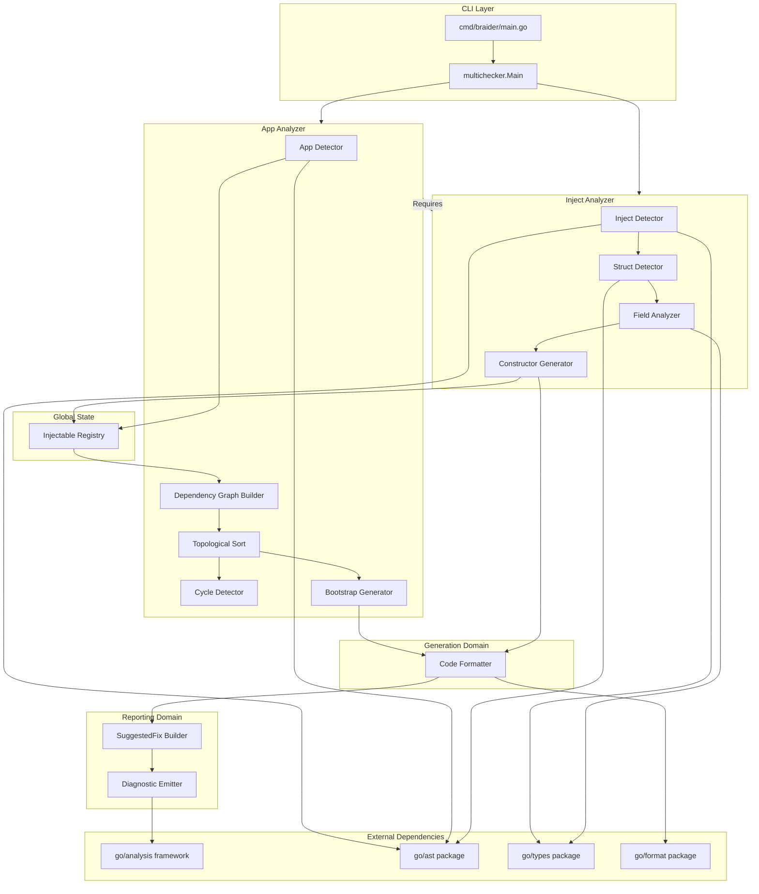
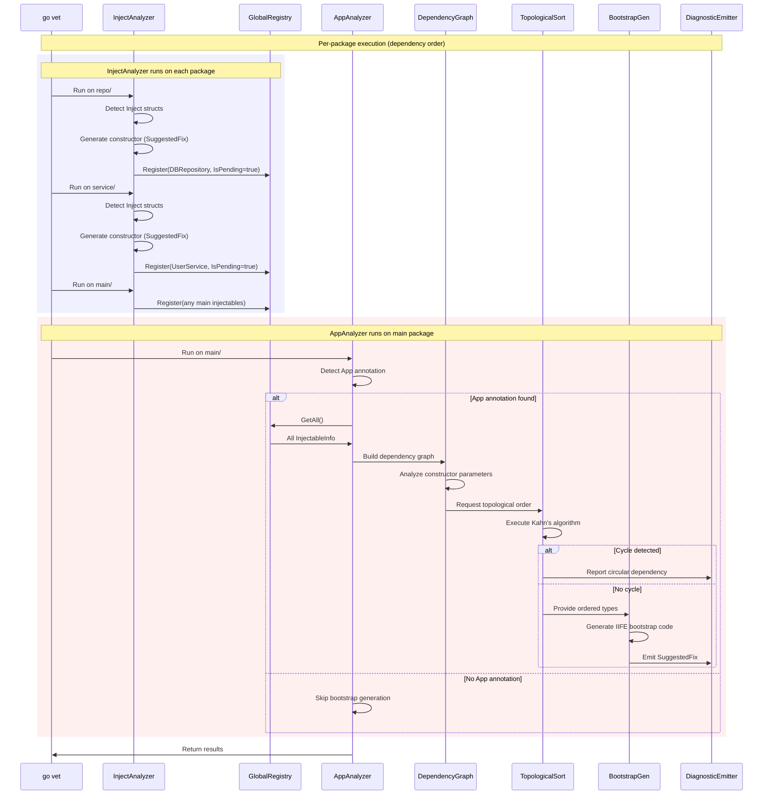
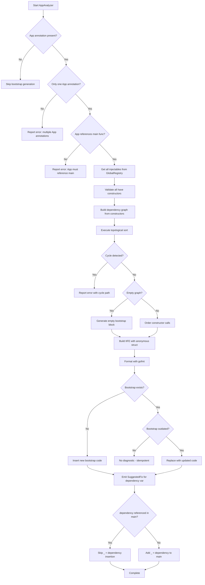
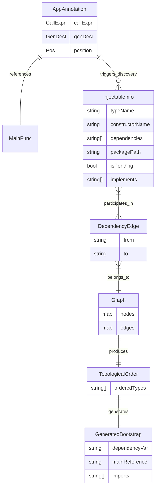

# Technical Design Document: Bootstrap with App Annotation

## Overview

**Purpose**: This feature delivers automatic DI wiring and bootstrap code generation to Go developers using braider, enabling them to resolve dependency graphs and initialize all injectable components in topological order when `annotation.App(main)` is detected.

**Users**: Go developers building applications with dependency injection will utilize this feature to automatically generate bootstrap code that creates and wires all `annotation.Inject`-marked structs, eliminating manual initialization boilerplate.

**Impact**: This feature extends the existing braider analyzer by splitting it into two analyzers (InjectAnalyzer and AppAnalyzer) and adding bootstrap generation capability. It introduces the `annotation.App` marker detection, cross-package dependency discovery via global InjectableRegistry, dependency graph construction with cycle detection, and IIFE-based bootstrap code generation.

### Goals

- Detect `annotation.App(main)` markers to identify bootstrap targets
- Discover all `annotation.Inject` structs across the module via global InjectableRegistry
- Build dependency graph from constructor parameters
- Detect and report circular dependencies with full cycle paths
- Generate bootstrap code in topological order via `SuggestedFix`
- Produce idempotent output (no changes if bootstrap is current)
- Integrate with existing constructor generation feature using multichecker architecture

### Non-Goals

- Runtime dependency resolution or containers
- Support for multiple `annotation.App` declarations per package
- Support for `annotation.App` with functions other than `main`
- Lazy initialization or scoped lifetimes
- Dynamic dependency selection based on configuration
- Plugin/module loading at runtime

### Design Decisions

The following design decisions were made based on requirements clarification:

#### DD-1: Module-Wide Discovery via Global InjectableRegistry

Injectable structs are discovered across all packages using a global InjectableRegistry. The InjectAnalyzer registers each discovered injectable to the global registry; the AppAnalyzer retrieves all injectables from the registry when generating bootstrap code. This approach bypasses the import-relationship limitation of go/analysis Facts.

**Mechanism**: Using multichecker with two analyzers:
1. **InjectAnalyzer** runs on each package, detecting `annotation.Inject` structs and registering them to the global InjectableRegistry
2. **AppAnalyzer** runs on each package, but only acts when `annotation.App(main)` is detected
3. When AppAnalyzer detects the App annotation, it retrieves all registered injectables from the global registry
4. The dependency graph is built from the complete set of injectables

**Rationale**: The go/analysis Facts API propagates only through import relationships, which would require users to explicitly import all injectable packages from main. By using a global registry, we enable automatic discovery of all injectables across the module without import requirements, providing a better developer experience.

#### DD-2: Strict Constructor Validation

If any injectable struct lacks a constructor, bootstrap generation halts with an error. Partial bootstrap generation is not supported.

**Rationale**: Partial bootstrap code would compile but fail at runtime with nil pointer dereferences. Failing fast at analysis time provides clearer feedback.

#### DD-3: Strict Interface Resolution

When a constructor parameter is an interface type, an injectable struct implementing that interface must exist. If no implementation is found, bootstrap generation halts with an error.

**Rationale**: Interface parameters without injectable implementations indicate either a missing `annotation.Inject` marker or an architectural issue that should be addressed before bootstrap generation.

#### DD-4: Unresolvable Constructor Parameters

If any constructor parameter cannot be resolved to an injectable type (whether interface without implementation or concrete non-injectable type like `*sql.DB`), bootstrap generation halts with an error. This applies uniformly regardless of whether the unresolvable type is internal or external.

**Rationale**: Consistent with DD-2 and DD-3, the analyzer follows a fail-fast approach. Partial bootstrap generation would produce code that cannot compile. Clear error messages guide users to either add `annotation.Inject` to the dependency or restructure their code.

#### DD-5: Single-Pass Constructor and Bootstrap Generation

Constructor generation and bootstrap generation MUST work in a single `go vet -fix` invocation. The InjectableRegistry tracks both existing and pending constructors.

**Mechanism**: Each InjectableInfo in the global registry includes an `IsPending` flag indicating whether the constructor exists on disk or is being generated in the current pass. When InjectAnalyzer generates a constructor SuggestedFix, it registers the injectable with `IsPending=true`. AppAnalyzer uses all registered injectables regardless of pending status.

**Rationale**: SuggestedFix changes are not applied until after `go vet -fix` completes. By tracking pending constructors within the same InjectableRegistry, we enable single-pass execution where bootstrap generation can reference constructors that don't yet exist on disk.

## Architecture

### Existing Architecture Analysis

The current braider implementation provides:

- **Constructor generation pipeline** (`internal/analyzer.go`): Two-phase pipeline (Detection -> Generation -> Reporting) for constructor auto-generation
- **Detection components** (`internal/detect/`): `InjectDetector`, `StructDetector`, `FieldAnalyzer` for finding `annotation.Inject` structs
- **Generation components** (`internal/generate/`): `ConstructorGenerator`, `CodeFormatter` for code synthesis
- **Reporting components** (`internal/report/`): `DiagnosticEmitter`, `SuggestedFixBuilder` for diagnostic emission
- **Annotation package** (`pkg/annotation/annotation.go`): Defines `Inject` struct and `App` function for DI marking

The existing `run` function in `analyzer.go` handles constructor generation in a loop over candidates. This design extends the analyzer to add a Phase 3 for bootstrap generation after constructors are processed.

### Architecture Pattern and Boundary Map



**Architecture Integration**:

- **Selected pattern**: Multichecker architecture with two analyzers (InjectAnalyzer -> AppAnalyzer)
- **Domain boundaries**: InjectAnalyzer handles Inject detection and constructor generation; AppAnalyzer handles App detection, dependency resolution, and bootstrap generation; Registry provides cross-package state sharing
- **Existing patterns preserved**: Component-based architecture, `inspect.Analyzer` dependency, `analysistest` testing, SuggestedFix-based code generation
- **New components rationale**:
  - `InjectAnalyzer`: Detects `annotation.Inject` structs, generates constructors, registers to global registry
  - `AppAnalyzer`: Detects `annotation.App(main)` calls, retrieves injectables from registry, generates bootstrap
  - `InjectableRegistry`: Global state storing all discovered injectables across packages (DD-1)
  - `DependencyGraph`: Builds edges from constructor parameters to injectable types
  - `TopologicalSort`: Orders dependencies using Kahn's algorithm with cycle detection
  - `BootstrapGenerator`: Synthesizes IIFE-based bootstrap code
- **Steering compliance**: Follows Go analyzer conventions (multichecker), zero external dependencies for graph algorithms, compile-time safety
- **Trade-off**: Global state is not idiomatic go/analysis, but necessary to bypass Facts' import-relationship limitation

### Technology Stack

| Layer | Choice / Version | Role in Feature | Notes |
|-------|------------------|-----------------|-------|
| Framework | `golang.org/x/tools/go/analysis` | Analyzer interface, diagnostics | v0.29.0 per go.mod |
| CLI | `golang.org/x/tools/go/analysis/multichecker` | Multiple analyzer execution | Standard CLI pattern |
| AST Processing | `go/ast`, `go/parser` | App annotation and struct parsing | Standard library |
| Type Resolution | `go/types` via `pass.TypesInfo` | Constructor parameter type resolution | Standard library |
| Code Generation | `go/format`, `go/printer` | gofmt-compatible output | Standard library |
| AST Traversal | `golang.org/x/tools/go/ast/inspector` | Efficient node filtering | Via inspect.Analyzer |
| Cross-Package Data | Global InjectableRegistry | Injectable struct discovery across packages | Custom (DD-1) |
| Testing | `golang.org/x/tools/go/analysis/analysistest` | Golden file testing | RunWithSuggestedFixes |

## System Flows

### Extended Analysis Pipeline



### Bootstrap Code Generation Detail



## Requirements Traceability

| Requirement | Summary | Components | Interfaces | Flows |
|-------------|---------|------------|------------|-------|
| 1.1 | Detect `annotation.App(main)` as bootstrap target | AppDetector | DetectAppAnnotation | Extended Analysis Pipeline |
| 1.2 | Report error for multiple App annotations | AppDetector, DiagnosticEmitter | ValidateAppCount, EmitMultipleAppError | Bootstrap Generation Detail |
| 1.3 | Skip bootstrap when no App annotation | AppDetector | DetectAppAnnotation | Extended Analysis Pipeline |
| 1.4 | Report error when App references non-main function | AppDetector, DiagnosticEmitter | ValidateMainReference, EmitNonMainError | Bootstrap Generation Detail |
| 2.1 | Identify structs embedding `annotation.Inject` | InjectDetector | HasInjectAnnotation | Extended Analysis Pipeline |
| 2.2 | Exclude structs without Inject from graph | StructDetector | DetectCandidates | Extended Analysis Pipeline |
| 2.3 | Discover Inject structs across packages | InjectableRegistry | GetAll | Extended Analysis Pipeline |
| 2.4 | Report error when Inject struct lacks constructor | DependencyGraph, DiagnosticEmitter | ValidateConstructors | Bootstrap Generation Detail |
| 3.1 | Extract constructor parameter types | DependencyGraph | BuildGraph | Extended Analysis Pipeline |
| 3.2 | Add dependency edges for injectable params | DependencyGraph | AddDependencyEdge | Extended Analysis Pipeline |
| 3.3 | Exclude non-injectable types from graph | DependencyGraph | BuildGraph | Bootstrap Generation Detail |
| 3.4 | Use first return value as provided type | DependencyGraph | ResolveReturnType | Bootstrap Generation Detail |
| 3.5 | Resolve interface to implementing injectable | InterfaceRegistry, DependencyGraph | Resolve, BuildGraph | Bootstrap Generation Detail |
| 3.6 | Report error for multiple implementations | InterfaceRegistry, DiagnosticEmitter | Resolve, EmitAmbiguousImplementationError | Bootstrap Generation Detail |
| 3.7 | Report error for unresolved interface dependency | InterfaceRegistry, DiagnosticEmitter | Resolve, EmitUnresolvedInterfaceError | Bootstrap Generation Detail |
| 3.8 | Cross-package interface resolution via Registry | InterfaceRegistry, InjectableRegistry | Build, GetAll | Extended Analysis Pipeline |
| 4.1 | Report error with cycle path | CycleDetector, DiagnosticEmitter | DetectCycle, EmitCircularDependency | Bootstrap Generation Detail |
| 4.2 | Proceed when no cycles | TopologicalSort | Sort | Extended Analysis Pipeline |
| 4.3 | Include full cycle path in error | DiagnosticEmitter | EmitCircularDependency | Bootstrap Generation Detail |
| 5.1 | Initialize in topological order | TopologicalSort | Sort | Bootstrap Generation Detail |
| 5.2 | Deterministic alphabetical tie-breaking | TopologicalSort | Sort | Bootstrap Generation Detail |
| 5.3 | Generate empty bootstrap for empty graph | BootstrapGenerator | GenerateBootstrap | Bootstrap Generation Detail |
| 6.1 | Generate SuggestedFix with bootstrap code | BootstrapGenerator, SuggestedFixBuilder | GenerateBootstrap, BuildBootstrapFix | Extended Analysis Pipeline |
| 6.2 | Define `dependency` variable | BootstrapGenerator | GenerateBootstrap | Bootstrap Generation Detail |
| 6.3 | Conditionally include `_ = dependency` in main | BootstrapGenerator | IsDependencyReferenced, GenerateBootstrap | Bootstrap Generation Detail |
| 6.4 | Generate valid compilable Go code | BootstrapGenerator, CodeFormatter | GenerateBootstrap, FormatCode | Bootstrap Generation Detail |
| 6.5 | Idempotent - no diagnostic if up-to-date | BootstrapGenerator | CheckBootstrapCurrent | Bootstrap Generation Detail |
| 6.6 | Update outdated bootstrap via SuggestedFix | BootstrapGenerator, SuggestedFixBuilder | DetectOutdated, BuildReplacementFix | Bootstrap Generation Detail |
| 7.1 | IIFE returning anonymous struct | BootstrapGenerator | GenerateBootstrap | Bootstrap Generation Detail |
| 7.2 | camelCase field names from type names | BootstrapGenerator | DeriveFieldName | Bootstrap Generation Detail |
| 7.3 | Use field names as intermediate variables | BootstrapGenerator | GenerateBootstrap | Bootstrap Generation Detail |
| 7.4 | Include imports for external packages | BootstrapGenerator | CollectImports | Bootstrap Generation Detail |
| 7.5 | Format per gofmt standards | CodeFormatter | FormatCode | Bootstrap Generation Detail |
| 8.1 | Include source position in errors | DiagnosticEmitter | All emit methods | All Flows |
| 8.2 | Provide descriptive error messages | DiagnosticEmitter | All emit methods | All Flows |
| 8.3 | Describe fix actions clearly | SuggestedFixBuilder | BuildBootstrapFix | Bootstrap Generation Detail |
| 9.1 | Work alongside constructor generation | InjectAnalyzer, InjectableRegistry | Run, Register | Extended Analysis Pipeline |
| 9.2 | Constructors generated before bootstrap | InjectAnalyzer, InjectableRegistry | Run, Register | Extended Analysis Pipeline |
| 9.3 | Consistent results on incremental analysis | InjectableRegistry | Register, GetAll | Extended Analysis Pipeline |

## Components and Interfaces

| Component | Domain/Layer | Intent | Req Coverage | Key Dependencies | Contracts |
|-----------|--------------|--------|--------------|------------------|-----------|
| InjectAnalyzer | Analyzer | Detect Inject structs, generate constructors, register to registry | 2.1, 2.2, 9.1, 9.2 | InjectableRegistry (P0) | Analyzer |
| AppAnalyzer | Analyzer | Detect App annotation, generate bootstrap | 1.1-1.4, 6.1-6.6 | InjectableRegistry (P0), InjectAnalyzer (Requires) | Analyzer |
| InjectableRegistry | Registry | Store all discovered injectables across packages | 2.3, 9.3 (DD-1, DD-5) | none | State |
| AppDetector | Detection | Detect `annotation.App(main)` calls | 1.1-1.4 | go/ast (P0), go/types (P0) | Service |
| InterfaceRegistry | Graph | Map interface types to implementing injectable structs | 3.5-3.8 | InjectableInfo (P0), go/types (P0) | Service |
| DependencyGraph | Graph | Build dependency edges from constructors | 2.4, 3.1-3.8 | InjectableRegistry (P0), InterfaceRegistry (P0) | Service |
| TopologicalSort | Graph | Order types via Kahn's algorithm | 4.1-4.3, 5.1-5.3 | DependencyGraph (P0) | Service |
| BootstrapGenerator | Generation | Generate IIFE bootstrap code | 6.1-6.6, 7.1-7.5 | TopologicalSort (P0), CodeFormatter (P0) | Service |

### Detection Domain

#### AppDetector

| Field | Detail |
|-------|--------|
| Intent | Detect `annotation.App(main)` calls and validate bootstrap target |
| Requirements | 1.1, 1.2, 1.3, 1.4 |

**Responsibilities and Constraints**

- Traverse AST to find `var _ = annotation.App(main)` declarations
- Validate that exactly one App annotation exists per package
- Validate that the App annotation references the `main` function
- Extract position information for diagnostic reporting
- Boundary: App detection and validation only; does not build dependency graph

**Dependencies**

- Inbound: run function - invoked during Phase 3 (P0)
- External: `go/ast.CallExpr` - App function call detection (P0)
- External: `go/types.Info` - function reference resolution (P0)

**Contracts**: Service [x]

##### Service Interface

```go
// AppDetector detects annotation.App calls in packages.
type AppDetector interface {
    // DetectAppAnnotation finds annotation.App(main) in the package.
    // Returns the call expression and position, or nil if not found.
    DetectAppAnnotation(pass *analysis.Pass) *AppAnnotation

    // ValidateAppAnnotation checks that the App annotation is valid.
    // Reports diagnostics for multiple annotations or non-main references.
    ValidateAppAnnotation(pass *analysis.Pass, app *AppAnnotation) bool
}

// AppAnnotation represents a detected annotation.App call.
type AppAnnotation struct {
    CallExpr *ast.CallExpr  // The App(main) call expression
    GenDecl  *ast.GenDecl   // The var declaration containing the call
    MainFunc *ast.Ident     // The main function identifier argument
    Pos      token.Pos      // Position for diagnostics
}

// AppAnnotationPath is the import path for the annotation package.
const AppAnnotationPath = "github.com/miyamo2/braider/pkg/annotation"

// AppFuncName is the function name for the App annotation.
const AppFuncName = "App"
```

- Preconditions: Pass must have valid AST and TypesInfo
- Postconditions: Returns AppAnnotation if valid; nil if not present; emits diagnostics for invalid cases
- Invariants: At most one valid App annotation per package

**Implementation Notes**

- Integration: Invoked at start of Phase 3, after constructor generation
- Validation: Use `pass.TypesInfo.Uses` to verify the called function is `annotation.App`
- Validation: Check argument is identifier `main` and references a function
- Risks: Must handle aliased imports of annotation package

### Registry Domain

#### InjectableRegistry

| Field | Detail |
|-------|--------|
| Intent | Store all discovered injectable structs across packages globally |
| Requirements | 2.3, 9.1, 9.2, 9.3 (DD-1, DD-5) |

**Responsibilities and Constraints**

- Store injectable struct information when InjectAnalyzer discovers them
- Provide all registered injectables to AppAnalyzer for bootstrap generation
- Track whether constructor exists on disk or is pending (IsPending flag)
- Thread-safe for potential parallel analyzer execution
- Boundary: Global state storage; does not perform detection or generation

**Dependencies**

- Inbound: InjectAnalyzer - registers discovered injectables (P0)
- Inbound: AppAnalyzer - retrieves all injectables for bootstrap (P0)
- Inbound: DependencyGraph - retrieves injectables for graph construction (P0)

**Contracts**: State [x]

##### State Model

```go
// GlobalRegistry is the singleton instance used by all analyzers.
var GlobalRegistry = NewInjectableRegistry()

// InjectableRegistry stores all discovered injectable structs globally.
// Thread-safe for potential parallel analyzer execution.
type InjectableRegistry struct {
    mu          sync.Mutex
    injectables map[string]*InjectableInfo  // key: fully qualified type name
}

// NewInjectableRegistry creates a new empty registry.
func NewInjectableRegistry() *InjectableRegistry

// Register adds an injectable struct to the registry.
// If already registered, updates the entry (pending -> existing).
func (r *InjectableRegistry) Register(info *InjectableInfo)

// GetAll returns all registered injectable structs.
func (r *InjectableRegistry) GetAll() []*InjectableInfo

// Get retrieves an injectable by fully qualified type name.
// Returns nil if not found.
func (r *InjectableRegistry) Get(typeName string) *InjectableInfo

// Clear removes all entries. Used for testing.
func (r *InjectableRegistry) Clear()

// InjectableInfo contains information about an injectable struct.
type InjectableInfo struct {
    TypeName        string      // Fully qualified type name (pkg.TypeName)
    PackagePath     string      // Import path of the package
    LocalName       string      // Type name without package path
    ConstructorName string      // Constructor function name (New<TypeName>)
    Dependencies    []string    // Fully qualified types of constructor parameters
    IsPending       bool        // Whether constructor is generated in current pass (not yet on disk)
    Implements      []string    // Fully qualified interface types this struct implements
}
```

- Persistence: In-memory only; not persisted between runs
- Consistency: Thread-safe via sync.Mutex
- Concurrency: Safe for parallel analyzer execution

**Implementation Notes**

- **Global singleton**: `GlobalRegistry` is used by both InjectAnalyzer and AppAnalyzer
- **Thread safety**: All methods protected by sync.Mutex for parallel go vet execution
- **Pending tracking**: When InjectAnalyzer generates a constructor SuggestedFix, it registers with `IsPending=true`; if constructor already exists on disk, `IsPending=false`
- **Clear for testing**: Tests should call `Clear()` before each test case to ensure isolation
- **Interface detection**: InjectAnalyzer uses `types.Implements()` to populate `Implements` field before registration

**Trade-off Documentation**

Global state is not idiomatic go/analysis. However, this is a deliberate trade-off to bypass the Facts API limitation:
- Facts propagate only through import relationships
- Users expect `annotation.App(main)` to discover all injectables without explicit imports
- Global registry enables this user experience at the cost of non-standard architecture

**Execution Model Assumptions**

Users MUST run `go vet ./...` (or specify all packages) to ensure module-wide discovery:

```bash
# Correct: Analyzes all packages, all injectables discovered
go vet -vettool=$(which braider) ./...

# Incorrect: Only analyzes main package, misses injectables in other packages
go vet -vettool=$(which braider) ./cmd/app/
```

go vet analyzes packages in dependency order within a single invocation. However, since injectable packages may not be imported by main, users MUST explicitly include all packages in the analysis scope.

**Parallel Analysis Behavior**

go vet may analyze packages in parallel (controlled by `-p` flag). The GlobalRegistry uses `sync.Mutex` to ensure thread-safe registration and retrieval. However, `GetAll()` returns a snapshot of currently registered injectables, which may be incomplete if other packages are still being analyzed.

**Eventual Consistency Model**:

The analyzer adopts an eventual consistency approach for parallel execution:

1. **Temporary inconsistency is acceptable**: During parallel analysis, some injectables may not yet be registered when AppAnalyzer runs
2. **Re-running resolves inconsistencies**: Running `go vet ./...` again will capture any missed injectables
3. **Final state is consistent**: After all packages are analyzed at least once, the global registry contains all injectables

This trade-off prioritizes simplicity over strict single-pass guarantees. Users running incremental analysis may need to run the analyzer multiple times until the bootstrap stabilizes.

```bash
# Run analysis (may need to repeat if injectables are discovered incrementally)
go vet -vettool=$(which braider) ./...
```

**Pending Constructor Signature Derivation**

When `IsPending=true`, the `Dependencies` field is populated by InjectAnalyzer analyzing the struct's embedded fields (excluding `annotation.Inject`). This matches the same logic used for constructor generation:

1. Find all fields with injectable types (pointer to struct with annotation.Inject)
2. Extract fully qualified type names as dependencies
3. Store in `InjectableInfo.Dependencies`

This ensures consistency between pending constructor parameters and DependencyGraph edge construction.

### Graph Domain

#### DependencyGraph

| Field | Detail |
|-------|--------|
| Intent | Build dependency edges from constructor parameters |
| Requirements | 2.4, 3.1, 3.2, 3.3, 3.4 |

**Responsibilities and Constraints**

- Collect all injectable types (local and imported)
- Parse constructor function signatures
- Create edges from dependencies to dependents
- Filter out non-injectable parameter types (primitives, external types)
- Validate that all Inject structs have constructors
- Boundary: Graph construction only; does not sort or detect cycles

**Dependencies**

- Inbound: AppAnalyzer - builds graph for bootstrap (P0)
- Outbound: InjectableRegistry - get all injectables (P0)
- External: `go/types.Func` - constructor signature resolution (P0)

**Contracts**: Service [x]

##### Service Interface

```go
// DependencyGraph builds the dependency graph for injectable types.
type DependencyGraph interface {
    // BuildGraph constructs the dependency graph from all registered injectables.
    // Injectables are retrieved from GlobalRegistry.GetAll().
    //
    // Returns error if:
    // - An injectable struct lacks both existing and pending constructor (see DD-2)
    // - An interface parameter has no injectable implementation (see DD-3)
    // - Multiple injectable structs implement the same required interface
    BuildGraph(
        pass *analysis.Pass,
        injectables []*InjectableInfo,  // from GlobalRegistry.GetAll()
    ) (*Graph, error)
}

// Graph represents the dependency graph.
type Graph struct {
    Nodes map[string]*Node // Keyed by fully qualified type name
    Edges map[string][]string // Dependencies: from -> []to
}

// Node represents an injectable type in the graph.
type Node struct {
    TypeName        string           // Fully qualified type name
    PackagePath     string           // Import path
    LocalName       string           // Type name without package
    ConstructorName string           // New<TypeName>
    Dependencies    []string         // Types this depends on
    InDegree        int              // For Kahn's algorithm
    InjectableInfo  *InjectableInfo  // From InjectableRegistry (includes IsPending flag)
}
```

- Preconditions: Injectables must be registered in GlobalRegistry with valid type info
- Postconditions: Returns complete graph with all edges; errors for missing constructors
- Invariants: All nodes in graph have constructors; edges only between injectable types

**Implementation Notes**

- Integration: Called by AppAnalyzer after InjectAnalyzer has registered all injectables to GlobalRegistry
- **Constructor resolution** (DD-5):
  - Check InjectableInfo.IsPending flag to determine if constructor exists on disk or is pending
  - If constructor missing (neither on disk nor pending), return error (see DD-2)
- Constructor validation: For each injectable, verify constructor exists (on disk or pending via IsPending flag); halt with error if missing
- Edge construction: Parse constructor parameters (from existing or pending), filter for injectable types
- **Interface resolution** (see DD-3): For interface-typed parameters:
  1. Use InterfaceRegistry to find implementing injectable
  2. If found → add dependency edge
  3. If not found → return error (do not exclude from graph)
- **Concrete type handling** (see DD-4): For non-injectable concrete type parameters:
  1. If type is injectable → add dependency edge
  2. If type is not injectable → return error (fail-fast, no partial bootstrap)
- Risks: Must handle imported types with different import aliases; must correctly identify pending vs. existing constructors

#### InterfaceRegistry

| Field | Detail |
|-------|--------|
| Intent | Map interface types to their implementing injectable structs |
| Requirements | 3.5, 3.6, 3.7, 3.8 |

**Responsibilities and Constraints**

- Build mapping from interface types to implementing injectable structs
- Use `types.Implements()` to detect interface implementations
- Support all injectables from GlobalRegistry
- Report error when multiple injectables implement the same interface
- Boundary: Interface-to-implementation mapping only; does not build dependency edges

**Dependencies**

- Inbound: DependencyGraph - requests interface resolution (P0)
- Outbound: InjectableRegistry - get all injectables (P0)
- External: `go/types.Implements` - interface implementation check (P0)

**Contracts**: Service [x]

##### Service Interface

```go
// InterfaceRegistry maps interface types to their implementing injectable structs.
type InterfaceRegistry interface {
    // Build constructs the registry from all registered injectables.
    // Injectables are retrieved from GlobalRegistry.GetAll().
    // Uses go/types.Implements() to detect interface implementations.
    Build(
        pass *analysis.Pass,
        injectables []*InjectableInfo,  // from GlobalRegistry.GetAll()
    ) error

    // Resolve finds the injectable struct implementing the given interface.
    // Returns the fully qualified type name of the implementation.
    // Returns AmbiguousImplementationError if multiple implementations exist.
    // Returns UnresolvedInterfaceError if no implementation found (see DD-3).
    // Note: Unlike concrete types, missing interface implementations are errors.
    Resolve(ifaceType string) (string, error)
}

// AmbiguousImplementationError indicates multiple structs implement an interface.
type AmbiguousImplementationError struct {
    InterfaceType    string   // Fully qualified interface type name
    Implementations  []string // List of implementing types
}

func (e *AmbiguousImplementationError) Error() string {
    return fmt.Sprintf(
        "multiple injectable structs implement interface %s: %s",
        e.InterfaceType,
        strings.Join(e.Implementations, ", "),
    )
}

// UnresolvedInterfaceError indicates no injectable struct implements a required interface.
type UnresolvedInterfaceError struct {
    InterfaceType string    // Fully qualified interface type name
    ParameterPos  token.Pos // Position of the constructor parameter
}

func (e *UnresolvedInterfaceError) Error() string {
    return fmt.Sprintf(
        "no injectable struct implements interface %s; add annotation.Inject to an implementing struct or change parameter to concrete type",
        e.InterfaceType,
    )
}
```

- Preconditions: Pass must have valid TypesInfo; injectables must have valid type info
- Postconditions: Registry contains all interface-to-implementation mappings
- Invariants: Each interface maps to at most one implementation (or error)

**Implementation Notes**

- Build phase: For each injectable from GlobalRegistry, detect implemented interfaces
- Detection: Use `types.Implements(structType, iface)` for both value and pointer receivers
- Interface info: Use `InjectableInfo.Implements` field populated by InjectAnalyzer
- Conflict detection: Track all implementations per interface; report error if count > 1
- Resolution: Return the implementing type's fully qualified name for dependency edge creation

#### TopologicalSort

| Field | Detail |
|-------|--------|
| Intent | Order types using Kahn's algorithm with cycle detection |
| Requirements | 4.1, 4.2, 4.3, 5.1, 5.2, 5.3 |

**Responsibilities and Constraints**

- Implement Kahn's algorithm for topological ordering
- Detect cycles via non-zero in-degree nodes after sort
- Reconstruct cycle path for error reporting
- Apply alphabetical tie-breaking for determinism
- Handle empty graph case
- Boundary: Sorting and cycle detection only; does not build graph

**Dependencies**

- Inbound: BootstrapGenerator - requests ordered types (P0)
- Inbound: run function - requests sort after graph construction (P0)
- External: none (pure algorithm)

**Contracts**: Service [x]

##### Service Interface

```go
// TopologicalSort provides topological ordering with cycle detection.
type TopologicalSort interface {
    // Sort orders nodes topologically using Kahn's algorithm.
    // Returns ordered node list or error with cycle path if cycle detected.
    Sort(graph *Graph) ([]string, error)
}

// CycleError represents a circular dependency error.
type CycleError struct {
    Cycle []string // Cycle path, e.g., ["A", "B", "C", "A"]
}

func (e *CycleError) Error() string {
    return fmt.Sprintf("circular dependency detected: %s", strings.Join(e.Cycle, " -> "))
}
```

- Preconditions: Graph must have valid nodes and edges
- Postconditions: Returns ordered list or CycleError
- Invariants: Output order satisfies dependency constraints; alphabetical for ties

**Implementation Notes**

- Algorithm: Kahn's algorithm
  1. Compute in-degree for each node
  2. Initialize queue with zero in-degree nodes (alphabetically sorted)
  3. Process queue: remove node, add to result, decrement successors' in-degrees
  4. Add new zero in-degree nodes to queue (alphabetically sorted)
  5. If nodes remain with non-zero in-degree, cycle exists
- Cycle reconstruction: BFS/DFS from remaining nodes to find cycle path
- Risks: Must handle disconnected components correctly

### Generation Domain

#### BootstrapGenerator

| Field | Detail |
|-------|--------|
| Intent | Generate IIFE-based bootstrap code |
| Requirements | 6.1, 6.2, 6.3, 6.4, 6.5, 6.6, 7.1, 7.2, 7.3, 7.4, 7.5 |

**Responsibilities and Constraints**

- Generate IIFE pattern with anonymous struct return
- Generate constructor calls in topological order
- Derive camelCase field names from type names
- Collect required imports for external packages
- Check if existing bootstrap is current (idempotent behavior)
- Detect outdated bootstrap for replacement
- Boundary: Bootstrap code generation only; relies on sorted order from TopologicalSort

**Dependencies**

- Inbound: run function - requests bootstrap generation (P0)
- Outbound: TopologicalSort - ordered types (P0)
- Outbound: CodeFormatter - formatting (P0)
- External: `go/format` - gofmt compatibility (P0)

**Contracts**: Service [x]

##### Service Interface

```go
// BootstrapGenerator generates bootstrap code for App annotation.
type BootstrapGenerator interface {
    // GenerateBootstrap creates the IIFE bootstrap code.
    GenerateBootstrap(
        orderedTypes []string,
        graph *Graph,
    ) (*GeneratedBootstrap, error)

    // CheckBootstrapCurrent compares existing bootstrap with current graph.
    // Returns true if no regeneration needed (idempotent).
    CheckBootstrapCurrent(
        pass *analysis.Pass,
        existingBootstrap *ast.GenDecl,
        graph *Graph,
    ) bool

    // DetectExistingBootstrap finds the existing dependency variable if present.
    DetectExistingBootstrap(pass *analysis.Pass) *ast.GenDecl

    // IsDependencyReferenced checks if the dependency variable is already
    // referenced in the main function body (excluding blank identifier assignments).
    // Returns true if dependency is used, meaning _ = dependency should be skipped.
    IsDependencyReferenced(pass *analysis.Pass, mainFunc *ast.FuncDecl) bool
}

// GeneratedBootstrap contains the generated bootstrap code.
type GeneratedBootstrap struct {
    DependencyVar string // The dependency variable declaration code
    MainReference string // The _ = dependency statement for main
    Imports       []string // Required import paths
}
```

- Preconditions: orderedTypes must be valid topological order; graph must contain all types
- Postconditions: Returns valid Go code following IIFE pattern
- Invariants: Field order matches ordered types; generated code passes gofmt

**Implementation Notes**

- Integration: Called after TopologicalSort succeeds
- Idempotency strategy: Use graph state hash comparison for reliable detection
  1. Compute deterministic hash from ordered type names and their dependencies using SHA-256
  2. Truncate hash to first 8 hexadecimal characters for brevity
  3. Store hash as a comment marker above the `var dependency` declaration: `// braider:hash:abc12345`
  4. Compare hash values to determine if regeneration is needed
  5. This avoids complex AST comparison and formatting-related false positives
- Import collection: Track external package paths for types
- Risks: Complex type expressions (generics) may require special handling
- Reference detection: `IsDependencyReferenced` walks main function body using `ast.Inspect`, looking for `ast.Ident` or `ast.SelectorExpr` that references `dependency`. It excludes blank identifier assignments (`_ = dependency`) from consideration to avoid false positives from braider's own generated code.
- **Unresolvable parameter validation**: Before adding an injectable to the graph, verify all constructor parameters are resolvable (either injectable types or interface types with injectable implementations). If any parameter cannot be resolved (see DD-4), halt bootstrap generation and emit an error diagnostic.

##### Generated Code Structure

```go
// Generated bootstrap code structure:
var dependency = func() struct {
    myRepository MyRepository
    myService    MyService
    myHandler    MyHandler
} {
    myRepository := NewMyRepository()
    myService := NewMyService(myRepository)
    myHandler := NewMyHandler(myService)
    return struct {
        myRepository MyRepository
        myService    MyService
        myHandler    MyHandler
    }{
        myRepository: myRepository,
        myService:    myService,
        myHandler:    myHandler,
    }
}()

// Added to main function body (only if dependency is not already referenced):
func main() {
    _ = dependency  // Omitted if dependency is already used (e.g., dependency.handler.Run())
    // ... existing main code
}
```

##### Field Name Derivation Rules

```go
// DeriveFieldName converts a type name to a camelCase field name.
// Rules:
// 1. Use local type name (strip package path)
// 2. Convert to lowerCamelCase
// 3. Handle all-caps like "DB" -> "db"
// 4. Handle conflicts by appending numeric suffix
func DeriveFieldName(typeName string, existing map[string]bool) string
```

### Reporting Domain

Extended `DiagnosticEmitter` with bootstrap-specific methods:

```go
// Additional methods for DiagnosticEmitter
type DiagnosticEmitter interface {
    // ... existing methods ...

    // EmitMultipleAppError reports multiple annotation.App declarations.
    EmitMultipleAppError(reporter Reporter, positions []token.Pos)

    // EmitNonMainAppError reports App referencing non-main function.
    EmitNonMainAppError(reporter Reporter, pos token.Pos, funcName string)

    // EmitMissingConstructorError reports Inject struct without constructor.
    EmitMissingConstructorError(reporter Reporter, pos token.Pos, typeName string)

    // EmitAmbiguousImplementationError reports multiple injectable structs implementing same interface.
    EmitAmbiguousImplementationError(reporter Reporter, pos token.Pos, ifaceType string, implementations []string)

    // EmitUnresolvableParameterError reports constructor parameter that cannot be resolved (see DD-4).
    EmitUnresolvableParameterError(reporter Reporter, pos token.Pos, constructorName, paramName, paramType string)

    // EmitBootstrapFix reports bootstrap code generation.
    EmitBootstrapFix(reporter Reporter, pos token.Pos, fix analysis.SuggestedFix)

    // EmitBootstrapUpdateFix reports bootstrap code update.
    EmitBootstrapUpdateFix(reporter Reporter, pos token.Pos, fix analysis.SuggestedFix)
}
```

Extended `SuggestedFixBuilder` with bootstrap-specific methods:

```go
// Additional methods for SuggestedFixBuilder
type SuggestedFixBuilder interface {
    // ... existing methods ...

    // BuildBootstrapFix creates SuggestedFix for bootstrap insertion.
    BuildBootstrapFix(
        pass *analysis.Pass,
        appAnnotation *AppAnnotation,
        bootstrap *GeneratedBootstrap,
    ) analysis.SuggestedFix

    // BuildBootstrapReplacementFix creates SuggestedFix for bootstrap update.
    BuildBootstrapReplacementFix(
        pass *analysis.Pass,
        existingBootstrap *ast.GenDecl,
        bootstrap *GeneratedBootstrap,
    ) analysis.SuggestedFix

    // BuildMainReferenceFix creates SuggestedFix for adding _ = dependency to main.
    // This method should only be called when IsDependencyReferenced returns false.
    // If dependency is already referenced in main, this fix should be skipped.
    BuildMainReferenceFix(
        pass *analysis.Pass,
        mainFunc *ast.FuncDecl,
    ) analysis.SuggestedFix
}
```

##### Diagnostic Message Templates

| Category | Message Template | Example |
|----------|------------------|---------|
| Multiple App | `multiple annotation.App declarations in package` | - |
| Non-main App | `annotation.App must reference main function, got %s` | `annotation.App must reference main function, got init` |
| Missing constructor | `injectable struct %s requires a constructor (New%s)` | `injectable struct UserService requires a constructor (NewUserService)` |
| Circular dependency | `circular dependency detected: %s` | `circular dependency detected: A -> B -> C -> A` |
| Ambiguous implementation | `multiple injectable structs implement interface %s: %s` | `multiple injectable structs implement interface pkg.IUserRepository: UserRepositoryA, UserRepositoryB` |
| Unresolved interface | `no injectable struct implements interface %s; add annotation.Inject to an implementing struct or change parameter to concrete type` | `no injectable struct implements interface io.Reader; add annotation.Inject to an implementing struct or change parameter to concrete type` |
| Unresolvable parameter | `constructor parameter %s of type %s in %s cannot be resolved; the type must be injectable or an interface with an injectable implementation` | `constructor parameter db of type *sql.DB in NewUserRepository cannot be resolved; the type must be injectable or an interface with an injectable implementation` |
| Bootstrap available | `missing bootstrap code for annotation.App` | - |
| Bootstrap outdated | `bootstrap code is outdated` | - |

## Data Models

### Domain Model



**Aggregates and Boundaries**

- `AppAnnotation`: Root aggregate for bootstrap trigger; single instance per package
- `Graph`: Root aggregate for dependency resolution; contains all nodes and edges
- `GeneratedBootstrap`: Root aggregate for generation phase; immutable value object
- Transaction scope: Entire bootstrap generation is atomic per package

**Business Rules and Invariants**

1. Package must have exactly one `annotation.App(main)` to trigger bootstrap
2. App annotation must reference the `main` function
3. All injectable structs must have corresponding constructors
4. Dependency graph must be acyclic
5. Topological order satisfies: if A depends on B, B appears before A
6. Field names in bootstrap struct are unique (use suffixes for conflicts)

### Logical Data Model

#### Constructor Signature Parsing

```go
// ConstructorInfo contains parsed constructor information.
type ConstructorInfo struct {
    Name       string       // Function name (New<TypeName>)
    Parameters []ParamInfo  // Parameter types
    ReturnType string       // Return type (pointer to struct)
}

// ParamInfo contains constructor parameter information.
type ParamInfo struct {
    Name         string // Parameter name
    TypeName     string // Fully qualified type name
    IsInjectable bool   // Whether type is injectable (for edge creation)
}
```

#### Bootstrap Code Template

```go
// Template for dependency variable:
const dependencyVarTemplate = `var dependency = func() struct {
{{range .Fields}}	{{.Name}} {{.Type}}
{{end}}} {
{{range .Initializations}}	{{.VarName}} := {{.Constructor}}({{.Args}})
{{end}}	return struct {
{{range .Fields}}		{{.Name}} {{.Type}}
{{end}}	}{
{{range .Fields}}		{{.Name}}: {{.VarName}},
{{end}}	}
}()`

// Template for main function reference:
const mainReferenceTemplate = `_ = dependency`
```

## Error Handling

### Error Strategy

The analyzer follows fail-fast for invalid configurations with graceful degradation for optional features:

1. **Multiple App annotations**: Report error and halt bootstrap generation for package
2. **Non-main App reference**: Report error and halt bootstrap generation
3. **Missing constructor**: Report error for each missing constructor; halt bootstrap if any missing
4. **Circular dependency**: Report error with cycle path; halt bootstrap generation
5. **Empty graph**: Proceed with empty bootstrap block (not an error)
6. **Unresolved interface**: Report error for interface parameter without injectable implementation; halt bootstrap generation (see DD-3)
7. **Unresolvable parameter**: Report error for constructor parameter that cannot be resolved to injectable type; halt bootstrap generation (see DD-4)

### Error Categories and Responses

**Configuration Errors (User)**:
- Multiple App annotations: Report all positions; suggest removing duplicates
- Non-main reference: Report position; suggest changing to main function
- Missing constructor: Report struct position; suggest running with -fix first
- Unresolved interface: Report interface type and parameter position; suggest adding annotation.Inject to an implementing struct
- Unresolvable parameter: Report parameter type and constructor; suggest making the type injectable or restructuring dependencies

**Graph Errors (Logic)**:
- Circular dependency: Report cycle path; suggest refactoring dependencies

**Generation Errors (Internal)**:
- Code formatting failure: Report as bug with generated code snippet
- Position calculation error: Report with AST context

### Monitoring

- All diagnostics include source position for IDE integration
- Cycle detection includes full path for debugging
- Idempotent behavior prevents redundant diagnostics on re-analysis

## Testing Strategy

### Unit Tests

Core function testing using standard Go testing:

1. **AppDetector.DetectAppAnnotation**: Valid/invalid App annotation detection
2. **AppDetector.ValidateAppAnnotation**: Multiple annotations, non-main reference
3. **TopologicalSort.Sort**: Various graph topologies, cycle detection
4. **DependencyGraph.BuildGraph**: Edge construction, non-injectable filtering
5. **BootstrapGenerator.DeriveFieldName**: Naming rules, conflict handling
6. **BootstrapGenerator.CheckBootstrapCurrent**: Idempotency verification
7. **BootstrapGenerator.IsDependencyReferenced**: Detection of dependency usage in main function (including field access like `dependency.handler`)
8. **InterfaceRegistry.Build**: Interface-to-implementation mapping construction
9. **InterfaceRegistry.Resolve**: Single implementation resolution, ambiguous detection
10. **InjectableRegistry.Register**: Registration of injectable info with IsPending flag
11. **InjectableRegistry.GetAll**: Retrieval of all registered injectables
12. **InjectableRegistry.Get**: Retrieval by type name, nil for not found
13. **DependencyGraph.BuildGraph with pending constructors**: Graph construction using InjectableInfo.IsPending flag

### Integration Tests

Using `analysistest.Run` for analyzer behavior:

1. **App detection**: Package with valid App annotation triggers bootstrap
2. **No App**: Package without App annotation skips bootstrap
3. **Multiple App**: Error reported for multiple annotations
4. **Cross-package**: Injectables registered from all packages via GlobalRegistry
5. **Circular dependency**: Cycle detected and reported with path
6. **Empty graph**: Empty bootstrap generated when no injectables
7. **Idempotent**: No diagnostic when bootstrap is current
8. **Dependency used in main**: `_ = dependency` not added when dependency is already referenced
9. **Interface resolution**: Interface parameter resolved to implementing injectable
10. **Ambiguous interface**: Error reported when multiple implementations exist
11. **Cross-package interface**: Interface in one package, implementation in another
12. **Unresolved interface**: Error reported when interface parameter has no injectable implementation
13. **Single-pass constructor+bootstrap**: Constructor generation and bootstrap generation work in single `go vet -fix` invocation
14. **Pending constructor dependency resolution**: Bootstrap correctly references constructors marked as IsPending in InjectableInfo
15. **Module-wide discovery**: All injectables discovered via GlobalRegistry without explicit imports in main

### Golden File Tests

Using `analysistest.RunWithSuggestedFixes` for output verification:

1. **Simple bootstrap**: Single injectable type
2. **Multi-type bootstrap**: Multiple types in dependency order
3. **Cross-package bootstrap**: Types from multiple packages
4. **Update bootstrap**: Outdated bootstrap replaced
5. **Main reference**: `_ = dependency` added to main
6. **Dependency already used**: `_ = dependency` skipped when dependency is already referenced in main
7. **Interface dependency**: Interface parameter resolved to implementing injectable
8. **Cross-package interface**: Interface defined locally, implementation from another package
9. **Single-pass**: Constructor and bootstrap generated in single pass (no existing constructors)
10. **Module-wide**: Injectables discovered from multiple packages without imports in main

#### Test Directory Structure

All test cases use realistic multi-package architectures. Each test case follows a layered structure with separate packages for domain, repository, and service layers.

```
internal/testdata/src/
  bootstrap/
    simple/
      main.go                 # annotation.App(main) only
      repository/
        user.go               # UserRepository with annotation.Inject
      service/
        user.go               # UserService depends on *repository.UserRepository
      main.go.golden          # Expected output with cross-package imports
    multitype/
      main.go                 # annotation.App(main) only
      repository/
        user.go               # UserRepository
        order.go              # OrderRepository
      service/
        user.go               # UserService
        order.go              # OrderService
      main.go.golden
    crosspackage/
      main.go                 # App with imported injectables
      repository/
        user.go               # UserRepository
      service/
        user.go               # UserService
      main.go.golden
    circular/
      main.go                 # Circular dependency (error case)
      service/
        a.go                  # ServiceA depends on *service.ServiceB
        b.go                  # ServiceB depends on *service.ServiceA
    noapp/
      main.go                 # No App annotation (no changes)
      service/
        user.go               # UserService (no bootstrap generated)
    update/
      main.go                 # Outdated bootstrap
      repository/
        user.go               # UserRepository
      service/
        user.go               # UserService
      main.go.golden          # Expected updated output
    depused/
      main.go                 # dependency already referenced (dependency.userService.Run())
      service/
        user.go               # UserService
      main.go.golden          # No _ = dependency added
    interface/
      main.go                 # Interface dependency resolution
      domain/
        user.go               # IUserRepository interface, User type
      repository/
        user.go               # UserRepository implements domain.IUserRepository
      service/
        user.go               # UserService depends on domain.IUserRepository
      main.go.golden          # Expected output with interface resolved
    singlepass/
      main.go                 # Injectable structs without existing constructors
      repository/
        user.go               # UserRepository (no constructor yet)
      service/
        user.go               # UserService (no constructor yet)
      main.go.golden          # Both constructors and bootstrap generated
    modulewide/
      main.go                 # Only annotation.App(main), no explicit imports
      repository/
        user.go               # UserRepository with annotation.Inject
        order.go              # OrderRepository with annotation.Inject
      service/
        user.go               # UserService with annotation.Inject
      main.go.golden          # Bootstrap includes all module injectables
    pending_ctor/
      main.go                 # Test pending constructor registry behavior
      repository/
        user.go               # UserRepository (constructor being generated)
      service/
        user.go               # UserService (constructor being generated)
      main.go.golden
    ambiguous/
      main.go                 # Multiple implementations error case
      domain/
        user.go               # IUserRepository interface
      repository/
        user_a.go             # UserRepositoryA implements IUserRepository
        user_b.go             # UserRepositoryB implements IUserRepository
      service/
        user.go               # UserService depends on domain.IUserRepository
    unresolved_interface/
      main.go                 # Interface parameter with no implementation
      writer/
        writer.go             # MyWriter depends on io.Reader (no impl)
    crosspackage_interface/
      main.go                 # Interface defined locally, implementation imported
      domain/
        repository.go         # IUserRepository interface
      repository/
        user.go               # UserRepository implements domain.IUserRepository
      service/
        user.go               # UserService depends on domain.IUserRepository
      main.go.golden
    unresolvable_param/
      main.go                 # Injectable with unresolvable parameter
      repository/
        user.go               # UserRepository depends on *sql.DB (error)
      service/
        user.go               # UserService depends on *repository.UserRepository
```

#### Example Test Case: Basic Multi-Package Bootstrap

**Input** (`simple/main.go`):
```go
package main

import "github.com/miyamo2/braider/pkg/annotation"

var _ = annotation.App(main)

func main() {}
```

**Input** (`simple/repository/user.go`):
```go
package repository

import "github.com/miyamo2/braider/pkg/annotation"

type UserRepository struct {
    annotation.Inject
}

// NewUserRepository is a constructor for UserRepository.
//
// Generated by braider. DO NOT EDIT.
func NewUserRepository() *UserRepository {
    return &UserRepository{}
}
```

**Input** (`simple/service/user.go`):
```go
package service

import (
    "github.com/miyamo2/braider/pkg/annotation"
    "example.com/simple/repository"
)

type UserService struct {
    annotation.Inject
    repo *repository.UserRepository
}

// NewUserService is a constructor for UserService.
//
// Generated by braider. DO NOT EDIT.
func NewUserService(repo *repository.UserRepository) *UserService {
    return &UserService{
        repo: repo,
    }
}
```

**Expected Output** (`simple/main.go.golden`):
```go
package main

import (
    "github.com/miyamo2/braider/pkg/annotation"
    "example.com/simple/repository"
    "example.com/simple/service"
)

var _ = annotation.App(main)

func main() {
    _ = dependency
}

// braider:hash:a1b2c3d4
var dependency = func() struct {
    userRepository *repository.UserRepository
    userService    *service.UserService
} {
    userRepository := repository.NewUserRepository()
    userService := service.NewUserService(userRepository)
    return struct {
        userRepository *repository.UserRepository
        userService    *service.UserService
    }{
        userRepository: userRepository,
        userService:    userService,
    }
}()
```

**Note**: The bootstrap code includes import statements for cross-package types. Injectable structs with external type constructor parameters (e.g., `*sql.DB`) cause bootstrap generation to halt with an error per DD-4.

#### Example Test Case: Dependency Already Used

**Input** (`depused/main.go`):
```go
package main

import "github.com/miyamo2/braider/pkg/annotation"

var _ = annotation.App(main)

func main() {
    // dependency is already used, no _ = dependency needed
    dependency.userService.Run()
}
```

**Input** (`depused/service/user.go`):
```go
package service

import "github.com/miyamo2/braider/pkg/annotation"

type UserService struct {
    annotation.Inject
}

// NewUserService is a constructor for UserService.
func NewUserService() *UserService {
    return &UserService{}
}

func (s *UserService) Run() {}
```

**Expected Output** (`depused/main.go.golden`):
```go
package main

import (
    "github.com/miyamo2/braider/pkg/annotation"
    "example.com/depused/service"
)

var _ = annotation.App(main)

func main() {
    // dependency is already used, no _ = dependency needed
    dependency.userService.Run()  // Note: _ = dependency is NOT added
}

// braider:hash:b2c3d4e5
var dependency = func() struct {
    userService *service.UserService
} {
    userService := service.NewUserService()
    return struct {
        userService *service.UserService
    }{
        userService: userService,
    }
}()
```

**Note**: In this example, `dependency.userService.Run()` already references the `dependency` variable, so the analyzer does not add `_ = dependency` to the main function.

#### Example Test Case: Interface Dependency Resolution

**Input** (`interface/main.go`):
```go
package main

import "github.com/miyamo2/braider/pkg/annotation"

var _ = annotation.App(main)

func main() {}
```

**Input** (`interface/domain/user.go`):
```go
package domain

type IUserRepository interface {
    FindByID(string) (User, error)
}

type User struct {
    ID   string
    Name string
}
```

**Input** (`interface/repository/user.go`):
```go
package repository

import (
    "github.com/miyamo2/braider/pkg/annotation"
    "example.com/interface/domain"
)

type UserRepository struct {
    annotation.Inject
}

func NewUserRepository() *UserRepository {
    return &UserRepository{}
}

func (r *UserRepository) FindByID(id string) (domain.User, error) {
    return domain.User{}, nil
}
```

**Input** (`interface/service/user.go`):
```go
package service

import (
    "github.com/miyamo2/braider/pkg/annotation"
    "example.com/interface/domain"
)

type UserService struct {
    annotation.Inject
    repo domain.IUserRepository
}

func NewUserService(repo domain.IUserRepository) *UserService {
    return &UserService{repo: repo}
}
```

**Expected Output** (`interface/main.go.golden`):
```go
package main

import (
    "github.com/miyamo2/braider/pkg/annotation"
    "example.com/interface/repository"
    "example.com/interface/service"
)

var _ = annotation.App(main)

func main() {
    _ = dependency
}

// braider:hash:c3d4e5f6
var dependency = func() struct {
    userRepository *repository.UserRepository
    userService    *service.UserService
} {
    userRepository := repository.NewUserRepository()
    userService := service.NewUserService(userRepository)
    return struct {
        userRepository *repository.UserRepository
        userService    *service.UserService
    }{
        userRepository: userRepository,
        userService:    userService,
    }
}()
```

**Note**: In this example, `service.UserService` depends on `domain.IUserRepository` interface. The analyzer detects that `repository.UserRepository` implements `domain.IUserRepository` and resolves the dependency accordingly. The bootstrap code passes `userRepository` (of type `*repository.UserRepository`) to `service.NewUserService` which accepts `domain.IUserRepository`.

#### Example Test Case: Ambiguous Interface Implementation

**Input** (`ambiguous/main.go`):
```go
package main

import "github.com/miyamo2/braider/pkg/annotation"

var _ = annotation.App(main) // want "multiple injectable structs implement interface domain.IUserRepository"

func main() {}
```

**Input** (`ambiguous/domain/user.go`):
```go
package domain

type IUserRepository interface {
    FindByID(string) (User, error)
}

type User struct{}
```

**Input** (`ambiguous/repository/user_a.go`):
```go
package repository

import (
    "github.com/miyamo2/braider/pkg/annotation"
    "example.com/ambiguous/domain"
)

type UserRepositoryA struct {
    annotation.Inject
}

func NewUserRepositoryA() *UserRepositoryA {
    return &UserRepositoryA{}
}

func (r *UserRepositoryA) FindByID(id string) (domain.User, error) {
    return domain.User{}, nil
}
```

**Input** (`ambiguous/repository/user_b.go`):
```go
package repository

import (
    "github.com/miyamo2/braider/pkg/annotation"
    "example.com/ambiguous/domain"
)

type UserRepositoryB struct {
    annotation.Inject
}

func NewUserRepositoryB() *UserRepositoryB {
    return &UserRepositoryB{}
}

func (r *UserRepositoryB) FindByID(id string) (domain.User, error) {
    return domain.User{}, nil
}
```

**Input** (`ambiguous/service/user.go`):
```go
package service

import (
    "github.com/miyamo2/braider/pkg/annotation"
    "example.com/ambiguous/domain"
)

type UserService struct {
    annotation.Inject
    repo domain.IUserRepository
}

func NewUserService(repo domain.IUserRepository) *UserService {
    return &UserService{repo: repo}
}
```

**Note**: In this example, both `repository.UserRepositoryA` and `repository.UserRepositoryB` implement `domain.IUserRepository`. The analyzer reports an error indicating ambiguous implementation.

#### Example Test Case: Unresolved Interface

**Input** (`unresolved_interface/main.go`):
```go
package main

import "github.com/miyamo2/braider/pkg/annotation"

var _ = annotation.App(main) // want "no injectable struct implements interface io.Reader"

func main() {}
```

**Input** (`unresolved_interface/writer/writer.go`):
```go
package writer

import (
    "io"
    "github.com/miyamo2/braider/pkg/annotation"
)

type MyWriter struct {
    annotation.Inject
    reader io.Reader // No injectable implements io.Reader
}

func NewMyWriter(reader io.Reader) *MyWriter {
    return &MyWriter{reader: reader}
}
```

**Note**: In this example, `writer.MyWriter` depends on `io.Reader` interface, but no injectable struct implements it. The analyzer reports an error because interface dependencies must be resolved to injectable implementations (see DD-3).

#### Example Test Case: Unresolvable Constructor Parameter

**Input** (`unresolvable_param/main.go`):
```go
package main

import "github.com/miyamo2/braider/pkg/annotation"

var _ = annotation.App(main) // want "constructor parameter db of type \\*sql.DB in NewUserRepository cannot be resolved"

func main() {}
```

**Input** (`unresolvable_param/repository/user.go`):
```go
package repository

import (
    "database/sql"
    "github.com/miyamo2/braider/pkg/annotation"
)

type UserRepository struct {
    annotation.Inject
    db *sql.DB
}

// NewUserRepository is a constructor for UserRepository.
func NewUserRepository(db *sql.DB) *UserRepository {
    return &UserRepository{db: db}
}
```

**Input** (`unresolvable_param/service/user.go`):
```go
package service

import (
    "github.com/miyamo2/braider/pkg/annotation"
    "example.com/unresolvable_param/repository"
)

type UserService struct {
    annotation.Inject
    repo *repository.UserRepository
}

func NewUserService(repo *repository.UserRepository) *UserService {
    return &UserService{repo: repo}
}
```

**Note**: In this example, `repository.UserRepository` has a constructor parameter `db` of type `*sql.DB` which is not an injectable type. Per DD-4, bootstrap generation halts with an error. This is an error case with no golden file (no code changes expected).

### Performance Tests

Not required for initial implementation. Kahn's algorithm is O(V+E) which is efficient for typical application dependency graphs.

## Supporting References

- [go/analysis multichecker documentation](https://pkg.go.dev/golang.org/x/tools/go/analysis/multichecker) - Running multiple analyzers
- [Writing multi-package analysis tools](https://eli.thegreenplace.net/2020/writing-multi-package-analysis-tools-for-go/) - Multi-package patterns
- [Kahn's algorithm](https://en.wikipedia.org/wiki/Topological_sorting#Kahn's_algorithm) - Topological sort algorithm
- [google/wire](https://github.com/google/wire) - Inspiration for DI patterns
