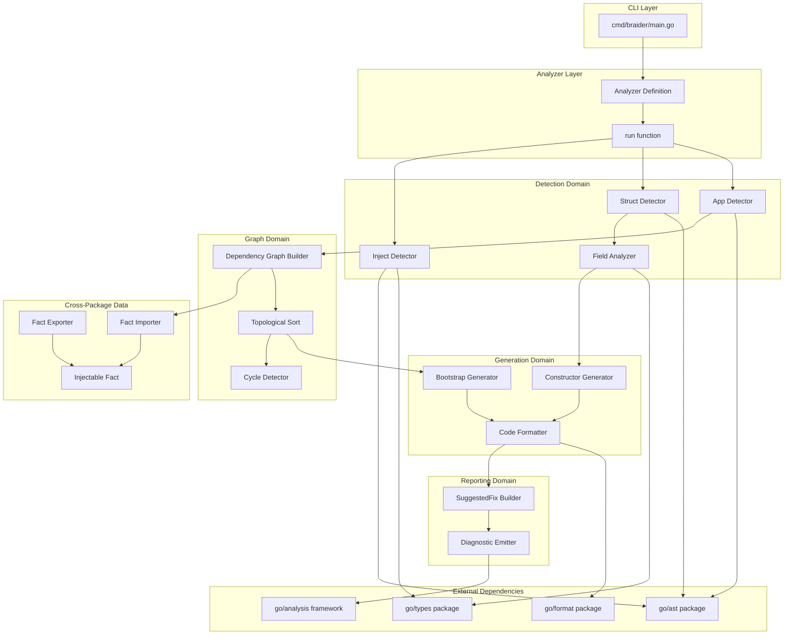
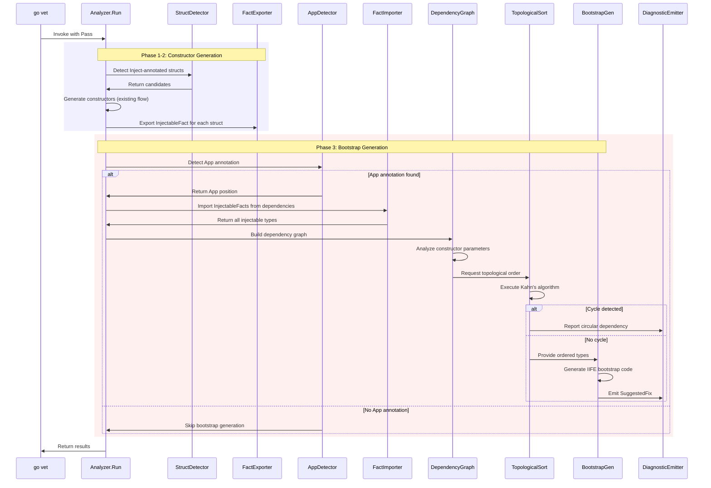
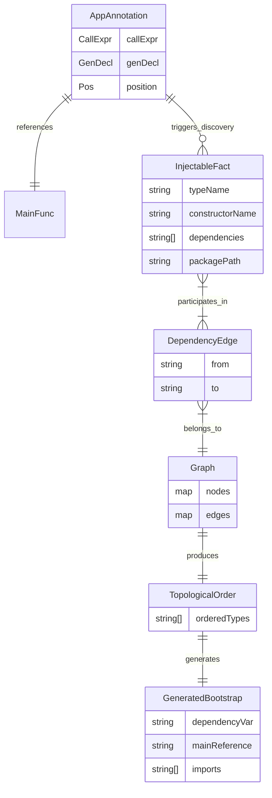

# Technical Design Document: Bootstrap with App Annotation

## Overview

**Purpose**: This feature delivers automatic DI wiring and bootstrap code generation to Go developers using braider, enabling them to resolve dependency graphs and initialize all injectable components in topological order when `annotation.App(main)` is detected.

**Users**: Go developers building applications with dependency injection will utilize this feature to automatically generate bootstrap code that creates and wires all `annotation.Inject`-marked structs, eliminating manual initialization boilerplate.

**Impact**: This feature extends the existing braider analyzer by adding a third phase (bootstrap generation) after constructor generation. It introduces the `annotation.App` marker detection, cross-package dependency discovery via Facts, dependency graph construction with cycle detection, and IIFE-based bootstrap code generation.

### Goals

- Detect `annotation.App(main)` markers to identify bootstrap targets
- Discover all `annotation.Inject` structs across the module via Facts
- Build dependency graph from constructor parameters
- Detect and report circular dependencies with full cycle paths
- Generate bootstrap code in topological order via `SuggestedFix`
- Produce idempotent output (no changes if bootstrap is current)
- Integrate with existing constructor generation feature

### Non-Goals

- Runtime dependency resolution or containers
- Support for multiple `annotation.App` declarations per package
- Support for `annotation.App` with functions other than `main`
- Lazy initialization or scoped lifetimes
- Dynamic dependency selection based on configuration
- Plugin/module loading at runtime

## Architecture

### Existing Architecture Analysis

The current braider implementation provides:

- **Constructor generation pipeline** (`internal/analyzer.go`): Two-phase pipeline (Detection -> Generation -> Reporting) for constructor auto-generation
- **Detection components** (`internal/detect/`): `InjectDetector`, `StructDetector`, `FieldAnalyzer` for finding `annotation.Inject` structs
- **Generation components** (`internal/generate/`): `ConstructorGenerator`, `CodeFormatter` for code synthesis
- **Reporting components** (`internal/report/`): `DiagnosticEmitter`, `SuggestedFixBuilder` for diagnostic emission
- **Annotation package** (`pkg/annotation/annotation.go`): Defines `Inject` struct and `App` function for DI marking

The existing `run` function in `analyzer.go` handles constructor generation in a loop over candidates. This design extends the analyzer to add a Phase 3 for bootstrap generation after constructors are processed.

### Architecture Pattern and Boundary Map



**Architecture Integration**:

- **Selected pattern**: Extended pipeline architecture with three phases (Detection -> Constructor Generation -> Bootstrap Generation)
- **Domain boundaries**: Detection handles AST traversal and marker detection; Graph handles dependency resolution and ordering; Generation handles code synthesis; Reporting handles diagnostic emission
- **Existing patterns preserved**: Component-based architecture, `inspect.Analyzer` dependency, `analysistest` testing, SuggestedFix-based code generation
- **New components rationale**:
  - `AppDetector`: Identifies `annotation.App(main)` calls to trigger bootstrap generation
  - `DependencyGraph`: Builds edges from constructor parameters to injectable types
  - `TopologicalSort`: Orders dependencies using Kahn's algorithm with cycle detection
  - `BootstrapGenerator`: Synthesizes IIFE-based bootstrap code
  - Facts: Enable cross-package discovery of injectable structs
- **Steering compliance**: Follows Go analyzer conventions, zero external dependencies for graph algorithms, compile-time safety

### Technology Stack

| Layer | Choice / Version | Role in Feature | Notes |
|-------|------------------|-----------------|-------|
| Framework | `golang.org/x/tools/go/analysis` | Analyzer interface, Facts, diagnostics | v0.29.0 per go.mod |
| AST Processing | `go/ast`, `go/parser` | App annotation and struct parsing | Standard library |
| Type Resolution | `go/types` via `pass.TypesInfo` | Constructor parameter type resolution | Standard library |
| Code Generation | `go/format`, `go/printer` | gofmt-compatible output | Standard library |
| AST Traversal | `golang.org/x/tools/go/ast/inspector` | Efficient node filtering | Via inspect.Analyzer |
| Cross-Package Data | `analysis.Fact` | Injectable struct discovery across packages | Built-in mechanism |
| Testing | `golang.org/x/tools/go/analysis/analysistest` | Golden file testing | RunWithSuggestedFixes |

## System Flows

### Extended Analysis Pipeline



### Bootstrap Code Generation Detail


## Requirements Traceability

| Requirement | Summary | Components | Interfaces | Flows |
|-------------|---------|------------|------------|-------|
| 1.1 | Detect `annotation.App(main)` as bootstrap target | AppDetector | DetectAppAnnotation | Extended Analysis Pipeline |
| 1.2 | Report error for multiple App annotations | AppDetector, DiagnosticEmitter | ValidateAppCount, EmitMultipleAppError | Bootstrap Generation Detail |
| 1.3 | Skip bootstrap when no App annotation | AppDetector | DetectAppAnnotation | Extended Analysis Pipeline |
| 1.4 | Report error when App references non-main function | AppDetector, DiagnosticEmitter | ValidateMainReference, EmitNonMainError | Bootstrap Generation Detail |
| 2.1 | Identify structs embedding `annotation.Inject` | InjectDetector | HasInjectAnnotation | Extended Analysis Pipeline |
| 2.2 | Exclude structs without Inject from graph | StructDetector | DetectCandidates | Extended Analysis Pipeline |
| 2.3 | Discover Inject structs across packages | FactImporter | ImportInjectableFacts | Extended Analysis Pipeline |
| 2.4 | Report error when Inject struct lacks constructor | DependencyGraph, DiagnosticEmitter | ValidateConstructors | Bootstrap Generation Detail |
| 3.1 | Extract constructor parameter types | DependencyGraph | BuildGraph | Extended Analysis Pipeline |
| 3.2 | Add dependency edges for injectable params | DependencyGraph | AddDependencyEdge | Extended Analysis Pipeline |
| 3.3 | Exclude non-injectable types from graph | DependencyGraph | BuildGraph | Bootstrap Generation Detail |
| 3.4 | Use first return value as provided type | DependencyGraph | ResolveReturnType | Bootstrap Generation Detail |
| 3.5 | Resolve interface to implementing injectable | InterfaceRegistry, DependencyGraph | Resolve, BuildGraph | Bootstrap Generation Detail |
| 3.6 | Report error for multiple implementations | InterfaceRegistry, DiagnosticEmitter | Resolve, EmitAmbiguousImplementationError | Bootstrap Generation Detail |
| 3.7 | Exclude unresolved interfaces from graph | DependencyGraph | BuildGraph | Bootstrap Generation Detail |
| 3.8 | Cross-package interface resolution via Facts | InterfaceRegistry, FactImporter | Build, ImportInjectableFacts | Extended Analysis Pipeline |
| 4.1 | Report error with cycle path | CycleDetector, DiagnosticEmitter | DetectCycle, EmitCircularDependency | Bootstrap Generation Detail |
| 4.2 | Proceed when no cycles | TopologicalSort | Sort | Extended Analysis Pipeline |
| 4.3 | Include full cycle path in error | DiagnosticEmitter | EmitCircularDependency | Bootstrap Generation Detail |
| 5.1 | Initialize in topological order | TopologicalSort | Sort | Bootstrap Generation Detail |
| 5.2 | Deterministic alphabetical tie-breaking | TopologicalSort | Sort | Bootstrap Generation Detail |
| 5.3 | Generate empty bootstrap for empty graph | BootstrapGenerator | GenerateBootstrap | Bootstrap Generation Detail |
| 6.1 | Generate SuggestedFix with bootstrap code | BootstrapGenerator, SuggestedFixBuilder | GenerateBootstrap, BuildBootstrapFix | Extended Analysis Pipeline |
| 6.2 | Define `dependency` variable | BootstrapGenerator | GenerateBootstrap | Bootstrap Generation Detail |
| 6.3 | Conditionally include `_ = dependency` in main | BootstrapGenerator | IsDependencyReferenced, GenerateBootstrap | Bootstrap Generation Detail |
| 6.4 | Generate valid compilable Go code | BootstrapGenerator, CodeFormatter | GenerateBootstrap, FormatCode | Bootstrap Generation Detail |
| 6.5 | Idempotent - no diagnostic if up-to-date | BootstrapGenerator | CheckBootstrapCurrent | Bootstrap Generation Detail |
| 6.6 | Update outdated bootstrap via SuggestedFix | BootstrapGenerator, SuggestedFixBuilder | DetectOutdated, BuildReplacementFix | Bootstrap Generation Detail |
| 7.1 | IIFE returning anonymous struct | BootstrapGenerator | GenerateBootstrap | Bootstrap Generation Detail |
| 7.2 | camelCase field names from type names | BootstrapGenerator | DeriveFieldName | Bootstrap Generation Detail |
| 7.3 | Use field names as intermediate variables | BootstrapGenerator | GenerateBootstrap | Bootstrap Generation Detail |
| 7.4 | Include imports for external packages | BootstrapGenerator | CollectImports | Bootstrap Generation Detail |
| 7.5 | Format per gofmt standards | CodeFormatter | FormatCode | Bootstrap Generation Detail |
| 8.1 | Include source position in errors | DiagnosticEmitter | All emit methods | All Flows |
| 8.2 | Provide descriptive error messages | DiagnosticEmitter | All emit methods | All Flows |
| 8.3 | Describe fix actions clearly | SuggestedFixBuilder | BuildBootstrapFix | Bootstrap Generation Detail |
| 9.1 | Work alongside constructor generation | run function | Run | Extended Analysis Pipeline |
| 9.2 | Constructors generated before bootstrap | run function | Run | Extended Analysis Pipeline |
| 9.3 | Consistent results on incremental analysis | FactExporter, FactImporter | ExportFact, ImportFact | Extended Analysis Pipeline |

## Components and Interfaces

| Component | Domain/Layer | Intent | Req Coverage | Key Dependencies | Contracts |
|-----------|--------------|--------|--------------|------------------|-----------|
| AppDetector | Detection | Detect `annotation.App(main)` calls | 1.1-1.4 | go/ast (P0), go/types (P0) | Service |
| InjectableFact | Facts | Cross-package injectable struct data | 2.3, 9.3 | analysis.Fact (P0) | State |
| FactExporter | Facts | Export facts from current package | 2.3, 9.3 | pass.ExportObjectFact (P0) | Service |
| FactImporter | Facts | Import facts from dependencies | 2.3 | pass.ImportObjectFact (P0) | Service |
| InterfaceRegistry | Graph | Map interface types to implementing injectable structs | 3.5-3.8 | InjectableFact (P0), go/types (P0) | Service |
| DependencyGraph | Graph | Build dependency edges from constructors | 2.4, 3.1-3.8 | FieldAnalyzer (P0), FactImporter (P1), InterfaceRegistry (P0) | Service |
| TopologicalSort | Graph | Order types via Kahn's algorithm | 4.1-4.3, 5.1-5.3 | DependencyGraph (P0) | Service |
| BootstrapGenerator | Generation | Generate IIFE bootstrap code | 6.1-6.6, 7.1-7.5 | TopologicalSort (P0), CodeFormatter (P0) | Service |

### Detection Domain

#### AppDetector

| Field | Detail |
|-------|--------|
| Intent | Detect `annotation.App(main)` calls and validate bootstrap target |
| Requirements | 1.1, 1.2, 1.3, 1.4 |

**Responsibilities and Constraints**

- Traverse AST to find `var _ = annotation.App(main)` declarations
- Validate that exactly one App annotation exists per package
- Validate that the App annotation references the `main` function
- Extract position information for diagnostic reporting
- Boundary: App detection and validation only; does not build dependency graph

**Dependencies**

- Inbound: run function - invoked during Phase 3 (P0)
- External: `go/ast.CallExpr` - App function call detection (P0)
- External: `go/types.Info` - function reference resolution (P0)

**Contracts**: Service [x]

##### Service Interface

```go
// AppDetector detects annotation.App calls in packages.
type AppDetector interface {
    // DetectAppAnnotation finds annotation.App(main) in the package.
    // Returns the call expression and position, or nil if not found.
    DetectAppAnnotation(pass *analysis.Pass) *AppAnnotation

    // ValidateAppAnnotation checks that the App annotation is valid.
    // Reports diagnostics for multiple annotations or non-main references.
    ValidateAppAnnotation(pass *analysis.Pass, app *AppAnnotation) bool
}

// AppAnnotation represents a detected annotation.App call.
type AppAnnotation struct {
    CallExpr *ast.CallExpr  // The App(main) call expression
    GenDecl  *ast.GenDecl   // The var declaration containing the call
    MainFunc *ast.Ident     // The main function identifier argument
    Pos      token.Pos      // Position for diagnostics
}

// AppAnnotationPath is the import path for the annotation package.
const AppAnnotationPath = "github.com/miyamo2/braider/pkg/annotation"

// AppFuncName is the function name for the App annotation.
const AppFuncName = "App"
```

- Preconditions: Pass must have valid AST and TypesInfo
- Postconditions: Returns AppAnnotation if valid; nil if not present; emits diagnostics for invalid cases
- Invariants: At most one valid App annotation per package

**Implementation Notes**

- Integration: Invoked at start of Phase 3, after constructor generation
- Validation: Use `pass.TypesInfo.Uses` to verify the called function is `annotation.App`
- Validation: Check argument is identifier `main` and references a function
- Risks: Must handle aliased imports of annotation package

### Facts Domain

#### InjectableFact

| Field | Detail |
|-------|--------|
| Intent | Store cross-package data about injectable structs |
| Requirements | 2.3, 9.3 |

**Responsibilities and Constraints**

- Implement `analysis.Fact` interface for gob serialization
- Store constructor signature and dependency information
- Enable import of facts from transitive dependencies
- Boundary: Data structure only; no logic

**Dependencies**

- External: `analysis.Fact` interface (P0)
- External: `encoding/gob` - serialization (P0)

**Contracts**: State [x]

##### State Model

```go
// InjectableFact stores information about an injectable struct.
// Implements analysis.Fact interface for cross-package sharing.
type InjectableFact struct {
    TypeName        string   // Fully qualified type name (pkg.TypeName)
    ConstructorName string   // Constructor function name (New<TypeName>)
    Dependencies    []string // Fully qualified types of constructor parameters
    PackagePath     string   // Import path of the package
    Implements      []string // Fully qualified interface types this struct implements
}

// AFact marks InjectableFact as implementing analysis.Fact.
func (*InjectableFact) AFact() {}

// String returns a string representation for debugging.
func (f *InjectableFact) String() string {
    return fmt.Sprintf("Injectable(%s)", f.TypeName)
}
```

- Persistence: Serialized via gob by go/analysis framework
- Consistency: Facts are computed once per package during analysis
- Concurrency: Read-only after creation; thread-safe via framework

#### FactExporter

| Field | Detail |
|-------|--------|
| Intent | Export InjectableFact for each discovered injectable struct |
| Requirements | 2.3, 9.3 |

**Responsibilities and Constraints**

- Create InjectableFact from ConstructorCandidate and constructor info
- Export facts using `pass.ExportObjectFact`
- Boundary: Export only; does not import or consume facts

**Dependencies**

- Inbound: run function - called after constructor generation (P0)
- External: `pass.ExportObjectFact` - fact export API (P0)

**Contracts**: Service [x]

##### Service Interface

```go
// FactExporter exports injectable facts for cross-package discovery.
type FactExporter interface {
    // ExportInjectableFact creates and exports a fact for an injectable struct.
    ExportInjectableFact(
        pass *analysis.Pass,
        candidate detect.ConstructorCandidate,
        constructor *generate.GeneratedConstructor,
        dependencies []string,
    )
}
```

- Preconditions: Candidate must have valid TypeSpec; constructor must be generated successfully
- Postconditions: Fact exported and available to dependent packages
- Invariants: One fact per injectable struct per package

**Implementation Notes**

- Interface detection: Use `types.Implements()` to detect which interfaces each injectable struct implements
- Check both value receiver (`T`) and pointer receiver (`*T`) implementations
- Only include interfaces defined within the module (not standard library or external packages)
- Store fully qualified interface names in `InjectableFact.Implements` for cross-package resolution

#### FactImporter

| Field | Detail |
|-------|--------|
| Intent | Import InjectableFacts from all imported packages |
| Requirements | 2.3 |

**Responsibilities and Constraints**

- Iterate through package imports
- Import facts using `pass.ImportObjectFact`
- Collect all injectable types for dependency graph construction
- Boundary: Import only; does not export or modify facts

**Dependencies**

- Inbound: DependencyGraph - requests injectable types (P0)
- External: `pass.ImportObjectFact` - fact import API (P0)
- External: `pass.Pkg.Imports()` - import list (P0)

**Contracts**: Service [x]

##### Service Interface

```go
// FactImporter imports injectable facts from dependencies.
type FactImporter interface {
    // ImportInjectableFacts collects all InjectableFacts from imported packages.
    ImportInjectableFacts(pass *analysis.Pass) []*InjectableFact
}
```

- Preconditions: Pass must have valid package information
- Postconditions: Returns all available InjectableFacts from imports
- Invariants: Returns empty slice if no facts found (not an error)

### Graph Domain

#### DependencyGraph

| Field | Detail |
|-------|--------|
| Intent | Build dependency edges from constructor parameters |
| Requirements | 2.4, 3.1, 3.2, 3.3, 3.4 |

**Responsibilities and Constraints**

- Collect all injectable types (local and imported)
- Parse constructor function signatures
- Create edges from dependencies to dependents
- Filter out non-injectable parameter types (primitives, external types)
- Validate that all Inject structs have constructors
- Boundary: Graph construction only; does not sort or detect cycles

**Dependencies**

- Inbound: run function - builds graph for bootstrap (P0)
- Outbound: FactImporter - get imported injectables (P0)
- External: `go/types.Func` - constructor signature resolution (P0)

**Contracts**: Service [x]

##### Service Interface

```go
// DependencyGraph builds the dependency graph for injectable types.
type DependencyGraph interface {
    // BuildGraph constructs the dependency graph from local and imported injectables.
    // Returns error if an injectable struct lacks a constructor.
    BuildGraph(
        pass *analysis.Pass,
        localCandidates []detect.ConstructorCandidate,
        importedFacts []*InjectableFact,
    ) (*Graph, error)
}

// Graph represents the dependency graph.
type Graph struct {
    Nodes map[string]*Node // Keyed by fully qualified type name
    Edges map[string][]string // Dependencies: from -> []to
}

// Node represents an injectable type in the graph.
type Node struct {
    TypeName        string          // Fully qualified type name
    PackagePath     string          // Import path
    LocalName       string          // Type name without package
    ConstructorName string          // New<TypeName>
    Dependencies    []string        // Types this depends on
    InDegree        int             // For Kahn's algorithm
    Candidate       *detect.ConstructorCandidate // nil for imported
    Fact            *InjectableFact // nil for local
}
```

- Preconditions: Candidates must have valid TypeSpec and generated constructors
- Postconditions: Returns complete graph with all edges; errors for missing constructors
- Invariants: All nodes in graph have constructors; edges only between injectable types

**Implementation Notes**

- Integration: Called after constructor generation and fact import
- Validation: For each Inject struct, verify constructor exists in package or facts
- Edge construction: Parse constructor parameters, filter for injectable types
- Interface resolution: For interface-typed parameters, use InterfaceRegistry to find implementing injectable
- Risks: Must handle imported types with different import aliases

#### InterfaceRegistry

| Field | Detail |
|-------|--------|
| Intent | Map interface types to their implementing injectable structs |
| Requirements | 3.5, 3.6, 3.7, 3.8 |

**Responsibilities and Constraints**

- Build mapping from interface types to implementing injectable structs
- Use `types.Implements()` to detect interface implementations
- Support both local candidates and imported facts
- Report error when multiple injectables implement the same interface
- Boundary: Interface-to-implementation mapping only; does not build dependency edges

**Dependencies**

- Inbound: DependencyGraph - requests interface resolution (P0)
- External: `go/types.Implements` - interface implementation check (P0)
- External: InjectableFact - imported implementation info (P0)

**Contracts**: Service [x]

##### Service Interface

```go
// InterfaceRegistry maps interface types to their implementing injectable structs.
type InterfaceRegistry interface {
    // Build constructs the registry from local candidates and imported facts.
    // Uses go/types.Implements() to detect interface implementations.
    Build(
        pass *analysis.Pass,
        localCandidates []detect.ConstructorCandidate,
        importedFacts []*InjectableFact,
    ) error

    // Resolve finds the injectable struct implementing the given interface.
    // Returns the fully qualified type name of the implementation.
    // Returns AmbiguousImplementationError if multiple implementations exist.
    // Returns empty string and nil error if no implementation found (external dependency).
    Resolve(ifaceType string) (string, error)
}

// AmbiguousImplementationError indicates multiple structs implement an interface.
type AmbiguousImplementationError struct {
    InterfaceType    string   // Fully qualified interface type name
    Implementations  []string // List of implementing types
}

func (e *AmbiguousImplementationError) Error() string {
    return fmt.Sprintf(
        "multiple injectable structs implement interface %s: %s",
        e.InterfaceType,
        strings.Join(e.Implementations, ", "),
    )
}
```

- Preconditions: Pass must have valid TypesInfo; candidates must have valid TypeSpec
- Postconditions: Registry contains all interface-to-implementation mappings
- Invariants: Each interface maps to at most one implementation (or error)

**Implementation Notes**

- Build phase: For each injectable struct (local and imported), detect implemented interfaces
- Local detection: Use `types.Implements(structType, iface)` for both value and pointer receivers
- Imported detection: Use `InjectableFact.Implements` field populated by FactExporter
- Conflict detection: Track all implementations per interface; report error if count > 1
- Resolution: Return the implementing type's fully qualified name for dependency edge creation

#### TopologicalSort

| Field | Detail |
|-------|--------|
| Intent | Order types using Kahn's algorithm with cycle detection |
| Requirements | 4.1, 4.2, 4.3, 5.1, 5.2, 5.3 |

**Responsibilities and Constraints**

- Implement Kahn's algorithm for topological ordering
- Detect cycles via non-zero in-degree nodes after sort
- Reconstruct cycle path for error reporting
- Apply alphabetical tie-breaking for determinism
- Handle empty graph case
- Boundary: Sorting and cycle detection only; does not build graph

**Dependencies**

- Inbound: BootstrapGenerator - requests ordered types (P0)
- Inbound: run function - requests sort after graph construction (P0)
- External: none (pure algorithm)

**Contracts**: Service [x]

##### Service Interface

```go
// TopologicalSort provides topological ordering with cycle detection.
type TopologicalSort interface {
    // Sort orders nodes topologically using Kahn's algorithm.
    // Returns ordered node list or error with cycle path if cycle detected.
    Sort(graph *Graph) ([]string, error)
}

// CycleError represents a circular dependency error.
type CycleError struct {
    Cycle []string // Cycle path, e.g., ["A", "B", "C", "A"]
}

func (e *CycleError) Error() string {
    return fmt.Sprintf("circular dependency detected: %s", strings.Join(e.Cycle, " -> "))
}
```

- Preconditions: Graph must have valid nodes and edges
- Postconditions: Returns ordered list or CycleError
- Invariants: Output order satisfies dependency constraints; alphabetical for ties

**Implementation Notes**

- Algorithm: Kahn's algorithm
  1. Compute in-degree for each node
  2. Initialize queue with zero in-degree nodes (alphabetically sorted)
  3. Process queue: remove node, add to result, decrement successors' in-degrees
  4. Add new zero in-degree nodes to queue (alphabetically sorted)
  5. If nodes remain with non-zero in-degree, cycle exists
- Cycle reconstruction: BFS/DFS from remaining nodes to find cycle path
- Risks: Must handle disconnected components correctly

### Generation Domain

#### BootstrapGenerator

| Field | Detail |
|-------|--------|
| Intent | Generate IIFE-based bootstrap code |
| Requirements | 6.1, 6.2, 6.3, 6.4, 6.5, 6.6, 7.1, 7.2, 7.3, 7.4, 7.5 |

**Responsibilities and Constraints**

- Generate IIFE pattern with anonymous struct return
- Generate constructor calls in topological order
- Derive camelCase field names from type names
- Collect required imports for external packages
- Check if existing bootstrap is current (idempotent behavior)
- Detect outdated bootstrap for replacement
- Boundary: Bootstrap code generation only; relies on sorted order from TopologicalSort

**Dependencies**

- Inbound: run function - requests bootstrap generation (P0)
- Outbound: TopologicalSort - ordered types (P0)
- Outbound: CodeFormatter - formatting (P0)
- External: `go/format` - gofmt compatibility (P0)

**Contracts**: Service [x]

##### Service Interface

```go
// BootstrapGenerator generates bootstrap code for App annotation.
type BootstrapGenerator interface {
    // GenerateBootstrap creates the IIFE bootstrap code.
    GenerateBootstrap(
        orderedTypes []string,
        graph *Graph,
    ) (*GeneratedBootstrap, error)

    // CheckBootstrapCurrent compares existing bootstrap with current graph.
    // Returns true if no regeneration needed (idempotent).
    CheckBootstrapCurrent(
        pass *analysis.Pass,
        existingBootstrap *ast.GenDecl,
        graph *Graph,
    ) bool

    // DetectExistingBootstrap finds the existing dependency variable if present.
    DetectExistingBootstrap(pass *analysis.Pass) *ast.GenDecl

    // IsDependencyReferenced checks if the dependency variable is already
    // referenced in the main function body (excluding blank identifier assignments).
    // Returns true if dependency is used, meaning _ = dependency should be skipped.
    IsDependencyReferenced(pass *analysis.Pass, mainFunc *ast.FuncDecl) bool
}

// GeneratedBootstrap contains the generated bootstrap code.
type GeneratedBootstrap struct {
    DependencyVar string // The dependency variable declaration code
    MainReference string // The _ = dependency statement for main
    Imports       []string // Required import paths
}
```

- Preconditions: orderedTypes must be valid topological order; graph must contain all types
- Postconditions: Returns valid Go code following IIFE pattern
- Invariants: Field order matches ordered types; generated code passes gofmt

**Implementation Notes**

- Integration: Called after TopologicalSort succeeds
- Idempotency: Compare field list and constructor calls with existing bootstrap
- Import collection: Track external package paths for types
- Risks: Complex type expressions (generics) may require special handling
- Reference detection: `IsDependencyReferenced` walks main function body using `ast.Inspect`, looking for `ast.Ident` or `ast.SelectorExpr` that references `dependency`. It excludes blank identifier assignments (`_ = dependency`) from consideration to avoid false positives from braider's own generated code.

##### Generated Code Structure

```go
// Generated bootstrap code structure:
var dependency = func() struct {
    myRepository MyRepository
    myService    MyService
    myHandler    MyHandler
} {
    myRepository := NewMyRepository()
    myService := NewMyService(myRepository)
    myHandler := NewMyHandler(myService)
    return struct {
        myRepository MyRepository
        myService    MyService
        myHandler    MyHandler
    }{
        myRepository: myRepository,
        myService:    myService,
        myHandler:    myHandler,
    }
}()

// Added to main function body (only if dependency is not already referenced):
func main() {
    _ = dependency  // Omitted if dependency is already used (e.g., dependency.handler.Run())
    // ... existing main code
}
```

##### Field Name Derivation Rules

```go
// DeriveFieldName converts a type name to a camelCase field name.
// Rules:
// 1. Use local type name (strip package path)
// 2. Convert to lowerCamelCase
// 3. Handle all-caps like "DB" -> "db"
// 4. Handle conflicts by appending numeric suffix
func DeriveFieldName(typeName string, existing map[string]bool) string
```

### Reporting Domain

Extended `DiagnosticEmitter` with bootstrap-specific methods:

```go
// Additional methods for DiagnosticEmitter
type DiagnosticEmitter interface {
    // ... existing methods ...

    // EmitMultipleAppError reports multiple annotation.App declarations.
    EmitMultipleAppError(reporter Reporter, positions []token.Pos)

    // EmitNonMainAppError reports App referencing non-main function.
    EmitNonMainAppError(reporter Reporter, pos token.Pos, funcName string)

    // EmitMissingConstructorError reports Inject struct without constructor.
    EmitMissingConstructorError(reporter Reporter, pos token.Pos, typeName string)

    // EmitAmbiguousImplementationError reports multiple injectable structs implementing same interface.
    EmitAmbiguousImplementationError(reporter Reporter, pos token.Pos, ifaceType string, implementations []string)

    // EmitBootstrapFix reports bootstrap code generation.
    EmitBootstrapFix(reporter Reporter, pos token.Pos, fix analysis.SuggestedFix)

    // EmitBootstrapUpdateFix reports bootstrap code update.
    EmitBootstrapUpdateFix(reporter Reporter, pos token.Pos, fix analysis.SuggestedFix)
}
```

Extended `SuggestedFixBuilder` with bootstrap-specific methods:

```go
// Additional methods for SuggestedFixBuilder
type SuggestedFixBuilder interface {
    // ... existing methods ...

    // BuildBootstrapFix creates SuggestedFix for bootstrap insertion.
    BuildBootstrapFix(
        pass *analysis.Pass,
        appAnnotation *AppAnnotation,
        bootstrap *GeneratedBootstrap,
    ) analysis.SuggestedFix

    // BuildBootstrapReplacementFix creates SuggestedFix for bootstrap update.
    BuildBootstrapReplacementFix(
        pass *analysis.Pass,
        existingBootstrap *ast.GenDecl,
        bootstrap *GeneratedBootstrap,
    ) analysis.SuggestedFix

    // BuildMainReferenceFix creates SuggestedFix for adding _ = dependency to main.
    // This method should only be called when IsDependencyReferenced returns false.
    // If dependency is already referenced in main, this fix should be skipped.
    BuildMainReferenceFix(
        pass *analysis.Pass,
        mainFunc *ast.FuncDecl,
    ) analysis.SuggestedFix
}
```

##### Diagnostic Message Templates

| Category | Message Template | Example |
|----------|------------------|---------|
| Multiple App | `multiple annotation.App declarations in package` | - |
| Non-main App | `annotation.App must reference main function, got %s` | `annotation.App must reference main function, got init` |
| Missing constructor | `injectable struct %s requires a constructor (New%s)` | `injectable struct UserService requires a constructor (NewUserService)` |
| Circular dependency | `circular dependency detected: %s` | `circular dependency detected: A -> B -> C -> A` |
| Ambiguous implementation | `multiple injectable structs implement interface %s: %s` | `multiple injectable structs implement interface pkg.IUserRepository: UserRepositoryA, UserRepositoryB` |
| Bootstrap available | `missing bootstrap code for annotation.App` | - |
| Bootstrap outdated | `bootstrap code is outdated` | - |

## Data Models

### Domain Model



**Aggregates and Boundaries**

- `AppAnnotation`: Root aggregate for bootstrap trigger; single instance per package
- `Graph`: Root aggregate for dependency resolution; contains all nodes and edges
- `GeneratedBootstrap`: Root aggregate for generation phase; immutable value object
- Transaction scope: Entire bootstrap generation is atomic per package

**Business Rules and Invariants**

1. Package must have exactly one `annotation.App(main)` to trigger bootstrap
2. App annotation must reference the `main` function
3. All injectable structs must have corresponding constructors
4. Dependency graph must be acyclic
5. Topological order satisfies: if A depends on B, B appears before A
6. Field names in bootstrap struct are unique (use suffixes for conflicts)

### Logical Data Model

#### Constructor Signature Parsing

```go
// ConstructorInfo contains parsed constructor information.
type ConstructorInfo struct {
    Name       string       // Function name (New<TypeName>)
    Parameters []ParamInfo  // Parameter types
    ReturnType string       // Return type (pointer to struct)
}

// ParamInfo contains constructor parameter information.
type ParamInfo struct {
    Name         string // Parameter name
    TypeName     string // Fully qualified type name
    IsInjectable bool   // Whether type is injectable (for edge creation)
}
```

#### Bootstrap Code Template

```go
// Template for dependency variable:
const dependencyVarTemplate = `var dependency = func() struct {
{{range .Fields}}	{{.Name}} {{.Type}}
{{end}}} {
{{range .Initializations}}	{{.VarName}} := {{.Constructor}}({{.Args}})
{{end}}	return struct {
{{range .Fields}}		{{.Name}} {{.Type}}
{{end}}	}{
{{range .Fields}}		{{.Name}}: {{.VarName}},
{{end}}	}
}()`

// Template for main function reference:
const mainReferenceTemplate = `_ = dependency`
```

## Error Handling

### Error Strategy

The analyzer follows fail-fast for invalid configurations with graceful degradation for optional features:

1. **Multiple App annotations**: Report error and halt bootstrap generation for package
2. **Non-main App reference**: Report error and halt bootstrap generation
3. **Missing constructor**: Report error for each missing constructor; halt bootstrap if any missing
4. **Circular dependency**: Report error with cycle path; halt bootstrap generation
5. **Empty graph**: Proceed with empty bootstrap block (not an error)

### Error Categories and Responses

**Configuration Errors (User)**:
- Multiple App annotations: Report all positions; suggest removing duplicates
- Non-main reference: Report position; suggest changing to main function
- Missing constructor: Report struct position; suggest running with -fix first

**Graph Errors (Logic)**:
- Circular dependency: Report cycle path; suggest refactoring dependencies

**Generation Errors (Internal)**:
- Code formatting failure: Report as bug with generated code snippet
- Position calculation error: Report with AST context

### Monitoring

- All diagnostics include source position for IDE integration
- Cycle detection includes full path for debugging
- Idempotent behavior prevents redundant diagnostics on re-analysis

## Testing Strategy

### Unit Tests

Core function testing using standard Go testing:

1. **AppDetector.DetectAppAnnotation**: Valid/invalid App annotation detection
2. **AppDetector.ValidateAppAnnotation**: Multiple annotations, non-main reference
3. **TopologicalSort.Sort**: Various graph topologies, cycle detection
4. **DependencyGraph.BuildGraph**: Edge construction, non-injectable filtering
5. **BootstrapGenerator.DeriveFieldName**: Naming rules, conflict handling
6. **BootstrapGenerator.CheckBootstrapCurrent**: Idempotency verification
7. **BootstrapGenerator.IsDependencyReferenced**: Detection of dependency usage in main function (including field access like `dependency.handler`)
8. **InterfaceRegistry.Build**: Interface-to-implementation mapping construction
9. **InterfaceRegistry.Resolve**: Single implementation resolution, ambiguous detection

### Integration Tests

Using `analysistest.Run` for analyzer behavior:

1. **App detection**: Package with valid App annotation triggers bootstrap
2. **No App**: Package without App annotation skips bootstrap
3. **Multiple App**: Error reported for multiple annotations
4. **Cross-package**: Facts imported from dependencies correctly
5. **Circular dependency**: Cycle detected and reported with path
6. **Empty graph**: Empty bootstrap generated when no injectables
7. **Idempotent**: No diagnostic when bootstrap is current
8. **Dependency used in main**: `_ = dependency` not added when dependency is already referenced
9. **Interface resolution**: Interface parameter resolved to implementing injectable
10. **Ambiguous interface**: Error reported when multiple implementations exist
11. **Cross-package interface**: Interface in one package, implementation in another

### Golden File Tests

Using `analysistest.RunWithSuggestedFixes` for output verification:

1. **Simple bootstrap**: Single injectable type
2. **Multi-type bootstrap**: Multiple types in dependency order
3. **Cross-package bootstrap**: Types from multiple packages
4. **Update bootstrap**: Outdated bootstrap replaced
5. **Main reference**: `_ = dependency` added to main
6. **Dependency already used**: `_ = dependency` skipped when dependency is already referenced in main
7. **Interface dependency**: Interface parameter resolved to implementing injectable
8. **Cross-package interface**: Interface defined locally, implementation from another package

#### Test Directory Structure

```
internal/testdata/src/
  bootstrap/
    simple/
      main.go           # Simple App with single injectable
      main.go.golden    # Expected output after fix
    multitype/
      main.go           # Multiple injectable types
      main.go.golden
    crosspackage/
      main.go           # App with imported injectables
      dep/
        service.go      # Injectable in dependency package
      main.go.golden
    circular/
      main.go           # Circular dependency (error case)
    noapp/
      main.go           # No App annotation (no changes)
    update/
      main.go           # Outdated bootstrap
      main.go.golden    # Expected updated output
    depused/
      main.go           # dependency already referenced in main
      main.go.golden    # No _ = dependency added
    interface/
      main.go           # Interface dependency resolution
      main.go.golden    # Expected output with interface resolved
    ambiguous/
      main.go           # Multiple implementations of same interface (want "multiple injectable structs")
    crosspackage_interface/
      main.go           # Interface defined locally, implementation imported
      repo/
        repo.go         # IUserRepository implementation
      main.go.golden
```

#### Example Test Case

**Input** (`simple/main.go`):
```go
package main

import "github.com/miyamo2/braider/pkg/annotation"

var _ = annotation.App(main)

func main() {}

type UserRepository struct {
    annotation.Inject
    db *sql.DB
}

// NewUserRepository is a constructor for UserRepository.
//
// Generated by braider. DO NOT EDIT.
func NewUserRepository(db *sql.DB) *UserRepository {
    return &UserRepository{
        db: db,
    }
}

type UserService struct {
    annotation.Inject
    repo *UserRepository
}

// NewUserService is a constructor for UserService.
//
// Generated by braider. DO NOT EDIT.
func NewUserService(repo *UserRepository) *UserService {
    return &UserService{
        repo: repo,
    }
}
```

**Expected Output** (`simple/main.go.golden`):
```go
package main

import "github.com/miyamo2/braider/pkg/annotation"

var _ = annotation.App(main)

func main() {
    _ = dependency
}

var dependency = func() struct {
    userRepository *UserRepository
    userService    *UserService
} {
    userRepository := NewUserRepository()
    userService := NewUserService(userRepository)
    return struct {
        userRepository *UserRepository
        userService    *UserService
    }{
        userRepository: userRepository,
        userService:    userService,
    }
}()

type UserRepository struct {
    annotation.Inject
    db *sql.DB
}

// NewUserRepository is a constructor for UserRepository.
//
// Generated by braider. DO NOT EDIT.
func NewUserRepository(db *sql.DB) *UserRepository {
    return &UserRepository{
        db: db,
    }
}

type UserService struct {
    annotation.Inject
    repo *UserRepository
}

// NewUserService is a constructor for UserService.
//
// Generated by braider. DO NOT EDIT.
func NewUserService(repo *UserRepository) *UserService {
    return &UserService{
        repo: repo,
    }
}
```

**Note**: In the example above, `db *sql.DB` is not an injectable type (external dependency), so it is excluded from the dependency graph. The bootstrap only wires injectable types (`UserRepository`, `UserService`).

#### Example Test Case: Dependency Already Used

**Input** (`depused/main.go`):
```go
package main

import "github.com/miyamo2/braider/pkg/annotation"

var _ = annotation.App(main)

func main() {
    // dependency is already used, no _ = dependency needed
    dependency.userService.Run()
}

type UserService struct {
    annotation.Inject
}

// NewUserService is a constructor for UserService.
func NewUserService() *UserService {
    return &UserService{}
}
```

**Expected Output** (`depused/main.go.golden`):
```go
package main

import "github.com/miyamo2/braider/pkg/annotation"

var _ = annotation.App(main)

func main() {
    // dependency is already used, no _ = dependency needed
    dependency.userService.Run()  // Note: _ = dependency is NOT added
}

var dependency = func() struct {
    userService *UserService
} {
    userService := NewUserService()
    return struct {
        userService *UserService
    }{
        userService: userService,
    }
}()

type UserService struct {
    annotation.Inject
}

// NewUserService is a constructor for UserService.
func NewUserService() *UserService {
    return &UserService{}
}
```

**Note**: In this example, `dependency.userService.Run()` already references the `dependency` variable, so the analyzer does not add `_ = dependency` to the main function.

#### Example Test Case: Interface Dependency Resolution

**Input** (`interface/main.go`):
```go
package main

import "github.com/miyamo2/braider/pkg/annotation"

var _ = annotation.App(main)

func main() {}

type IUserRepository interface {
    FindByID(string) (User, error)
}

type User struct {
    ID   string
    Name string
}

type UserRepository struct {
    annotation.Inject
}

func NewUserRepository() *UserRepository {
    return &UserRepository{}
}

func (r *UserRepository) FindByID(id string) (User, error) {
    return User{}, nil
}

type UserService struct {
    annotation.Inject
    repo IUserRepository
}

func NewUserService(repo IUserRepository) *UserService {
    return &UserService{repo: repo}
}
```

**Expected Output** (`interface/main.go.golden`):
```go
package main

import "github.com/miyamo2/braider/pkg/annotation"

var _ = annotation.App(main)

func main() {
    _ = dependency
}

var dependency = func() struct {
    userRepository *UserRepository
    userService    *UserService
} {
    userRepository := NewUserRepository()
    userService := NewUserService(userRepository)
    return struct {
        userRepository *UserRepository
        userService    *UserService
    }{
        userRepository: userRepository,
        userService:    userService,
    }
}()

type IUserRepository interface {
    FindByID(string) (User, error)
}

type User struct {
    ID   string
    Name string
}

type UserRepository struct {
    annotation.Inject
}

func NewUserRepository() *UserRepository {
    return &UserRepository{}
}

func (r *UserRepository) FindByID(id string) (User, error) {
    return User{}, nil
}

type UserService struct {
    annotation.Inject
    repo IUserRepository
}

func NewUserService(repo IUserRepository) *UserService {
    return &UserService{repo: repo}
}
```

**Note**: In this example, `UserService` depends on `IUserRepository` interface. The analyzer detects that `UserRepository` implements `IUserRepository` and resolves the dependency accordingly. The bootstrap code passes `userRepository` (of type `*UserRepository`) to `NewUserService` which accepts `IUserRepository`.

#### Example Test Case: Ambiguous Interface Implementation

**Input** (`ambiguous/main.go`):
```go
package main

import "github.com/miyamo2/braider/pkg/annotation"

var _ = annotation.App(main) // want "multiple injectable structs implement interface main.IUserRepository"

func main() {}

type IUserRepository interface {
    FindByID(string) (User, error)
}

type User struct{}

type UserRepositoryA struct {
    annotation.Inject
}

func NewUserRepositoryA() *UserRepositoryA {
    return &UserRepositoryA{}
}

func (r *UserRepositoryA) FindByID(id string) (User, error) {
    return User{}, nil
}

type UserRepositoryB struct {
    annotation.Inject
}

func NewUserRepositoryB() *UserRepositoryB {
    return &UserRepositoryB{}
}

func (r *UserRepositoryB) FindByID(id string) (User, error) {
    return User{}, nil
}

type UserService struct {
    annotation.Inject
    repo IUserRepository
}

func NewUserService(repo IUserRepository) *UserService {
    return &UserService{repo: repo}
}
```

**Note**: In this example, both `UserRepositoryA` and `UserRepositoryB` implement `IUserRepository`. The analyzer reports an error indicating ambiguous implementation.

### Performance Tests

Not required for initial implementation. Kahn's algorithm is O(V+E) which is efficient for typical application dependency graphs.

## Supporting References

- [go/analysis Facts documentation](https://pkg.go.dev/golang.org/x/tools/go/analysis#hdr-Modular_analysis_with_Facts) - Cross-package data sharing
- [Writing multi-package analysis tools](https://eli.thegreenplace.net/2020/writing-multi-package-analysis-tools-for-go/) - Multi-package patterns
- [Kahn's algorithm](https://en.wikipedia.org/wiki/Topological_sorting#Kahn's_algorithm) - Topological sort algorithm
- [google/wire](https://github.com/google/wire) - Inspiration for DI patterns
