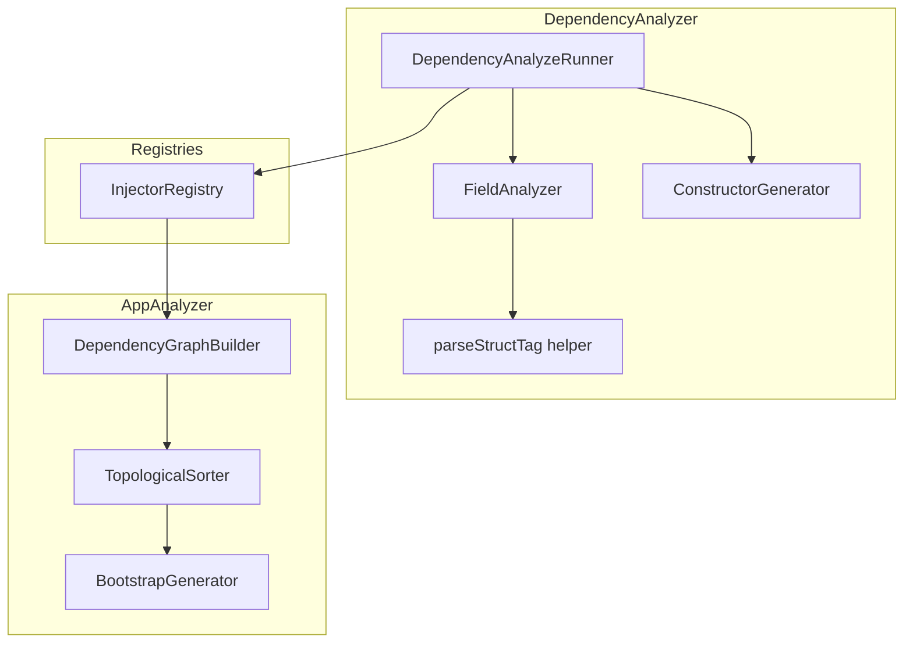
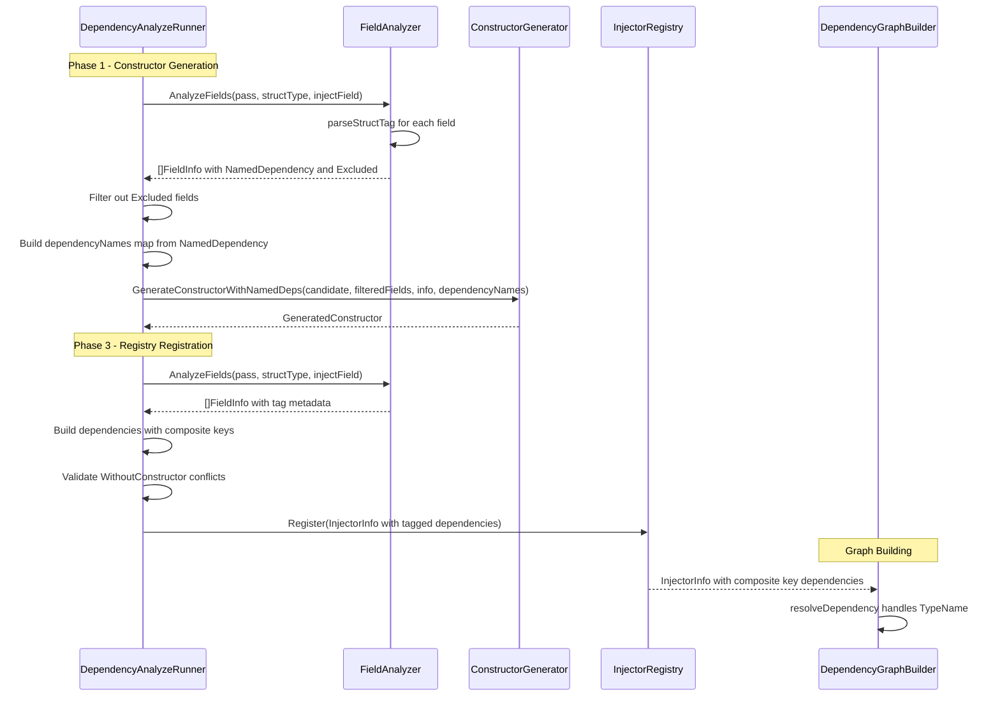

# Technical Design: braider-struct-tag

## Overview

**Purpose**: This feature delivers field-level dependency injection control to braider users through Go struct tags. The `braider` struct tag enables two capabilities: injecting a named dependency into a specific field (`braider:"name"`) and excluding a field from DI entirely (`braider:"-"`).

**Users**: Go developers using braider for compile-time DI will utilize struct tags to refine per-field injection behavior within `Injectable[T]` structs, complementing the existing type-level annotation options (`inject.Named[N]`, `inject.Typed[I]`).

**Impact**: Extends the existing DependencyAnalyzer's field analysis, constructor generation, and dependency graph construction to recognize and act on `braider` struct tags. No new public API types are introduced; the feature is expressed entirely through standard Go struct tag syntax.

### Goals
- Enable per-field named dependency resolution via `braider:"name"` struct tags
- Enable per-field DI exclusion via `braider:"-"` struct tags
- Parse and validate struct tags using Go's standard `reflect.StructTag` conventions
- Maintain full compatibility with existing annotation options (`inject.Named[N]`, `inject.Typed[I]`, `inject.WithoutConstructor`)
- Ensure hash-based idempotency correctly detects struct tag changes

### Non-Goals
- Custom struct tag key names (only `braider` is recognized)
- Struct tag options beyond name and exclusion (e.g., `braider:"name,optional"`)
- Runtime tag processing (all processing is static analysis at vet time)
- Field-level `Typed[I]` via struct tag (interface typing remains type-level only)

## Architecture

### Existing Architecture Analysis

The braider analyzer uses a multi-phase pipeline within `DependencyAnalyzeRunner.Run`:

- **Phase 1**: Detect `Injectable[T]` structs, analyze fields via `FieldAnalyzer.AnalyzeFields`, generate constructors via `ConstructorGenerator`.
- **Phase 2**: Detect `Provide[T](fn)` calls, register to `ProviderRegistry`.
- **Phase 2.5**: Detect `Variable[T](value)` calls, register to `VariableRegistry`.
- **Phase 3**: Re-detect `Injectable[T]` structs, extract dependencies from constructors (existing or pending), register to `InjectorRegistry`.
- **Phase 4**: Mark package as scanned.

Key integration points for this feature:
- `FieldAnalyzer.AnalyzeFields` -- must parse struct tags and populate new `FieldInfo` metadata
- `DependencyAnalyzeRunner.Run` Phase 1 -- must use tag metadata to build `dependencyNames` map and filter excluded fields before constructor generation
- `DependencyAnalyzeRunner.Run` Phase 3 -- must construct composite dependency keys for tagged named fields and validate `WithoutConstructor` conflicts

### Architecture Pattern & Boundary Map



**Architecture Integration**:
- Selected pattern: Component-based extension of existing analyzer pipeline
- Domain boundaries: Struct tag parsing is localized in `FieldAnalyzer`; dependency key construction is localized in `DependencyAnalyzeRunner` Phase 3; no new cross-component coupling
- Existing patterns preserved: `FieldInfo` struct extension, `GenerateConstructorWithNamedDeps` reuse, composite key `TypeName#Name` for graph edges
- New components rationale: No new top-level components; a `parseStructTag` helper method is added to `fieldAnalyzer`
- Steering compliance: Single responsibility (tag parsing in field analyzer), explicit error handling (diagnostics for invalid tags), idempotent code generation (hash captures tag effects via dependency list changes)

### Technology Stack

| Layer | Choice / Version | Role in Feature | Notes |
|-------|------------------|-----------------|-------|
| Backend / Services | Go 1.24, `go/ast`, `reflect` | Struct tag parsing from AST, standard tag parsing conventions | `reflect.StructTag.Lookup` for tag value extraction |
| Infrastructure / Runtime | `golang.org/x/tools/go/analysis` | Diagnostic emission for validation errors | Existing dependency, no version change |

## System Flows

### Struct Tag Processing Flow



Key decisions:
- Tag parsing occurs inside `FieldAnalyzer.AnalyzeFields`, not as a separate pass, to avoid double-traversal of struct fields.
- Excluded fields are filtered before constructor generation, so the generated constructor never includes parameters for `braider:"-"` fields.
- Composite dependency keys are constructed in Phase 3 after tag metadata is extracted from fields.

## Requirements Traceability

| Requirement | Summary | Components | Interfaces | Flows |
|-------------|---------|------------|------------|-------|
| 1.1 | Named dependency resolution via `braider:"name"` tag | FieldAnalyzer, DependencyAnalyzeRunner | FieldInfo.NamedDependency | Phase 3 dependency key construction |
| 1.2 | Diagnostic for unresolved named dependency | DependencyGraphBuilder | UnresolvableTypeError | Graph edge resolution |
| 1.3 | Constructor uses named dependency parameter | ConstructorGenerator | GenerateConstructorWithNamedDeps | Phase 1 constructor generation |
| 1.4 | Graph edge to composite key `TypeName#name` | DependencyAnalyzeRunner, DependencyGraphBuilder | InjectorInfo.Dependencies | Phase 3, graph building |
| 1.5 | Support all field types (concrete, pointer, interface) | FieldAnalyzer | FieldInfo | Phase 1 field analysis |
| 1.6 | Independent resolution per field | FieldAnalyzer, DependencyAnalyzeRunner | FieldInfo.NamedDependency | Phase 1, Phase 3 |
| 2.1 | Exclude field via `braider:"-"` | FieldAnalyzer | FieldInfo.Excluded | Phase 1 field filtering |
| 2.2 | Constructor omits excluded field parameter | ConstructorGenerator | GenerateConstructorWithNamedDeps | Phase 1 constructor generation |
| 2.3 | No graph edge for excluded field | DependencyAnalyzeRunner | InjectorInfo.Dependencies | Phase 3 dependency construction |
| 2.4 | Empty constructor when all fields excluded | ConstructorGenerator | GenerateConstructorWithNamedDeps | Phase 1 constructor generation |
| 3.1 | Parse `braider` tag from `ast.Field.Tag` | FieldAnalyzer | parseStructTag helper | Phase 1 field analysis |
| 3.2 | Diagnostic for empty tag value `braider:""` | FieldAnalyzer, DiagnosticEmitter | EmitInvalidStructTagError | Phase 1 field analysis |
| 3.3 | No tag treated as standard dependency | FieldAnalyzer | FieldInfo default values | Phase 1 field analysis |
| 3.4 | Only `braider` key recognized | FieldAnalyzer | parseStructTag helper | Phase 1 field analysis |
| 4.1 | Type-level Named[N] and field-level tag coexist | DependencyAnalyzeRunner | InjectorInfo.Name, Dependencies | Phase 3 |
| 4.2 | Typed[I] does not affect tag behavior | FieldAnalyzer | FieldInfo | Phase 1 |
| 4.3 | WithoutConstructor conflict validation | DependencyAnalyzeRunner, DiagnosticEmitter | EmitStructTagConflictError | Phase 3 validation |
| 5.1 | Bootstrap uses named dependency variable | BootstrapGenerator | GenerateBootstrap | Bootstrap generation |
| 5.2 | TopologicalSorter includes tagged dependencies | TopologicalSorter | Sort | Bootstrap generation |
| 5.3 | Hash captures tag-derived dependency changes | ComputeGraphHash | (existing) | Hash computation |
| 6.1 | Tag addition triggers regeneration | ComputeGraphHash, ConstructorGenerator | (existing) | Idempotency |
| 6.2 | Exclusion tag triggers regeneration | ComputeGraphHash, ConstructorGenerator | (existing) | Idempotency |
| 6.3 | Tag removal reverts to default behavior | FieldAnalyzer | FieldInfo default values | Phase 1 |
| 6.4 | Unchanged tags preserve hash | ComputeGraphHash | (existing) | Idempotency |

## Components and Interfaces

| Component | Domain/Layer | Intent | Req Coverage | Key Dependencies (P0/P1) | Contracts |
|-----------|--------------|--------|--------------|--------------------------|-----------|
| FieldAnalyzer | detect | Parse struct tags and extract injectable field metadata | 1.1, 1.5, 1.6, 2.1, 3.1-3.4 | ast.Field (P0) | Service |
| DependencyAnalyzeRunner | analyzer | Orchestrate tag-aware constructor generation and registry registration | 1.1, 1.3, 1.4, 1.6, 2.1-2.4, 4.1-4.3 | FieldAnalyzer (P0), ConstructorGenerator (P0), InjectorRegistry (P0) | Service |
| ConstructorGenerator | generate | Generate constructors with tag-derived named parameters and excluded fields | 1.3, 2.2, 2.4 | FieldInfo (P0) | Service |
| DiagnosticEmitter | report | Emit diagnostics for tag validation errors and conflicts | 3.2, 4.3 | Reporter (P0) | Service |
| DependencyGraphBuilder | graph | Resolve composite key dependencies from tagged fields | 1.2, 1.4, 2.3 | InjectorInfo (P0) | Service |
| ComputeGraphHash | generate | Detect tag changes through dependency list differences | 5.3, 6.1-6.4 | Graph (P0) | Service |

### Detection Layer

#### FieldAnalyzer (Extended)

| Field | Detail |
|-------|--------|
| Intent | Analyze struct fields for DI, including struct tag parsing for `braider` key |
| Requirements | 1.1, 1.5, 1.6, 2.1, 3.1, 3.2, 3.3, 3.4 |

**Responsibilities & Constraints**
- Parse `braider` struct tag from `ast.Field.Tag` using `reflect.StructTag.Lookup("braider")`
- Populate `FieldInfo.NamedDependency` and `FieldInfo.Excluded` based on parsed tag value
- Emit diagnostic error for empty tag value (`braider:""`)
- Ignore other struct tag keys on the same field
- Return excluded fields in the result set with `Excluded: true` (callers decide whether to filter)

**Dependencies**
- Inbound: DependencyAnalyzeRunner -- consumes FieldInfo results (P0)
- External: `reflect.StructTag`, `strconv.Unquote` -- tag parsing (P0)

**Contracts**: Service [x]

##### Service Interface

```go
// FieldInfo contains analyzed information about a struct field.
// Extended with struct tag metadata for braider-struct-tag feature.
type FieldInfo struct {
    Name            string     // Field name (or generated name for anonymous)
    TypeExpr        ast.Expr   // Original type expression from AST
    Type            types.Type // Resolved type from type checker
    IsExported      bool       // Whether the field is exported
    IsPointer       bool       // Whether the type is a pointer
    IsInterface     bool       // Whether the type is an interface
    NamedDependency string     // Named dependency from braider:"name" tag (empty if not tagged)
    Excluded        bool       // True if field has braider:"-" tag (excluded from DI)
}

// FieldAnalyzer analyzes struct fields for constructor generation.
// (Interface signature unchanged)
type FieldAnalyzer interface {
    AnalyzeFields(pass *analysis.Pass, st *ast.StructType, injectField *ast.Field) []FieldInfo
}
```

- Preconditions: `st` and `injectField` are non-nil; `pass.TypesInfo` is available
- Postconditions: Returned `FieldInfo` slice excludes the `injectField` (annotation embedding). Fields with `braider:"-"` have `Excluded: true`. Fields with `braider:"name"` have `NamedDependency` set to the name value.
- Invariants: Fields without a `braider` tag have `NamedDependency: ""` and `Excluded: false` (default behavior preserved).

**Implementation Notes**
- Integration: The `parseStructTag` helper extracts the raw tag string from `ast.Field.Tag.Value`, strips surrounding backticks/quotes via `strconv.Unquote`, then calls `reflect.StructTag(rawTag).Lookup("braider")`. The helper is a private method on `fieldAnalyzer`.
- Validation: Empty tag value (`braider:""`) is detected when `Lookup` returns `("", true)`. A diagnostic is emitted via a callback or by returning a validation error that `DependencyAnalyzeRunner` reports.
- Risks: Non-standard tag formats (e.g., missing backticks) may cause `strconv.Unquote` failure. Mitigation: skip tag parsing and treat field as standard when unquoting fails.

### Analyzer Layer

#### DependencyAnalyzeRunner (Extended)

| Field | Detail |
|-------|--------|
| Intent | Orchestrate struct tag-aware constructor generation (Phase 1) and dependency registration (Phase 3) |
| Requirements | 1.1, 1.3, 1.4, 1.6, 2.1, 2.2, 2.3, 2.4, 4.1, 4.2, 4.3 |

**Responsibilities & Constraints**
- Phase 1: Filter out `Excluded` fields before passing to constructor generator; build `dependencyNames` map from `NamedDependency` values; use `GenerateConstructorWithNamedDeps` when any field has tag metadata
- Phase 3: Construct composite dependency keys (`TypeName#name`) for fields with `NamedDependency`; validate `WithoutConstructor` conflicts
- Phase 3 validation for `WithoutConstructor`: cross-check struct tag metadata against existing constructor parameters. Emit diagnostic for `braider:"-"` on a field whose type matches a constructor parameter, and for `braider:"name"` on a field whose type does not match any constructor parameter.

**Dependencies**
- Inbound: DependencyAnalyzer function -- constructs runner (P0)
- Outbound: FieldAnalyzer -- field metadata with tag info (P0)
- Outbound: ConstructorGenerator.GenerateConstructorWithNamedDeps -- tag-aware constructor generation (P0)
- Outbound: InjectorRegistry -- registration with composite dependencies (P0)
- Outbound: DiagnosticEmitter -- validation error emission (P1)

**Contracts**: Service [x]

##### Phase 1 Changes (Constructor Generation)

```go
// In DependencyAnalyzeRunner.Run, Phase 1:
//
// 1. Call fieldAnalyzer.AnalyzeFields to get all fields (including tag metadata)
// 2. Filter out fields with Excluded == true to get filteredFields
// 3. Build dependencyNames map: for each field with NamedDependency != "",
//    add entry {field.Name: field.NamedDependency}
// 4. Call constructorGenerator.GenerateConstructorWithNamedDeps(
//        candidate, filteredFields, nil, dependencyNames)
//    instead of GenerateConstructor(candidate, fields)
// 5. Existing constructor staleness check uses filteredFields for comparison
```

##### Phase 3 Changes (Registry Registration)

```go
// In DependencyAnalyzeRunner.Run, Phase 3:
//
// When building dependencies list:
// 1. For fields with NamedDependency != "":
//    dependency = fullyQualifiedType + "#" + field.NamedDependency
// 2. For fields with Excluded == true:
//    skip (do not add to dependencies)
// 3. For fields without tag:
//    dependency = fullyQualifiedType (existing behavior)
//
// WithoutConstructor validation:
// 1. Extract existing constructor parameters via ConstructorAnalyzer
// 2. For each field with braider:"-":
//    if field type matches any constructor parameter type, emit diagnostic
// 3. For each field with braider:"name":
//    if field type does not match any constructor parameter type, emit diagnostic
```

- Preconditions: `FieldAnalyzer` returns `FieldInfo` with tag metadata populated
- Postconditions: `InjectorInfo.Dependencies` contains composite keys for named fields; excluded fields are absent from dependencies
- Invariants: Existing behavior preserved when no `braider` tags are present

**Implementation Notes**
- Integration: Phase 1 constructor generation path changes from `GenerateConstructor` to `GenerateConstructorWithNamedDeps` unconditionally. When `dependencyNames` is empty, behavior is identical to the current `GenerateConstructor` implementation.
- Validation: `WithoutConstructor` conflict detection compares field types (from `FieldInfo.Type`) against constructor parameter types (from `ConstructorAnalyzer.ExtractDependencies`). The comparison uses `types.Type.String()` for matching.
- Risks: Changing Phase 1 from `GenerateConstructor` to `GenerateConstructorWithNamedDeps` may affect existing tests. Mitigation: `GenerateConstructorWithNamedDeps` with empty `dependencyNames` map produces identical output.

### Report Layer

#### DiagnosticEmitter (Extended)

| Field | Detail |
|-------|--------|
| Intent | Emit diagnostics for struct tag validation errors and WithoutConstructor conflicts |
| Requirements | 3.2, 4.3 |

**Responsibilities & Constraints**
- Emit diagnostic for invalid (empty) braider struct tag value
- Emit diagnostic for braider struct tag conflicts with WithoutConstructor option

**Dependencies**
- Inbound: DependencyAnalyzeRunner -- calls emit methods (P0)

**Contracts**: Service [x]

##### Service Interface

```go
// DiagnosticEmitter interface extension (added methods)
type DiagnosticEmitter interface {
    // ... existing methods ...

    // EmitInvalidStructTagError reports an invalid braider struct tag value.
    // Triggered when braider:"" (empty value) is found.
    EmitInvalidStructTagError(reporter Reporter, pos token.Pos, fieldName string)

    // EmitStructTagConflictError reports a braider struct tag that conflicts
    // with the existing constructor when WithoutConstructor is active.
    EmitStructTagConflictError(reporter Reporter, pos token.Pos, fieldName string, reason string)
}
```

- Preconditions: `pos` is a valid source position for the field with the invalid tag
- Postconditions: Diagnostic is reported to the analysis pass

**Implementation Notes**
- Integration: `EmitInvalidStructTagError` is called from `DependencyAnalyzeRunner.Run` Phase 1 when `FieldAnalyzer` parsing detects an empty tag value. `EmitStructTagConflictError` is called from Phase 3 during `WithoutConstructor` validation.
- Risks: None significant; follows existing diagnostic emission pattern.

### Generation Layer

#### ConstructorGenerator (No Interface Change)

| Field | Detail |
|-------|--------|
| Intent | Generate constructors with tag-aware field filtering and named parameters |
| Requirements | 1.3, 2.2, 2.4 |

**Responsibilities & Constraints**
- Accept filtered field list (excluded fields already removed by caller)
- Use `dependencyNames` map for custom parameter names from struct tags
- Generate empty constructor when all fields are excluded

**Contracts**: Service [x]

The existing `GenerateConstructorWithNamedDeps` method handles all struct tag scenarios:
- Excluded fields: caller passes `filteredFields` (without excluded fields), so the constructor naturally omits those parameters
- Named fields: `dependencyNames` map entries derive parameter names from tag values
- No tags: empty `dependencyNames` map produces default behavior

No changes to the `ConstructorGenerator` interface or implementation are required.

### Graph Layer

#### DependencyGraphBuilder (No Change)

| Field | Detail |
|-------|--------|
| Intent | Build dependency graph with composite key resolution |
| Requirements | 1.2, 1.4, 2.3 |

The existing `DependencyGraphBuilder` and `resolveDependency` method already handle composite keys (`TypeName#Name`). When `InjectorInfo.Dependencies` contains a composite key from a struct tag, the graph builder resolves it identically to Named[N]-derived keys.

No changes to `DependencyGraphBuilder` are required.

#### ComputeGraphHash (No Change)

| Field | Detail |
|-------|--------|
| Intent | Compute deterministic hash from dependency graph |
| Requirements | 5.3, 6.1, 6.2, 6.3, 6.4 |

Struct tag changes affect the `Dependencies` list in graph nodes (composite keys added/removed/changed), which is already an input to `ComputeGraphHash`. No modification needed.

### Bootstrap Layer

#### BootstrapGenerator (No Change)

| Field | Detail |
|-------|--------|
| Intent | Generate IIFE bootstrap code from sorted dependency graph |
| Requirements | 5.1, 5.2 |

The bootstrap generator already resolves dependency variable names from graph nodes, including Named[N] dependencies. Struct tag named dependencies produce identical graph structures and are handled uniformly.

No changes to `BootstrapGenerator` are required.

## Data Models

### Domain Model

**FieldInfo** (extended value object):

```
FieldInfo
  +Name: string
  +TypeExpr: ast.Expr
  +Type: types.Type
  +IsExported: bool
  +IsPointer: bool
  +IsInterface: bool
  +NamedDependency: string   // NEW: from braider:"name" tag
  +Excluded: bool            // NEW: from braider:"-" tag
```

Invariants:
- `NamedDependency` and `Excluded` are mutually exclusive (a field cannot be both named and excluded)
- When `Excluded` is true, the field is not included in constructor parameters or dependency lists
- When `NamedDependency` is non-empty, the dependency key uses composite format `TypeName#NamedDependency`

**Struct Tag States** (value object, internal to parseStructTag):

| Tag Present | Tag Value | NamedDependency | Excluded | Behavior |
|-------------|-----------|-----------------|----------|----------|
| No | N/A | "" | false | Standard DI (default) |
| Yes | "-" | "" | true | Excluded from DI |
| Yes | "myName" | "myName" | false | Named dependency |
| Yes | "" | "" | false | Diagnostic error emitted |

## Error Handling

### Error Strategy

All struct tag errors are reported as `analysis.Diagnostic` messages, consistent with the existing error handling pattern. Errors are non-fatal to the overall analysis pass (other structs continue to be processed).

### Error Categories and Responses

**Validation Errors** (emitted during Phase 1):
- Empty tag value (`braider:""`) -- `EmitInvalidStructTagError`: clear message identifying the field and struct. The field is treated as a standard (untagged) dependency after the error is emitted, allowing analysis to continue.

**Conflict Errors** (emitted during Phase 3):
- `braider:"-"` on a field accepted by existing constructor (WithoutConstructor) -- `EmitStructTagConflictError`: identifies the field and explains that the exclusion tag conflicts with the constructor signature.
- `braider:"name"` on a field not accepted by existing constructor (WithoutConstructor) -- `EmitStructTagConflictError`: identifies the field and explains that the named tag references a field the constructor does not handle.

**Resolution Errors** (emitted during graph building, existing):
- Named dependency `TypeName#name` not found in graph -- `UnresolvableTypeError`: existing error path, no changes needed.

### Monitoring

No additional monitoring beyond existing `analysis.Diagnostic` reporting.

## Testing Strategy

### Unit Tests

1. **FieldAnalyzer.parseStructTag**: Test parsing of `braider:"name"`, `braider:"-"`, `braider:""`, absent tag, and multi-tag fields (e.g., `json:"x" braider:"name"`). Verify `NamedDependency` and `Excluded` fields in returned `FieldInfo`.
2. **FieldAnalyzer.AnalyzeFields**: Test that excluded fields have `Excluded: true` and named fields have `NamedDependency` populated. Test that fields without `braider` tag retain default values.
3. **DependencyAnalyzeRunner Phase 1**: Test that excluded fields are filtered before constructor generation and that `dependencyNames` map is correctly built from `NamedDependency` values.
4. **DependencyAnalyzeRunner Phase 3**: Test that composite dependency keys are constructed for named fields and that excluded fields are absent from `InjectorInfo.Dependencies`.
5. **WithoutConstructor validation**: Test diagnostic emission when `braider:"-"` conflicts with constructor parameters and when `braider:"name"` references a field not in the constructor.

### Integration Tests (analysistest)

1. **struct_tag_named**: `Injectable[T]` struct with `braider:"myDep"` field, provider registered with matching Named[N]. Verify constructor generation with named parameter and correct bootstrap wiring. (bootstrapgen testdata)
2. **struct_tag_exclude**: `Injectable[T]` struct with `braider:"-"` field. Verify constructor omits excluded field parameter and bootstrap excludes the dependency. (bootstrapgen testdata)
3. **struct_tag_mixed**: `Injectable[T]` struct with one `braider:"name"` field, one `braider:"-"` field, and one untagged field. Verify correct constructor and bootstrap generation. (bootstrapgen testdata)
4. **struct_tag_all_excluded**: `Injectable[T]` struct where all non-annotation fields have `braider:"-"`. Verify zero-parameter constructor. (bootstrapgen testdata)
5. **error_struct_tag_empty**: Field with `braider:""`. Verify diagnostic error is emitted. (bootstrapgen testdata)
6. **error_struct_tag_conflict**: `Injectable[inject.WithoutConstructor]` with `braider:"-"` on a constructor-accepted field. Verify diagnostic error. (bootstrapgen testdata)
7. **struct_tag_idempotent**: Run analyzer twice on struct with `braider:"name"` tag -- verify hash match on second run. (bootstrapgen testdata)
8. **struct_tag_outdated**: Modify struct tag value -- verify hash mismatch triggers regeneration. (bootstrapgen testdata)

### Constructor Generation Tests

1. **struct_tag_named** (constructorgen testdata): Verify constructor parameter uses named dependency name.
2. **struct_tag_exclude** (constructorgen testdata): Verify constructor omits excluded field.

Test fixtures follow the existing `testdata/` conventions with `// want "message"` directives for expected diagnostics and `.golden` files for expected code output.
