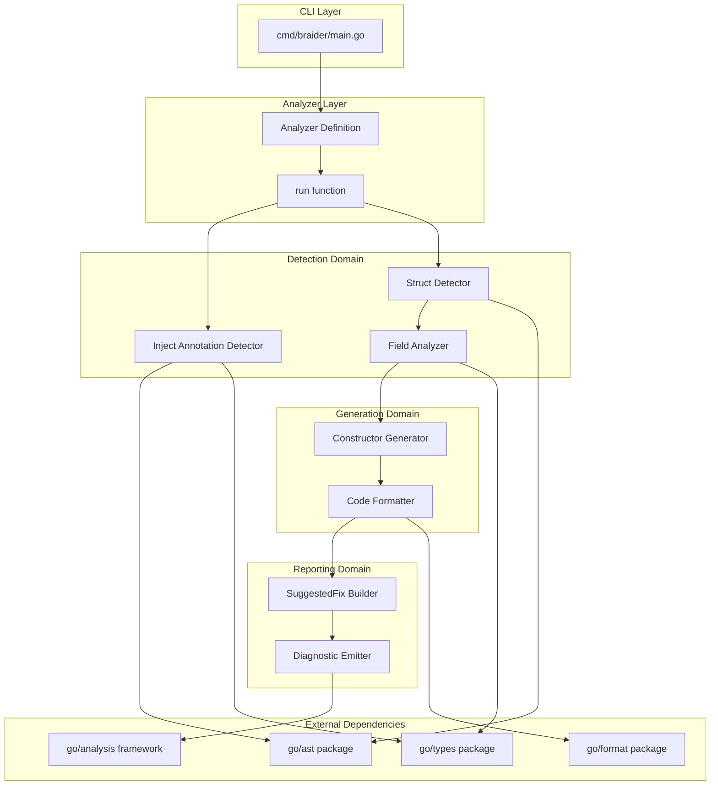
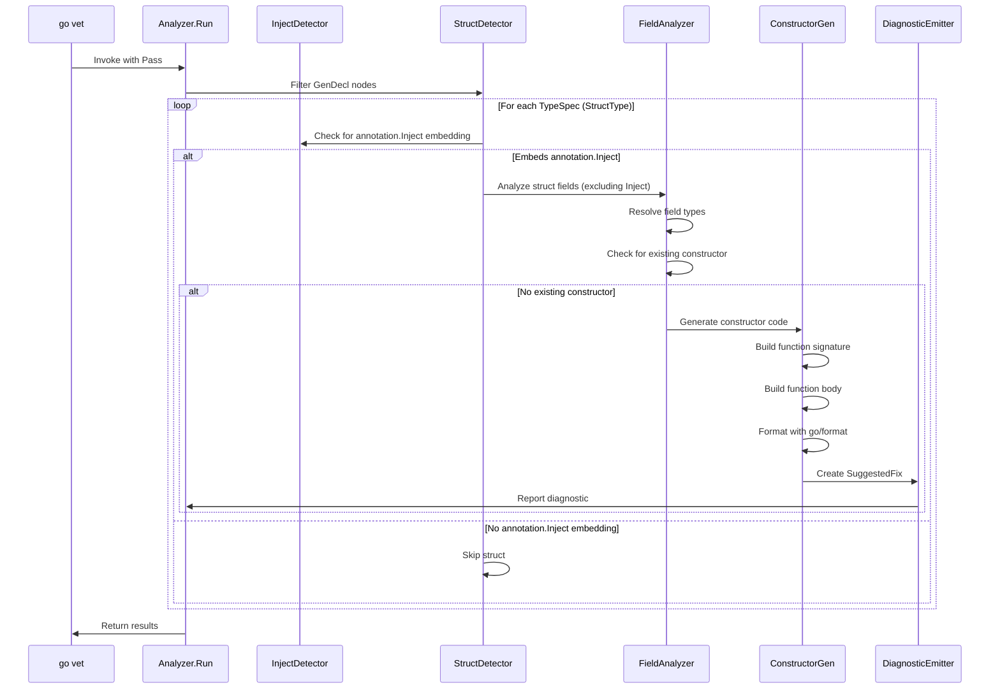
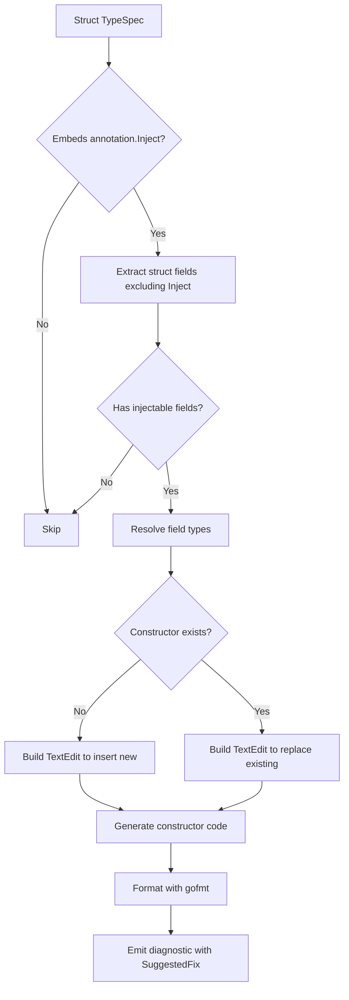
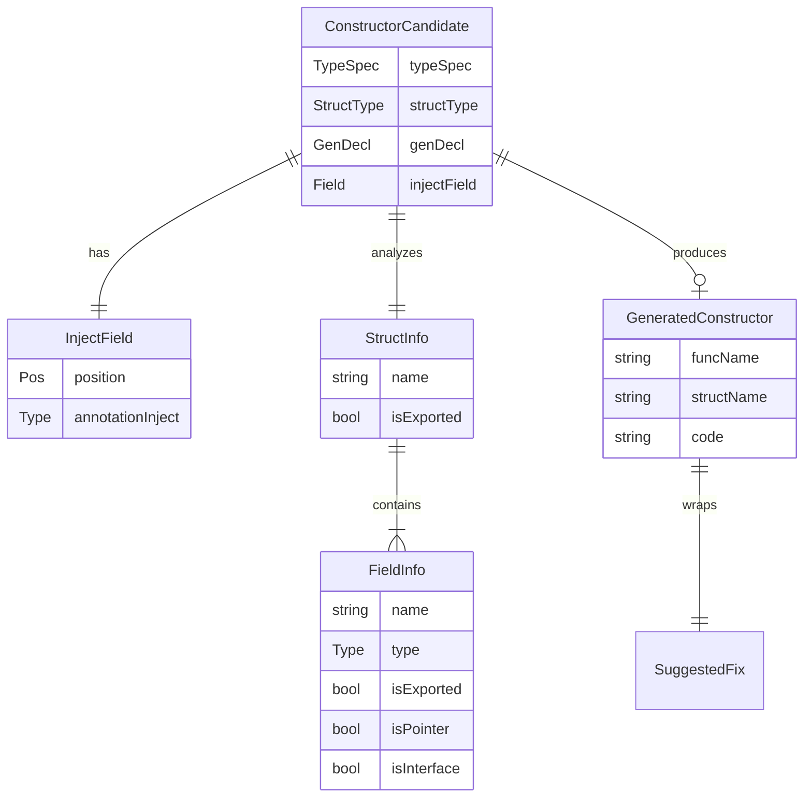

# Technical Design Document: Constructor Auto-Generation

## Overview

**Purpose**: This feature delivers automatic constructor function generation to Go developers using braider, enabling them to reduce boilerplate code for dependency injection patterns.

**Users**: Go developers working with dependency injection patterns will utilize this feature to automatically generate idiomatic `New<StructName>` constructor functions for structs marked with braider directives.

**Impact**: This feature extends the existing braider analyzer by adding struct detection via marker comments, AST-based field analysis, and constructor code generation through the `analysis.SuggestedFix` mechanism.

### Goals

- Detect structs embedding `annotation.Inject` for constructor generation
- Generate idiomatic Go constructor functions following naming conventions (`New<StructName>`)
- Integrate seamlessly with `go vet -fix` workflow via `SuggestedFix`
- Produce gofmt-compatible code output
- Provide clear diagnostic messages for error scenarios

### Non-Goals

- Full dependency injection container generation (deferred to future wiring feature)
- Runtime dependency resolution
- Support for constructor generation without `annotation.Inject` embedding (implicit detection)
- Circular dependency resolution at this phase (detection and reporting only)
- Support for generic struct types (future enhancement)
- Support for comment directive markers (use `annotation.Inject` embedding instead)

## Architecture

### Existing Architecture Analysis

The current braider implementation provides:

- **Analyzer skeleton** (`internal/analyzer.go`): Defines `analysis.Analyzer` with `inspect.Analyzer` dependency
- **CLI entry point** (`cmd/braider/main.go`): Uses `singlechecker.Main()` for go vet integration
- **Test infrastructure** (`internal/analyzer_test.go`): Uses `analysistest` framework
- **Annotation package** (`pkg/annotation/annotation.go`): Defines `Inject` struct type for DI marking

The existing `run` function filters for `*ast.CallExpr` nodes but has no implementation. This design extends the analyzer to also process `*ast.GenDecl` nodes for type declarations.

### Architecture Pattern and Boundary Map



**Architecture Integration**:

- **Selected pattern**: Pipeline architecture with clear domain separation (Detection -> Generation -> Reporting)
- **Domain boundaries**: Detection handles AST traversal and `annotation.Inject` embedding detection; Generation handles code synthesis; Reporting handles diagnostic emission
- **Existing patterns preserved**: Analyzer definition pattern, `inspect.Analyzer` dependency, `analysistest` testing
- **New components rationale**: Each component has single responsibility; separation enables independent testing and future extension
- **Steering compliance**: Follows Go analyzer conventions, uses standard library patterns, maintains compile-time safety
- **Annotation integration**: Uses existing `pkg/annotation.Inject` type for consistent DI marking across braider features

### Technology Stack

| Layer | Choice / Version | Role in Feature | Notes |
|-------|------------------|-----------------|-------|
| Framework | `golang.org/x/tools/go/analysis` | Analyzer interface, diagnostic reporting | v0.29.0 per go.mod |
| AST Processing | `go/ast`, `go/parser` | Struct and comment parsing | Standard library |
| Type Resolution | `go/types` via `pass.TypesInfo` | Field type analysis | Standard library |
| Code Generation | `go/format`, `go/printer` | gofmt-compatible output | Standard library |
| AST Traversal | `golang.org/x/tools/go/ast/inspector` | Efficient node filtering | Via inspect.Analyzer |
| Testing | `golang.org/x/tools/go/analysis/analysistest` | Golden file testing | RunWithSuggestedFixes |

## System Flows

### Main Analysis Flow



### Constructor Generation Detail Flow



## Requirements Traceability

| Requirement | Summary | Components | Interfaces | Flows |
|-------------|---------|------------|------------|-------|
| 1.1 | Detect annotation.Inject-embedded structs | InjectDetector, StructDetector | InjectDetector.HasInjectAnnotation | Main Analysis Flow |
| 1.2 | Recognize exported field dependencies | FieldAnalyzer | FieldAnalyzer.AnalyzeFields | Constructor Generation Flow |
| 1.3 | Recognize unexported field dependencies | FieldAnalyzer | FieldAnalyzer.AnalyzeFields | Constructor Generation Flow |
| 1.4 | Skip structs without injectable deps | FieldAnalyzer | FieldAnalyzer.HasInjectableFields | Constructor Generation Flow |
| 1.5 | Support multi-file package analysis | StructDetector | Pass iteration | Main Analysis Flow |
| 2.1 | Generate New function signature | ConstructorGenerator | GenerateConstructor | Constructor Generation Flow |
| 2.2 | Match parameter order to field order | ConstructorGenerator | GenerateConstructor | Constructor Generation Flow |
| 2.3 | Generate field assignment body | ConstructorGenerator | GenerateConstructor | Constructor Generation Flow |
| 2.4 | Return pointer to struct | ConstructorGenerator | GenerateConstructor | Constructor Generation Flow |
| 2.5 | Use interface types for interface deps | FieldAnalyzer, ConstructorGenerator | ResolveType | Constructor Generation Flow |
| 2.6 | Use concrete types for concrete deps | FieldAnalyzer, ConstructorGenerator | ResolveType | Constructor Generation Flow |
| 3.1 | Emit diagnostic with SuggestedFix | DiagnosticEmitter | EmitConstructorFix | Main Analysis Flow |
| 3.2 | Include TextEdit in SuggestedFix | SuggestedFixBuilder | BuildTextEdit | Main Analysis Flow |
| 3.3 | Support go vet -fix application | SuggestedFixBuilder | TextEdit positioning | Main Analysis Flow |
| 3.4 | Position constructor after struct | SuggestedFixBuilder | CalculateInsertPos | Constructor Generation Flow |
| 3.5 | Replace existing constructors | StructDetector, SuggestedFixBuilder | FindExistingConstructor, BuildReplacementEdit | Main Analysis Flow |
| 4.1 | Pass gofmt validation | CodeFormatter | FormatCode | Constructor Generation Flow |
| 4.2 | Use proper indentation | CodeFormatter | FormatCode | Constructor Generation Flow |
| 4.3 | Derive parameter names from fields | ConstructorGenerator | DeriveParamName | Constructor Generation Flow |
| 4.4 | Handle keyword conflicts | ConstructorGenerator | DeriveParamName | Constructor Generation Flow |
| 4.5 | Include blank line separation | SuggestedFixBuilder | BuildTextEdit | Constructor Generation Flow |
| 5.1 | Report circular dependencies | DependencyChecker | CheckCircular | Main Analysis Flow |
| 5.2 | Include position in diagnostics | DiagnosticEmitter | All methods | All Flows |
| 5.3 | Report generation failures | DiagnosticEmitter | EmitError | Main Analysis Flow |
| 5.4 | Provide actionable guidance | DiagnosticEmitter | All methods | All Flows |
| 6.1 | Recognize annotation.Inject embedding | InjectDetector | HasInjectAnnotation | Main Analysis Flow |
| 6.2 | Detect embedded Inject in struct fields | InjectDetector | FindInjectField | Main Analysis Flow |
| 6.3 | N/A (no malformed markers with embedding) | - | - | - |
| 6.4 | Ignore structs without Inject embedding | InjectDetector, StructDetector | HasInjectAnnotation, FilterStructs | Main Analysis Flow |

## Components and Interfaces

| Component | Domain/Layer | Intent | Req Coverage | Key Dependencies | Contracts |
|-----------|--------------|--------|--------------|------------------|-----------|
| InjectDetector | Detection | Detect annotation.Inject embedding in structs | 1.1, 6.1-6.2, 6.4 | go/ast (P0), go/types (P0) | Service |
| StructDetector | Detection | Identify constructor-candidate structs | 1.1, 1.5, 3.5 | inspector (P0), InjectDetector (P0) | Service |
| FieldAnalyzer | Detection | Analyze struct fields and resolve types | 1.2-1.4, 2.5-2.6 | pass.TypesInfo (P0) | Service |
| ConstructorGenerator | Generation | Generate constructor function code | 2.1-2.4, 4.3-4.4 | FieldAnalyzer (P0) | Service |
| CodeFormatter | Generation | Format generated code with gofmt | 4.1-4.2 | go/format (P0) | Service |
| SuggestedFixBuilder | Reporting | Build SuggestedFix with TextEdits | 3.1-3.4, 4.5 | pass.Fset (P0) | Service |
| DiagnosticEmitter | Reporting | Emit diagnostics to analysis pass | 5.1-5.4 | pass.Report (P0) | Service |

### Detection Domain

#### InjectDetector

| Field | Detail |
|-------|--------|
| Intent | Detect `annotation.Inject` embedding in struct types |
| Requirements | 1.1, 6.1, 6.2, 6.4 |

**Responsibilities and Constraints**

- Detect embedded `annotation.Inject` field in struct types
- Identify the position of the Inject embedding for field filtering
- Validate that the embedded type is the correct `github.com/miyamo2/braider/pkg/annotation.Inject`
- Boundary: Injection detection only; does not analyze other struct content

**Dependencies**

- Inbound: StructDetector - requests Inject check for StructType (P0)
- External: `go/ast.StructType` - struct field list (P0)
- External: `go/types.Info` - type resolution for import verification (P0)

**Contracts**: Service [x]

##### Service Interface

```go
// InjectDetector detects annotation.Inject embedding in structs.
type InjectDetector interface {
    // HasInjectAnnotation checks if a struct embeds annotation.Inject.
    // Returns true if the struct has an embedded annotation.Inject field.
    HasInjectAnnotation(pass *analysis.Pass, st *ast.StructType) bool

    // FindInjectField returns the embedded Inject field if present.
    // Returns nil if no Inject embedding is found.
    FindInjectField(pass *analysis.Pass, st *ast.StructType) *ast.Field
}

// InjectAnnotationPath is the import path for the annotation package.
const InjectAnnotationPath = "github.com/miyamo2/braider/pkg/annotation"

// InjectTypeName is the type name for the Inject annotation.
const InjectTypeName = "Inject"
```

- Preconditions: StructType must have valid Fields list; pass must have TypesInfo
- Postconditions: Returns true only if struct embeds `annotation.Inject` from the correct package
- Invariants: Only anonymous (embedded) fields of type `annotation.Inject` are detected

**Implementation Notes**

- Integration: Invoked during AST traversal for each struct TypeSpec
- Validation: Use `pass.TypesInfo.TypeOf(field.Type)` to verify the type is `annotation.Inject`
- Verification: Check import path to ensure it's the braider annotation package, not a different `Inject` type
- Risks: Must handle aliased imports (e.g., `import ann "github.com/miyamo2/braider/pkg/annotation"`)

#### StructDetector

| Field | Detail |
|-------|--------|
| Intent | Identify structs with `annotation.Inject` embedding for constructor generation |
| Requirements | 1.1, 1.5, 3.5 |

**Responsibilities and Constraints**

- Traverse AST to find type declarations (GenDecl with TypeSpec)
- Filter structs with embedded `annotation.Inject`
- Check for existing constructor functions to avoid duplicates
- Boundary: Struct identification only; does not analyze field content beyond Inject detection

**Dependencies**

- Inbound: run function - entry point for detection (P0)
- Outbound: InjectDetector - Inject embedding validation (P0)
- Outbound: FieldAnalyzer - field analysis for candidates (P0)
- External: `go/ast/inspector.Inspector` - AST traversal (P0)

**Contracts**: Service [x]

##### Service Interface

```go
// StructDetector identifies structs requiring constructor generation.
type StructDetector interface {
    // DetectCandidates returns all structs with annotation.Inject embedding.
    DetectCandidates(pass *analysis.Pass) []ConstructorCandidate

    // FindExistingConstructor returns the existing constructor function declaration if found.
    // Returns nil if no existing constructor exists.
    FindExistingConstructor(pass *analysis.Pass, structName string) *ast.FuncDecl
}

// ConstructorCandidate represents a struct requiring constructor generation.
type ConstructorCandidate struct {
    TypeSpec            *ast.TypeSpec     // The struct type specification
    StructType          *ast.StructType   // The struct type node
    GenDecl             *ast.GenDecl      // Parent declaration (for positioning)
    InjectField         *ast.Field        // The embedded annotation.Inject field
    ExistingConstructor *ast.FuncDecl     // Existing constructor to replace (nil if none)
}
```

- Preconditions: Pass must have valid AST and TypesInfo
- Postconditions: Returns all structs with Inject embedding; ExistingConstructor populated if found
- Invariants: Each candidate has non-nil TypeSpec, StructType, and InjectField

**Implementation Notes**

- Integration: Uses `inspector.Preorder` with `*ast.GenDecl` filter
- Validation: Constructor existence check uses `pass.TypesInfo.Defs` to find `New<Name>` functions
- Risks: Performance with large codebases; mitigated by inspector's efficient traversal

##### Existing Constructor Detection and Replacement

The `FindExistingConstructor` method locates an existing constructor for replacement:

```go
// FindExistingConstructor finds an existing New<StructName> function in the package.
// Detection criteria:
// 1. Function name matches "New" + StructName (case-sensitive)
// 2. Function is defined in the same package as the struct
// 3. Function returns *StructName (pointer to the struct type)
//
// If an existing constructor is found, it will be REPLACED by the generated constructor.
// This ensures the constructor always reflects the current struct field definitions.
func (d *structDetector) FindExistingConstructor(pass *analysis.Pass, structName string) *ast.FuncDecl
```

**Detection Strategy**:
- Iterate through `pass.TypesInfo.Defs` to find function declarations
- Match function name pattern `New<StructName>`
- Verify return type is `*StructName`
- Return the `*ast.FuncDecl` for replacement positioning

**Replacement Behavior**:
- If existing constructor found: Generate `TextEdit` that replaces the entire function
- If no existing constructor: Generate `TextEdit` that inserts after struct definition
- This ensures constructors always match current struct field definitions

#### FieldAnalyzer

| Field | Detail |
|-------|--------|
| Intent | Analyze struct fields to determine constructor parameters and types |
| Requirements | 1.2, 1.3, 1.4, 2.5, 2.6 |

**Responsibilities and Constraints**

- Extract field list from struct type
- **Exclude `annotation.Inject` embedded field from constructor parameters**
- Resolve field types using type checker information
- Determine if fields are injectable (exclude embedded fields, constants)
- Classify types as interface vs concrete for parameter type selection
- Boundary: Field analysis only; does not generate code

**Dependencies**

- Inbound: StructDetector - receives candidates (P0)
- Outbound: ConstructorGenerator - provides field info (P0)
- External: `types.Info` via `pass.TypesInfo` - type resolution (P0)

**Contracts**: Service [x]

##### Service Interface

```go
// FieldAnalyzer analyzes struct fields for constructor generation.
type FieldAnalyzer interface {
    // AnalyzeFields extracts injectable fields from a struct.
    // Excludes the embedded annotation.Inject field from results.
    AnalyzeFields(pass *analysis.Pass, st *ast.StructType, injectField *ast.Field) []FieldInfo

    // HasInjectableFields returns true if the struct has fields requiring injection.
    HasInjectableFields(fields []FieldInfo) bool
}

// FieldInfo contains analyzed information about a struct field.
type FieldInfo struct {
    Name       string       // Field name (or generated name for anonymous)
    TypeExpr   ast.Expr     // Original type expression from AST
    Type       types.Type   // Resolved type from type checker
    IsExported bool         // Whether the field is exported
    IsPointer  bool         // Whether the type is a pointer
    IsInterface bool        // Whether the type is an interface
}
```

- Preconditions: StructType must have valid Fields list; injectField identifies the Inject embedding to exclude
- Postconditions: Returns FieldInfo for each injectable field in declaration order, excluding Inject
- Invariants: Field order matches struct definition order; Inject field is never included

**Implementation Notes**

- Integration: Called after StructDetector identifies candidates
- Validation: Use `pass.TypesInfo.TypeOf(field.Type)` for type resolution
- Exclusion: Compare field position with injectField to skip the annotation.Inject embedding
- Risks: Other embedded structs require special handling (currently excluded from injection)

### Generation Domain

#### ConstructorGenerator

| Field | Detail |
|-------|--------|
| Intent | Generate constructor function source code from analyzed struct |
| Requirements | 2.1, 2.2, 2.3, 2.4, 4.3, 4.4 |

**Responsibilities and Constraints**

- Generate `New<StructName>` function signature
- Generate parameter list matching field order and types
- Generate function body with field assignments
- Handle parameter naming to avoid keyword conflicts
- Boundary: Code generation only; does not format or emit

**Dependencies**

- Inbound: FieldAnalyzer - field information (P0)
- Outbound: CodeFormatter - formatting (P0)
- External: `go/ast` - node construction (P0)

**Contracts**: Service [x]

##### Service Interface

```go
// ConstructorGenerator generates constructor function code.
type ConstructorGenerator interface {
    // GenerateConstructor creates constructor code for a struct.
    GenerateConstructor(candidate ConstructorCandidate, fields []FieldInfo) (*GeneratedConstructor, error)
}

// GeneratedConstructor contains the generated constructor code.
type GeneratedConstructor struct {
    FuncName   string   // Function name (New<StructName>)
    StructName string   // Original struct name
    Code       string   // Formatted constructor source code
}
```

- Preconditions: Candidate must have valid TypeSpec; fields must be non-empty
- Postconditions: Returns syntactically valid Go function code
- Invariants: Function name follows `New<StructName>` convention

**Implementation Notes**

- Integration: Receives analyzed data, produces code string
- Validation: Parameter name derivation uses `deriveParamName` helper with keyword check
- Risks: Complex type expressions (generics, nested) may require special rendering

##### Parameter Naming Rules

```go
// deriveParamName converts a field name to a valid parameter name.
// Rules:
// 1. Convert first letter to lowercase
// 2. If result is a Go keyword, append underscore
// 3. If result conflicts with builtin, use field name with "param" suffix
func deriveParamName(fieldName string) string
```

Reserved identifiers to check:
- Go keywords: `break`, `case`, `chan`, `const`, `continue`, `default`, `defer`, `else`, `fallthrough`, `for`, `func`, `go`, `goto`, `if`, `import`, `interface`, `map`, `package`, `range`, `return`, `select`, `struct`, `switch`, `type`, `var`
- Builtins: `append`, `cap`, `close`, `complex`, `copy`, `delete`, `imag`, `len`, `make`, `new`, `panic`, `print`, `println`, `real`, `recover`

#### CodeFormatter

| Field | Detail |
|-------|--------|
| Intent | Format generated code to pass gofmt validation |
| Requirements | 4.1, 4.2 |

**Responsibilities and Constraints**

- Apply `go/format.Source` to generated code
- Ensure consistent indentation and spacing
- Boundary: Formatting only; does not modify code semantics

**Dependencies**

- Inbound: ConstructorGenerator - raw code (P0)
- Outbound: SuggestedFixBuilder - formatted code (P0)
- External: `go/format` - gofmt implementation (P0)

**Contracts**: Service [x]

##### Service Interface

```go
// CodeFormatter formats generated Go code.
type CodeFormatter interface {
    // FormatCode applies gofmt to the provided source code.
    FormatCode(code string) (string, error)
}
```

- Preconditions: Code must be syntactically valid Go
- Postconditions: Returns gofmt-compliant code or error
- Invariants: Output passes `go/format.Source` without modification

**Implementation Notes**

- Integration: Called after code generation, before TextEdit creation
- Validation: Errors indicate code generation bugs (should not occur in normal operation)
- Risks: Minimal; go/format is well-tested standard library

### Reporting Domain

#### SuggestedFixBuilder

| Field | Detail |
|-------|--------|
| Intent | Build SuggestedFix with properly positioned TextEdits for insertion or replacement |
| Requirements | 3.1, 3.2, 3.3, 3.4, 4.5 |

**Responsibilities and Constraints**

- Calculate insertion position after struct definition (for new constructors)
- Calculate replacement range for existing constructors
- Include blank line separator between struct and constructor
- Create TextEdit with correct Pos/End for insertion or replacement
- Build SuggestedFix with descriptive message
- Boundary: Fix construction only; does not emit diagnostics

**Dependencies**

- Inbound: CodeFormatter - formatted code (P0)
- Outbound: DiagnosticEmitter - completed fix (P0)
- External: `token.FileSet` via `pass.Fset` - position calculation (P0)

**Contracts**: Service [x]

##### Service Interface

```go
// SuggestedFixBuilder constructs SuggestedFix for diagnostics.
type SuggestedFixBuilder interface {
    // BuildConstructorFix creates a SuggestedFix for constructor insertion or replacement.
    // If candidate.ExistingConstructor is non-nil, builds a replacement TextEdit.
    // Otherwise, builds an insertion TextEdit after the struct definition.
    BuildConstructorFix(
        pass *analysis.Pass,
        candidate ConstructorCandidate,
        constructor *GeneratedConstructor,
    ) analysis.SuggestedFix
}
```

- Preconditions: Candidate and constructor must be valid; pass must have valid Fset
- Postconditions: Returns SuggestedFix with single non-overlapping TextEdit
- Invariants:
  - For insertion: TextEdit.Pos equals TextEdit.End (pure insertion)
  - For replacement: TextEdit.Pos < TextEdit.End (spans existing constructor)

**Implementation Notes**

- Integration: Final step before diagnostic emission
- Validation: Position calculation uses `candidate.GenDecl.End()` + newline offset
- Risks: Multi-spec GenDecl requires finding specific TypeSpec end position

##### TextEdit Position Calculation

```go
// INSERTION (no existing constructor):
// For a GenDecl with single TypeSpec:
// Insert position = GenDecl.End() (after closing brace or final token)
// NewText = "\n\n" + formattedConstructorCode

// For a GenDecl with multiple TypeSpecs (grouped type block):
// Find the specific TypeSpec's end position
// Insert position = TypeSpec end + appropriate offset

// REPLACEMENT (existing constructor found):
// Pos = ExistingConstructor.Pos() (start of existing func, including doc comment)
// End = ExistingConstructor.End() (end of existing func closing brace)
// NewText = formattedConstructorCode (replaces entire function)
//
// IMPORTANT: Line count may differ between old and new constructors.
// TextEdit handles this correctly because:
// - Pos and End define a byte range, not line range
// - The entire range [Pos, End) is replaced with NewText
// - NewText can be shorter, longer, or same length as original
// - go vet -fix handles the file rewriting correctly
```

**Replacement Edge Cases**:

1. **Line count increase** (new fields added):
   - Old: 8 lines, New: 12 lines
   - TextEdit replaces byte range, file grows automatically

2. **Line count decrease** (fields removed):
   - Old: 12 lines, New: 8 lines
   - TextEdit replaces byte range, file shrinks automatically

3. **Doc comment handling**:
   - Include doc comment in replacement range: `ExistingConstructor.Doc.Pos()` if Doc exists
   - Otherwise use `ExistingConstructor.Pos()`

```go
// calculateReplacementRange returns the byte range for replacing an existing constructor.
func calculateReplacementRange(fn *ast.FuncDecl) (start, end token.Pos) {
    // Include doc comment if present
    if fn.Doc != nil {
        start = fn.Doc.Pos()
    } else {
        start = fn.Pos()
    }
    end = fn.End()
    return start, end
}
```

#### DiagnosticEmitter

| Field | Detail |
|-------|--------|
| Intent | Emit diagnostics with SuggestedFixes to analysis pass |
| Requirements | 5.1, 5.2, 5.3, 5.4 |

**Responsibilities and Constraints**

- Report diagnostics for constructor generation
- Report errors for malformed markers
- Report circular dependency detection
- Include source position in all messages
- Provide actionable guidance in messages
- Boundary: Diagnostic emission only; uses pass.Report

**Dependencies**

- Inbound: All components - diagnostic requests (P0)
- External: `analysis.Pass.Report` - diagnostic API (P0)

**Contracts**: Service [x]

##### Service Interface

```go
// DiagnosticEmitter emits diagnostics to the analysis pass.
type DiagnosticEmitter interface {
    // EmitConstructorFix reports a diagnostic with constructor SuggestedFix.
    EmitConstructorFix(
        pass *analysis.Pass,
        pos token.Pos,
        structName string,
        fix analysis.SuggestedFix,
    )

    // EmitCircularDependency reports a circular dependency error.
    EmitCircularDependency(pass *analysis.Pass, pos token.Pos, cycle []string)

    // EmitGenerationError reports a constructor generation failure.
    EmitGenerationError(pass *analysis.Pass, pos token.Pos, structName string, err error)
}
```

- Preconditions: Pass must be valid; pos must be within analyzed files
- Postconditions: Diagnostic emitted via pass.Report
- Invariants: All diagnostics include valid position information

**Implementation Notes**

- Integration: Called by all components that detect issues or generate fixes
- Validation: Position validation uses pass.Fset.Position
- Risks: Message formatting should be consistent across all emission types

##### Diagnostic Message Templates

| Category | Message Template | Example |
|----------|------------------|---------|
| Constructor available | `missing constructor for %s` | `missing constructor for UserService` |
| Circular dependency | `circular dependency detected: %s` | `circular dependency detected: A -> B -> A` |
| Generation error | `failed to generate constructor for %s: %s` | `failed to generate constructor for Config: invalid field type` |

## Data Models

### Domain Model

#### Core Entities



**Aggregates and Boundaries**

- `ConstructorCandidate`: Root aggregate for detection phase; owns reference to InjectField
- `GeneratedConstructor`: Root aggregate for generation phase; immutable value object
- Transaction scope: Single struct analysis is atomic; no cross-struct dependencies

**Business Rules**

1. A struct requires embedded `annotation.Inject` to be processed
2. A struct must have at least one injectable field (excluding Inject) to generate a constructor
3. Existing `New<StructName>` constructors are always replaced to ensure consistency
4. Field order in constructor parameters matches declaration order (excluding Inject)

### Logical Data Model

#### Injection Annotation Format

Structs requiring constructor generation embed `annotation.Inject` from the braider package:

```go
import "github.com/miyamo2/braider/pkg/annotation"
```

**Embedding Rules**:
- Import: Must import `github.com/miyamo2/braider/pkg/annotation` package
- Embedding: Anonymous (embedded) field of type `annotation.Inject`
- Position: Can be anywhere in the struct field list (typically first field by convention)

**Examples**:
```go
import "github.com/miyamo2/braider/pkg/annotation"

// Valid: struct with embedded annotation.Inject
type UserService struct {
    annotation.Inject
    repo UserRepository
    logger Logger
}

// Valid: with aliased import
import ann "github.com/miyamo2/braider/pkg/annotation"

type OrderService struct {
    ann.Inject
    repo OrderRepository
}

// Invalid: not embedded (named field)
type InvalidService struct {
    inject annotation.Inject  // Named field, not detected
    repo UserRepository
}

// Invalid: wrong package
import "some/other/annotation"

type AnotherInvalid struct {
    annotation.Inject  // Wrong package, not detected
}
```

#### Constructor Code Template

```go
// New{StructName} is a constructor for {StructName}.
//
// Generated by braider. DO NOT EDIT.
func New{StructName}({params}) *{StructName} {
    return &{StructName}{
        {fieldAssignments}
    }
}
```

**Template Variables**:
- `{StructName}`: Original struct name (preserves case)
- `{params}`: Comma-separated `paramName ParamType` pairs (excluding Inject)
- `{fieldAssignments}`: Newline-separated `fieldName: paramName,` entries (excluding Inject)

**GoDoc Requirements**:
- First line: Simple constructor description `New{StructName} is a constructor for {StructName}.`
- Second line: Empty line (GoDoc convention)
- Third line: `Generated by braider. DO NOT EDIT.` marker indicating auto-generation

**Note**: The `annotation.Inject` embedded field is NOT included in the constructor parameters or field assignments, as it is a zero-value marker type with no initialization required.

## Error Handling

### Error Strategy

The analyzer follows a fail-fast approach with graceful degradation:

1. **Malformed markers**: Report diagnostic and skip struct (do not halt analysis)
2. **Type resolution failures**: Report diagnostic and skip field (continue with other fields)
3. **Code generation failures**: Report diagnostic with reason (do not suggest fix)
4. **Circular dependencies**: Report diagnostic with cycle path (do not suggest fix)

### Error Categories and Responses

**User Errors (Code Issues)**:
- No injectable fields (only Inject embedding): Silent skip (not an error condition)
- No Inject embedding: Silent skip (struct not opted-in)

**Analysis Errors (Type System)**:
- Unresolved type: Report field name and position
- Unsupported type (generics): Report limitation message
- Wrong Inject package: Silent skip (not the braider annotation)

**Internal Errors (Generation)**:
- Code formatting failure: Report as bug with generated code snippet
- Position calculation error: Report with AST context

**Note**: Existing constructors are always replaced (not skipped) to ensure consistency with current struct definitions.

### Monitoring

- All diagnostics include source position for IDE integration
- Error counts available via standard go/analysis result mechanism
- Suggested fix application tracked by go vet -fix

## Testing Strategy

### Unit Tests

Core function testing using standard Go testing:

1. **InjectDetector.HasInjectAnnotation**: Valid/invalid Inject embedding detection
2. **InjectDetector.FindInjectField**: Finding embedded Inject field in struct
3. **FieldAnalyzer.AnalyzeFields**: Field extraction with various types (excluding Inject)
4. **ConstructorGenerator.deriveParamName**: Keyword/builtin conflict handling
5. **CodeFormatter.FormatCode**: Formatting edge cases

### Integration Tests

Using `analysistest.Run` for analyzer behavior:

1. **Positive cases**: Struct with embedded `annotation.Inject` generates constructor
2. **Negative cases**: Struct without Inject embedding is skipped
3. **Replacement cases**: Existing constructor is replaced with regenerated version
4. **Import cases**: Aliased imports correctly detected
5. **Wrong package**: Inject from different package is ignored

### Golden File Tests

Using `analysistest.RunWithSuggestedFixes` for output verification:

1. **Simple struct**: Single field constructor with Inject embedding
2. **Multi-field struct**: Multiple dependencies in order
3. **Interface fields**: Interface type parameters
4. **Mixed fields**: Pointer and value types
5. **Keyword handling**: Parameter name with keyword conflict
6. **Aliased import**: Inject with aliased annotation package

#### Test Directory Structure

```
internal/testdata/src/
  constructorgen/
    simple.go           # Simple struct with Inject embedding
    simple.go.golden    # Expected output after fix
    multifield.go       # Multi-field struct
    multifield.go.golden
    interface.go        # Interface-typed fields
    interface.go.golden
    noinject.go         # Struct without Inject (no changes)
    existing.go         # Struct with existing constructor (replacement)
    existing.go.golden  # Expected output after replacement
    aliased.go          # Aliased annotation import
    aliased.go.golden
```

#### Existing Constructor Replacement Test Case

**Input** (`existing.go`):
```go
package constructorgen

import "github.com/miyamo2/braider/pkg/annotation"

type ConfigService struct {
    annotation.Inject
    config Config
    logger Logger  // New field added
}

// NewConfigService is an outdated constructor.
func NewConfigService(config Config) *ConfigService {
    return &ConfigService{
        config: config,
    }
}

type Config struct {
    DSN string
}

type Logger interface {
    Info(msg string)
}
```

**Expected Output** (`existing.go.golden`):
```go
package constructorgen

import "github.com/miyamo2/braider/pkg/annotation"

type ConfigService struct {
    annotation.Inject
    config Config
    logger Logger  // New field added
}

// NewConfigService is a constructor for ConfigService.
//
// Generated by braider. DO NOT EDIT.
func NewConfigService(config Config, logger Logger) *ConfigService {
    return &ConfigService{
        config: config,
        logger: logger,
    }
}

type Config struct {
    DSN string
}

type Logger interface {
    Info(msg string)
}
```

**Expected Behavior**: Existing constructor is replaced with regenerated constructor that includes the new `logger` field.

**Line Count Change**:
- Input constructor: 6 lines (no doc comment, single parameter)
- Output constructor: 9 lines (with doc comment, two parameters, additional field assignment)
- TextEdit replaces byte range `[Pos, End)` regardless of line count difference

#### Example Test Case

**Input** (`simple.go`):
```go
package constructorgen

import "github.com/miyamo2/braider/pkg/annotation"

type UserService struct {
    annotation.Inject
    repo UserRepository
}

type UserRepository interface {
    FindByID(id string) (*User, error)
}

type User struct {
    ID   string
    Name string
}
```

**Expected Output** (`simple.go.golden`):
```go
package constructorgen

import "github.com/miyamo2/braider/pkg/annotation"

type UserService struct {
    annotation.Inject
    repo UserRepository
}

// NewUserService is a constructor for UserService.
//
// Generated by braider. DO NOT EDIT.
func NewUserService(repo UserRepository) *UserService {
    return &UserService{
        repo: repo,
    }
}

type UserRepository interface {
    FindByID(id string) (*User, error)
}

type User struct {
    ID   string
    Name string
}
```

### Performance Tests

Not required for initial implementation. Performance monitoring can be added if analysis time becomes a concern with large codebases.

## Supporting References

### Go Keywords and Builtins Reference

```go
var goKeywords = map[string]bool{
    "break": true, "case": true, "chan": true, "const": true,
    "continue": true, "default": true, "defer": true, "else": true,
    "fallthrough": true, "for": true, "func": true, "go": true,
    "goto": true, "if": true, "import": true, "interface": true,
    "map": true, "package": true, "range": true, "return": true,
    "select": true, "struct": true, "switch": true, "type": true,
    "var": true,
}

var goBuiltins = map[string]bool{
    "append": true, "cap": true, "close": true, "complex": true,
    "copy": true, "delete": true, "imag": true, "len": true,
    "make": true, "new": true, "panic": true, "print": true,
    "println": true, "real": true, "recover": true,
    "error": true, "true": true, "false": true, "iota": true, "nil": true,
}
```

### External Documentation References

- [go/analysis SuggestedFix documentation](https://github.com/golang/tools/blob/master/go/analysis/doc/suggested_fixes.md)
- [go/analysis package reference](https://pkg.go.dev/golang.org/x/tools/go/analysis)
- [analysistest package for testing](https://pkg.go.dev/golang.org/x/tools/go/analysis/analysistest)
- [Using go/analysis to fix your source code](https://arslan.io/2020/07/07/using-go-analysis-to-fix-your-source-code/)
