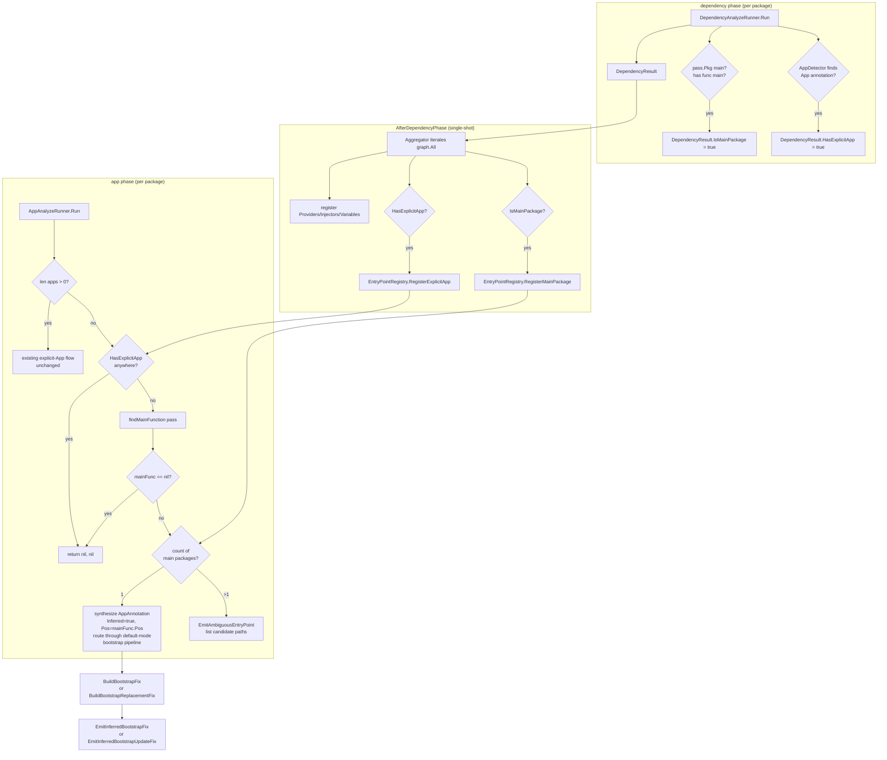
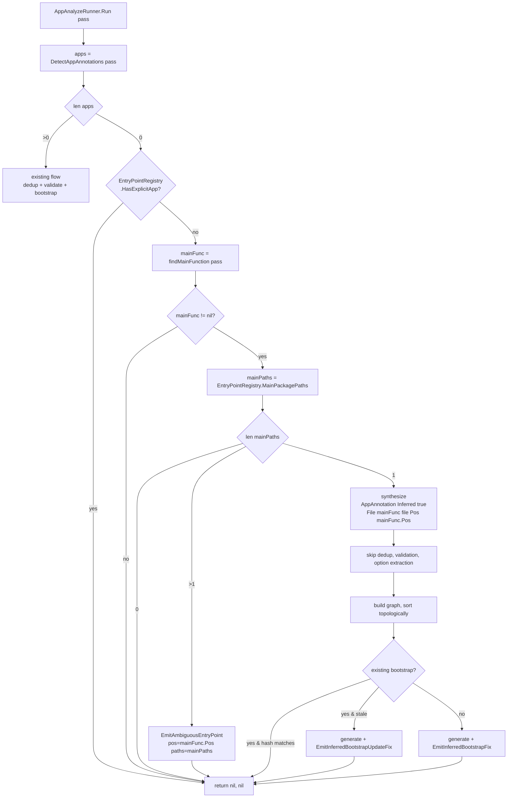

# Design Document: optional-app-annotation

## Overview

**Purpose**: Make `annotation.App[T](main)` optional for projects with exactly one main package in the analyzed scope. braider infers the unique main package as the entry point and generates the same `app.Default` bootstrap that an explicit `annotation.App[app.Default](main)` would produce. When more than one main package is present and no explicit `App` annotation exists, braider emits an ambiguity diagnostic instead of guessing.

**Users**: Developers using braider on single-`main`-package projects, who currently must declare a boilerplate `App[app.Default]` even though the entry point is unambiguous.

**Impact**: Extends the existing two-phase pipeline (`dependency` → `app`) by adding a small entry-point aggregation step. No change to public API in `pkg/annotation/`; one documentation update in `pkg/annotation/app`. One existing e2e test fixture (`noapp`) changes behavior and its golden is updated.

### Goals

- Infer `annotation.App[app.Default](main)` semantics when exactly one main package is in scope and no explicit `App` annotation exists.
- Emit an actionable, per-main-package ambiguity diagnostic when multiple main packages are in scope and no explicit `App` exists.
- Preserve all existing explicit-`App` behavior unchanged (precedence, duplicate-file warnings, non-main reference validation, default/container option semantics).
- Reuse the existing bootstrap generation pipeline, idempotency hash mechanism, and `braider -fix` workflow without duplication.

### Non-Goals

- Inferring `app.Container[T]` mode — container type parameters cannot be inferred.
- Inferring main packages outside the analyzer's invocation scope (no module-wide discovery beyond `pass.Pkg`-reachable packages).
- Changing the `dependency` phase semantics (Injectable / Provide / Variable detection).
- Adding a separate "entry-point resolution" pipeline phase. The decision fits within the existing `Aggregator.AfterDependencyPhase` + `AppAnalyzeRunner.Run` seam.

## Boundary Commitments

### This Spec Owns
- Detection of main packages within the analyzed scope during the `dependency` phase.
- Detection of explicit `App` annotation presence across the analyzed scope during the `dependency` phase.
- Cross-phase aggregation of main-package and explicit-App presence via a new `EntryPointRegistry`.
- Inference logic inside `AppAnalyzeRunner.Run`: synthesize an inferred `AppAnnotation`, route it through the existing default-mode bootstrap generation flow, or emit ambiguity diagnostics.
- Three new diagnostic messages (inferred bootstrap missing, inferred bootstrap update, ambiguous entry point).
- Documentation of inference rules in `pkg/annotation/app`.

### Out of Boundary
- Validation rules for explicit `App` annotations — unchanged.
- Container-mode bootstrap generation (`app.Container[T]`) — unchanged.
- `DependencyAnalyzer`'s constructor-generation, provider, injector, and variable detection — unchanged in semantics.
- `BuildBootstrapFix` / `BuildBootstrapReplacementFix` internal mechanics — used as-is.
- Public `pkg/annotation/{app,inject,provide,variable}` API surface — no type or signature changes.

### Allowed Dependencies
- `internal/detect.AppDetector` may be injected into `DependencyAnalyzeRunner` (already injected into `AppAnalyzeRunner`).
- `internal/analyzer.Aggregator` may read new fields on `DependencyResult` and write to `EntryPointRegistry`.
- `internal/analyzer.AppAnalyzeRunner` may read `EntryPointRegistry` and synthesize `*detect.AppAnnotation` values.
- `internal/report.DiagnosticEmitter` interface may be extended with three new methods.
- `cmd/braider/main.go` will be re-generated (dogfood) to wire the new registry into the existing container struct.

### Revalidation Triggers
- Any change to `AppAnnotation` struct fields beyond the new `Inferred` flag (would affect detect/report).
- Adding new App option types (e.g., a new `app.X`) that interact with the default-mode path.
- Changing the `dependency` → `app` phase boundary in `phasedchecker.Config` (would require re-checking that aggregation runs before inference).
- Changing the bootstrap generation contract (`GenerateBootstrap` / `CheckBootstrapCurrent`) — inferred-App uses the same default-mode entry points.

## Architecture

### Existing Architecture Analysis

The current pipeline:

1. **`dependency` phase** — per-package; `DependencyAnalyzeRunner.Run(pass)` returns `*DependencyResult` with providers/injectors/variables collected from that package.
2. **`Aggregator.AfterDependencyPhase(graph)`** — single-shot after all dependency analyzers complete; iterates `graph.All()`, reads each `*DependencyResult`, registers entries into shared registries (`ProviderRegistry`, `InjectorRegistry`, `VariableRegistry`, `DuplicateRegistry`).
3. **`app` phase** — per-package; `AppAnalyzeRunner.Run(pass)` detects `annotation.App` calls in the current package, validates, builds the dependency graph (from shared registries), runs topological sort, generates default or container bootstrap, emits diagnostics with `analysis.SuggestedFix`.

The aggregator-to-app-phase boundary is the natural seam for cross-package decisions because the aggregator runs strictly between the per-package dependency runs and the per-package app runs.

### Architecture Pattern & Boundary Map



**Architecture Integration**:
- Selected pattern: **Cross-phase aggregation extension** — reuses the existing `Aggregator` seam; one new registry; no new phase.
- Domain boundaries: detection (`internal/detect`) stays detection-only; aggregation (`internal/analyzer.Aggregator`) gains one new responsibility (entry-point registration); decision logic stays in `AppAnalyzeRunner`.
- Existing patterns preserved: per-package `DependencyResult` return values; thread-safe registries with `sync.RWMutex`; synthesized-marker reuse pattern (analogous to `DuplicateRegistry`'s deferred reporting).
- Steering compliance: component-based architecture maintained; phased pipeline pattern preserved; SuggestedFix workflow preserved.

### Technology Stack

| Layer | Choice / Version | Role in Feature | Notes |
|-------|------------------|-----------------|-------|
| Language | go 1.25 | Implementation language | unchanged |
| Pipeline | `github.com/miyamo2/phasedchecker` | Two-phase orchestration | unchanged |
| AST | `golang.org/x/tools/go/analysis` + `inspect` | Detection of `func main` and `App` calls in dependency phase | reuses existing AppDetector |
| Concurrency | `sync.RWMutex` | EntryPointRegistry thread safety | matches existing registry patterns |

## File Structure Plan

### Directory Structure
```
internal/
├── analyzer/
│   ├── aggregator.go              # MODIFIED: write to EntryPointRegistry
│   ├── app.go                     # MODIFIED: inference branch + ambiguity branch
│   ├── dependency.go              # MODIFIED: populate new DependencyResult fields
│   └── result.go                  # MODIFIED: add IsMainPackage, HasExplicitApp, PackagePath
├── detect/
│   └── app.go                     # MODIFIED: add Inferred flag on AppAnnotation
├── registry/
│   └── entrypoint_registry.go     # NEW: thread-safe main-package + explicit-App registry
├── report/
│   └── diagnostic.go              # MODIFIED: 3 new emit methods
pkg/
└── annotation/
    └── app/
        └── app.go                 # MODIFIED: doc comment update
cmd/
└── braider/
    └── main.go                    # MODIFIED (dogfood): EntryPointRegistry wired into container; bootstrap regenerated
internal/analyzer/testdata/e2e/
├── noapp/                         # MODIFIED: golden updated to inferred bootstrap (rename optional)
├── inferred_app_basic/            # NEW: single main, no App, has dependencies → inferred bootstrap
├── inferred_app_empty/            # NEW: single main, no App, no dependencies → inferred empty bootstrap
├── inferred_app_idempotent/       # NEW: existing inferred bootstrap with matching hash → no diff
├── inferred_app_outdated/         # NEW: existing inferred bootstrap with stale hash → update fix
└── ambiguous_entry_point/         # NEW: two main packages, no App anywhere → ambiguity diagnostic
internal/analyzer/integration_test.go  # MODIFIED: add new cases to TestIntegration table
```

### Modified Files
- `internal/analyzer/result.go` — `DependencyResult` gains `IsMainPackage`, `HasExplicitApp`, `PackagePath`.
- `internal/analyzer/dependency.go` — inject `appDetector detect.AppDetector`; populate the new `DependencyResult` fields in `Run`.
- `internal/analyzer/aggregator.go` — inject `*registry.EntryPointRegistry`; after the existing loop, register main-package paths and explicit-App presence.
- `internal/analyzer/app.go` — inject `*registry.EntryPointRegistry`; add inference branch when `len(apps) == 0`; synthesize `AppAnnotation{Inferred: true}` for single-main, emit ambiguity for multi-main.
- `internal/detect/app.go` — add `Inferred bool` to `AppAnnotation`. No detector logic change.
- `internal/report/diagnostic.go` — add `EmitInferredBootstrapFix`, `EmitInferredBootstrapUpdateFix`, `EmitAmbiguousEntryPoint`.
- `pkg/annotation/app/app.go` — package doc comment describes inference rule.
- `cmd/braider/main.go` — re-generate (dogfood) so the generated `dependency` IIFE wires `EntryPointRegistry` into the container struct.
- `internal/analyzer/testdata/e2e/noapp/main.go.golden` — updated to reflect inferred bootstrap (empty IIFE).
- `internal/analyzer/integration_test.go` — new table entries.

## System Flows

### Inference Decision Flow (per-package app phase)



### Aggregation Flow

```mermaid
sequenceDiagram
    participant Dep as DependencyAnalyzeRunner
    participant Agg as Aggregator
    participant EPR as EntryPointRegistry
    participant App as AppAnalyzeRunner

    loop per package P
        Dep->>Dep: walk pass, detect Injectable/Provide/Variable
        Dep->>Dep: isMain = pass.Pkg.Name == main AND findMainFunction != nil
        Dep->>Dep: appsLocal = appDetector.DetectAppAnnotations(pass)
        Dep-->>Agg: DependencyResult{Providers, Injectors, Variables, IsMainPackage=isMain, HasExplicitApp=len(appsLocal)>0, PackagePath=P}
    end

    Agg->>Agg: AfterDependencyPhase(graph)
    Agg->>Agg: for each DependencyResult: existing register Providers/Injectors/Variables
    Agg->>EPR: if IsMainPackage: RegisterMainPackage(PackagePath)
    Agg->>EPR: if HasExplicitApp: RegisterExplicitApp(PackagePath)

    loop per package P
        App->>App: apps = DetectAppAnnotations(pass)
        alt explicit App in this package
            App->>App: existing flow
        else no app in this package
            App->>EPR: HasExplicitApp()?
            alt explicit App anywhere
                App-->>App: return nil
            else no explicit App anywhere
                App->>EPR: MainPackagePaths()
                alt exactly 1 main, this is it
                    App->>App: synthesize Inferred AppAnnotation; run default bootstrap
                else >1 mains
                    App->>App: EmitAmbiguousEntryPoint
                else 0 mains (not a main package)
                    App-->>App: return nil
                end
            end
        end
    end
```

## Requirements Traceability

| Requirement | Summary | Components | Interfaces / Files |
|---|---|---|---|
| 1.1 | Infer single-main, no-App → bootstrap | AppAnalyzeRunner inference branch | `internal/analyzer/app.go` |
| 1.2 | Use `app.Default` semantics | AppAnalyzeRunner option-extraction skip | `internal/analyzer/app.go` |
| 1.3 | Zero registrations → empty bootstrap | Existing BootstrapGenerator | reused, no change |
| 1.4 | Idempotency on match | Existing `CheckBootstrapCurrent` | reused via `Inferred` branch |
| 1.5 | Stale hash → replacement fix | Existing `BuildBootstrapReplacementFix` | reused via `Inferred` branch |
| 2.1 | Explicit App suppresses inference | EntryPointRegistry.HasExplicitApp + early return | `internal/analyzer/app.go` |
| 2.2 | Explicit App behavior unchanged | Existing flow only runs when `len(apps) > 0` | `internal/analyzer/app.go` (no edit to that branch) |
| 2.3 | No mixed-mode inference | Single global flag suppresses inference everywhere | `EntryPointRegistry`, `internal/analyzer/app.go` |
| 3.1 | Multi-main + no App → ambiguity diagnostic | `EmitAmbiguousEntryPoint` | `internal/report/diagnostic.go` |
| 3.2 | No bootstrap on ambiguity | Return after emit | `internal/analyzer/app.go` |
| 3.3 | Diagnostic lists candidate paths | EntryPointRegistry.MainPackagePaths()  fed to emit | `internal/report/diagnostic.go`, `internal/analyzer/app.go` |
| 4.1 | "Main package" = `package main` + `func main` | `dependency.go` detection (name + findMainFunction) | `internal/analyzer/dependency.go` |
| 4.2 | Scope-limited | Only `pass.Pkg`-iterated packages contribute | natural to phasedchecker |
| 4.3 | `package main` w/o `func main` → no inference, no diagnostic | Registration gated on both checks | `internal/analyzer/dependency.go` |
| 4.4 | Zero mains, no App → no bootstrap, no diagnostic | `mainFunc == nil` short-circuit | `internal/analyzer/app.go` |
| 5.1 | Inferred fix at `mainFunc.Pos()` | Synthetic AppAnnotation Pos = mainFunc.Pos() | `internal/analyzer/app.go` |
| 5.2 | Distinguishable diagnostic message | `EmitInferredBootstrapFix` distinct message | `internal/report/diagnostic.go` |
| 5.3 | Result compiles, structurally identical | Synthetic flows through same `GenerateBootstrap` | `internal/analyzer/app.go` |
| 5.4 | Update on hash mismatch | `EmitInferredBootstrapUpdateFix` | `internal/report/diagnostic.go`, `internal/analyzer/app.go` |
| 6.1, 6.2, 6.3 | Documentation | Doc comment on `pkg/annotation/app` | `pkg/annotation/app/app.go` |

## Components and Interfaces

### Summary

| Component | Domain | Intent | Req Coverage | Key Dependencies | Contracts |
|-----------|--------|--------|--------------|------------------|-----------|
| `EntryPointRegistry` (new) | registry | Cross-phase tracking of main packages and explicit-App presence | 1.1, 2.1, 2.3, 3.1, 3.2, 3.3, 4.1, 4.2 | none | State |
| `DependencyResult` (extended) | analyzer | Per-package payload carrying main-package + App-presence flags | 4.1, 4.3 | — | State |
| `Aggregator` (extended) | analyzer | Push per-package main/App flags into EntryPointRegistry | 1.1, 2.1, 3.1 | EntryPointRegistry | Service |
| `AppAnalyzeRunner` (extended) | analyzer | Inference branch and ambiguity branch in `Run` | 1.x, 2.1, 3.x, 4.4, 5.x | EntryPointRegistry, DiagnosticEmitter, BootstrapGenerator (reused) | Service |
| `DependencyAnalyzeRunner` (extended) | analyzer | Detect main-package and explicit-App per package | 4.1, 4.3 | AppDetector | Service |
| `AppAnnotation.Inferred` (new field) | detect | Marks synthetic AppAnnotation values | 1.1, 5.1, 5.2 | — | State |
| `DiagnosticEmitter` (extended) | report | Three new diagnostic messages | 3.1, 3.3, 5.1, 5.2, 5.4 | — | Service |
| `pkg/annotation/app` doc | docs | User-facing documentation of inference | 6.1, 6.2, 6.3 | — | — |

### registry / EntryPointRegistry

| Field | Detail |
|-------|--------|
| Intent | Hold the set of main-package import paths and the set of explicit-App-bearing package paths discovered across all packages in the analyzed scope. |
| Requirements | 1.1, 2.1, 2.3, 3.1, 3.3, 4.1 |

**Responsibilities & Constraints**
- Idempotent registration: re-registering the same path is a no-op (set semantics).
- Thread-safe with `sync.RWMutex` (same pattern as `DuplicateRegistry`).
- Holds only strings (package import paths), not AST nodes — safe to share across pass goroutines.

**Dependencies**
- Inbound: `Aggregator.AfterDependencyPhase` (writer), `AppAnalyzeRunner.Run` (reader). (P0)
- Outbound: none.

**Contracts**: State

##### Service Interface
```go
package registry

type EntryPointRegistry struct {
    mu                 sync.RWMutex
    mainPackagePaths   map[string]struct{}
    explicitAppPkgPaths map[string]struct{}
}

func NewEntryPointRegistry() *EntryPointRegistry

// RegisterMainPackage records that pkgPath is a main package
// (i.e., `package main` declaration with a top-level `func main`).
// Idempotent.
func (r *EntryPointRegistry) RegisterMainPackage(pkgPath string)

// RegisterExplicitApp records that pkgPath contains at least one
// explicit annotation.App annotation. Idempotent.
func (r *EntryPointRegistry) RegisterExplicitApp(pkgPath string)

// MainPackagePaths returns a stable, lexicographically sorted slice of
// registered main package paths. Safe for the caller to retain.
func (r *EntryPointRegistry) MainPackagePaths() []string

// HasExplicitApp returns true iff at least one explicit App annotation
// was registered anywhere in scope.
func (r *EntryPointRegistry) HasExplicitApp() bool
```

- **Preconditions**: none.
- **Postconditions**: `MainPackagePaths()` returns a sorted snapshot; `HasExplicitApp()` reflects the disjunction of all registrations seen so far.
- **Invariants**: registration is monotonic — paths only added, never removed.

### analyzer / DependencyResult (extended)

```go
type DependencyResult struct {
    Providers []*registry.ProviderInfo
    Injectors []*registry.InjectorInfo
    Variables []*registry.VariableInfo

    // New: entry-point aggregation inputs.
    PackagePath      string // pass.Pkg.Path()
    IsMainPackage    bool   // pass.Pkg.Name() == "main" && findMainFunction(pass) != nil
    HasExplicitApp   bool   // len(appDetector.DetectAppAnnotations(pass)) > 0
}
```

- **Invariants**: `IsMainPackage` is set only when both conditions hold (per R4.1, R4.3); `PackagePath` is always populated.

### analyzer / DependencyAnalyzeRunner (extended)

**Responsibilities & Constraints**
- Add one field: `appDetector detect.AppDetector`.
- In `Run`, after existing detection loops, populate the new `DependencyResult` fields.
- Use the existing `appDetector.DetectAppAnnotations(pass)` to compute `HasExplicitApp`.
- Use a local `findMainFunction(pass)` helper (already defined in `app.go`; either move to a shared `internal/analyzer/main_func.go` or duplicate as a small inline walk).

**Dependencies**
- Inbound: phasedchecker dependency phase (P0).
- Outbound: existing components unchanged.

##### Service Interface
```go
// Constructor signature gains one parameter.
func NewDependencyAnalyzeRunner(
    provideCallDetector detect.ProvideCallDetector,
    injectDetector detect.InjectDetector,
    structDetector detect.StructDetector,
    fieldAnalyzer detect.FieldAnalyzer,
    constructorAnalyzer detect.ConstructorAnalyzer,
    optionExtractor detect.OptionExtractor,
    constructorGenerator generate.ConstructorGenerator,
    suggestedFixBuilder report.SuggestedFixBuilder,
    diagnosticEmitter report.DiagnosticEmitter,
    variableCallDetector detect.VariableCallDetector,
    appDetector detect.AppDetector, // NEW
) *DependencyAnalyzeRunner
```

### analyzer / Aggregator (extended)

```go
// Constructor signature gains one parameter.
func NewAggregator(
    providerRegistry  *registry.ProviderRegistry,
    injectorRegistry  *registry.InjectorRegistry,
    variableRegistry  *registry.VariableRegistry,
    duplicateRegistry *registry.DuplicateRegistry,
    entryPointRegistry *registry.EntryPointRegistry, // NEW
) *Aggregator
```

- **Logic addition** inside `AfterDependencyPhase`'s existing loop:
  ```go
  if result.IsMainPackage {
      a.EntryPointRegistry.RegisterMainPackage(result.PackagePath)
  }
  if result.HasExplicitApp {
      a.EntryPointRegistry.RegisterExplicitApp(result.PackagePath)
  }
  ```

### analyzer / AppAnalyzeRunner (extended)

```go
// Constructor signature gains one parameter (placed after duplicateRegistry).
func NewAppAnalyzeRunner(
    appDetector detect.AppDetector,
    injectRegistry *registry.InjectorRegistry,
    provideRegistry *registry.ProviderRegistry,
    graphBuilder *graph.DependencyGraphBuilder,
    sorter *graph.TopologicalSorter,
    bootstrapGen generate.BootstrapGenerator,
    fixBuilder report.SuggestedFixBuilder,
    diagnosticEmitter report.DiagnosticEmitter,
    variableRegistry *registry.VariableRegistry,
    appOptionExtractor detect.AppOptionExtractor,
    containerValidator graph.ContainerValidator,
    containerResolver graph.ContainerResolver,
    duplicateRegistry *registry.DuplicateRegistry,
    entryPointRegistry *registry.EntryPointRegistry, // NEW
) *AppAnalyzeRunner
```

**Run-flow modifications** (additive; pseudocode):

```go
apps := r.appDetector.DetectAppAnnotations(pass)

if len(apps) == 0 {
    if r.entryPointRegistry.HasExplicitApp() {
        return nil, nil
    }
    mainFunc := findMainFunction(pass)
    if mainFunc == nil {
        return nil, nil
    }
    mainPaths := r.entryPointRegistry.MainPackagePaths()
    switch {
    case len(mainPaths) > 1:
        r.diagnosticEmitter.EmitAmbiguousEntryPoint(reporter, mainFunc.Pos(), mainPaths)
        return nil, nil
    case len(mainPaths) == 1:
        apps = []*detect.AppAnnotation{
            {
                File:     findFileForFunc(pass, mainFunc),
                Pos:      mainFunc.Pos(),
                Inferred: true,
            },
        }
    default:
        // len == 0 → defensive: should not happen when mainFunc != nil
        return nil, nil
    }
}
```

After this block the existing flow runs unchanged, with two small guards:

- **Skip dedup/validation/duplicate-warning** when `apps[0].Inferred`: the dedup helper still runs but operates on a single-element slice (no-op); the `ValidateAppAnnotations` call is skipped when `apps[0].Inferred`.
- **Skip option extraction** when `apps[0].Inferred`: branch directly into default mode (`optionMeta := detect.AppOptionMetadata{}` — `ContainerDef` nil).
- **Diagnostic emission** branches on `apps[0].Inferred`:
  - missing → `EmitInferredBootstrapFix`
  - stale → `EmitInferredBootstrapUpdateFix`

### detect / AppAnnotation (extended)

```go
type AppAnnotation struct {
    CallExpr    *ast.CallExpr
    GenDecl     *ast.GenDecl
    MainFunc    *ast.Ident
    Pos         token.Pos
    File        *ast.File
    TypeArgExpr ast.Expr
    Inferred    bool // NEW: true when synthesized by AppAnalyzeRunner (no source annotation)
}
```

Detectors (`DetectAppAnnotations`) never set `Inferred = true`; only `AppAnalyzeRunner.Run` does, when synthesizing.

### report / DiagnosticEmitter (extended)

New methods on `DiagnosticEmitter` interface and `diagnosticEmitter` struct:

```go
// EmitInferredBootstrapFix reports missing bootstrap code when the entry point was
// inferred from a single main package in scope (no explicit annotation.App).
EmitInferredBootstrapFix(reporter Reporter, pos token.Pos, fix analysis.SuggestedFix)

// EmitInferredBootstrapUpdateFix reports outdated bootstrap code at an inferred
// entry point.
EmitInferredBootstrapUpdateFix(reporter Reporter, pos token.Pos, fix analysis.SuggestedFix)

// EmitAmbiguousEntryPoint reports that the analyzed scope contains multiple main
// packages but no explicit annotation.App declaration. candidatePaths is the list
// of main package import paths.
EmitAmbiguousEntryPoint(reporter Reporter, pos token.Pos, candidatePaths []string)
```

**Message templates** (final wording to be confirmed during implementation; targets):

| Method | Category | Message |
|--------|----------|---------|
| `EmitInferredBootstrapFix` | `CategoryBootstrapGeneration` | `"bootstrap code is missing (entry point inferred from single main package; add annotation.App to declare it explicitly)"` |
| `EmitInferredBootstrapUpdateFix` | `CategoryBootstrapGeneration` | `"bootstrap code is outdated (inferred entry point)"` |
| `EmitAmbiguousEntryPoint` | `CategoryAppValidation` | `"multiple main packages in scope and no annotation.App declared; add annotation.App[T](main) to one of: <comma-separated paths>"` |

### docs / pkg/annotation/app

Update package-level and/or `Default`/`Option` doc comments to describe:

- Inference rule (exactly one main package + no explicit App → behaves as `App[app.Default]`).
- Explicit always wins.
- Multi-main ambiguity → diagnostic.

## Data Models

No new data persisted. In-memory state only:

- `EntryPointRegistry`: two `map[string]struct{}` keyed by package import path. Concurrent-safe via `sync.RWMutex`.
- `DependencyResult`: three new fields (`string`, `bool`, `bool`).
- `AppAnnotation`: one new field (`bool`).

No serialization or schema changes.

## Error Handling

### Error Strategy

- **Ambiguity (multi-main, no App)**: emit `EmitAmbiguousEntryPoint` diagnostic; skip bootstrap generation. Diagnostic uses `CategoryAppValidation`; severity follows existing policy (warn by default).
- **No main package found and no explicit App**: silent (`return nil, nil`) — same as today's behavior for "no App, no inference."
- **`package main` without `func main`**: dependency phase does not register the package as a main candidate (R4.3); app phase finds `mainFunc == nil` and returns silently.
- **Synthetic-`AppAnnotation` validation path**: `ValidateAppAnnotations` is bypassed for inferred entries; no spurious `NonMainReference` diagnostics.

### Error Categories and Responses

- **User input ambiguity** (multi-main + no App): actionable diagnostic with candidate package paths.
- **System errors**: unchanged — existing graph build / cycle / generation errors still report at `apps[0].Pos`, which is `mainFunc.Pos()` for inferred entries.

## Testing Strategy

### Unit Tests

- `internal/registry/entrypoint_registry_test.go` (new):
  1. `RegisterMainPackage` is idempotent; `MainPackagePaths` returns sorted unique paths.
  2. `RegisterExplicitApp` flips `HasExplicitApp` to true; repeated calls do not error.
  3. Concurrent registration (goroutines) preserves set semantics.
- `internal/report/diagnostic_test.go` extensions:
  4. `EmitInferredBootstrapFix` produces the expected category and message and attaches the fix.
  5. `EmitInferredBootstrapUpdateFix` produces the expected category and message.
  6. `EmitAmbiguousEntryPoint` produces a message that includes each candidate path in deterministic order.

### Integration Tests (`internal/analyzer/integration_test.go`)

Add table entries (all use `RunWithSuggestedFixes` and golden files):

- **`InferredAppBasic`** (`testdata/e2e/inferred_app_basic`): one `package main` with `func main(){}`, plus a service package with an `Injectable` struct registered. Source has no `App` annotation. Golden contains an inferred bootstrap IIFE wiring the service. Verifies R1.1, R1.2, R5.1, R5.2, R5.3.
- **`InferredAppEmpty`** (`testdata/e2e/inferred_app_empty`, replacing the existing `noapp` semantics): one `package main` with `func main(){}` and zero injectables/providers/variables. Golden contains an inferred bootstrap with an empty IIFE. Verifies R1.3.
- **`InferredAppIdempotent`** (`testdata/e2e/inferred_app_idempotent`): inferred bootstrap already present with matching hash. No diff. Verifies R1.4.
- **`InferredAppOutdated`** (`testdata/e2e/inferred_app_outdated`): inferred bootstrap present but stale; expect update-fix diagnostic + replacement golden. Verifies R1.5, R5.4.
- **`AmbiguousEntryPoint`** (`testdata/e2e/ambiguous_entry_point`): two `package main` subdirectories, no `App` anywhere; expect `EmitAmbiguousEntryPoint` diagnostic on each main with candidate paths; no bootstrap generated. Verifies R3.1, R3.2, R3.3.
- **Existing `MultipleEntryPoints`** continues to pass unchanged (explicit App in each → no inference). Verifies R2.1, R2.3.
- **Existing `BasicSinglePackage`** continues to pass unchanged (explicit `App[app.Default]`). Verifies R2.1, R2.2.

The existing `noapp` testdata can be either renamed to `inferred_app_empty` or its golden updated in place. Either way, the assertion that "no fix" was previously the expected output is replaced with an empty-IIFE inferred bootstrap golden — required because the behavior changes intentionally.

### Existing E2E Suite Regression

- Run the full `TestIntegration` suite. All explicit-`App` cases must produce identical goldens (R2.2).

### Manual Verification

- `go build ./...` + `go test ./...` in repo root.
- `braider -fix ./...` against an example with a single main and no App → confirm inferred bootstrap is generated.
- `braider ./...` against an example with two mains and no App → confirm ambiguity diagnostic surfaces.

## Implementation Notes

- **`findMainFunction` placement**: currently defined in `internal/analyzer/app.go`. Either keep there and import locally from `dependency.go`, or extract to `internal/analyzer/main_func.go` for clarity. Either is acceptable; the latter is mildly preferable for symmetry.
- **`findFileForFunc`**: simple file-bound containment check (`file.Pos() <= fn.Pos() && fn.End() <= file.End()`). The `detect` package already has `findFileForNode` for similar purposes; analyzer-side can inline a 4-line walk.
- **`cmd/braider/main.go` regeneration**: braider's self-hosted DI regenerates the `dependency` IIFE. After adding the new registry and constructor parameters, `braider -fix ./...` (using the existing binary) will produce the updated `main.go`. Implementation task should commit the regenerated file together with the source changes.
- **Test setup helper (`internal/analyzer/integration_test.go::buildIntegrationDeps`)**: must construct the new `EntryPointRegistry`, wire it into `Aggregator` and `AppAnalyzeRunner`, and pass the new `appDetector` parameter to `DependencyAnalyzeRunner`. One-time edit.

## Supporting References

- `research.md` — discovery findings, architecture pattern comparison, risk register.
- `.claude/rules/architecture.md` — phased pipeline contract.
- `.claude/rules/annotations.md` — App option semantics (`app.Default`, `app.Container[T]`).
- `.claude/rules/code-generation.md` — bootstrap hash idempotency.
- `.claude/rules/testing.md` — golden test conventions.
