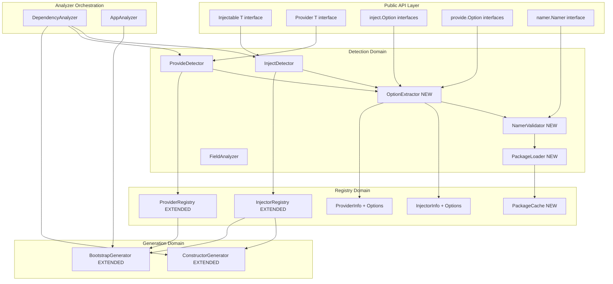
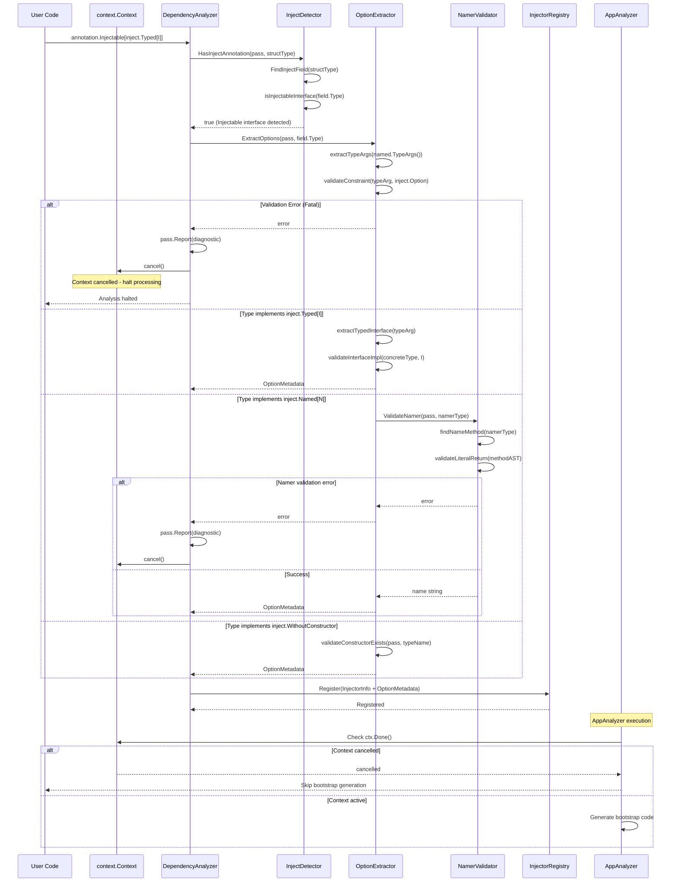
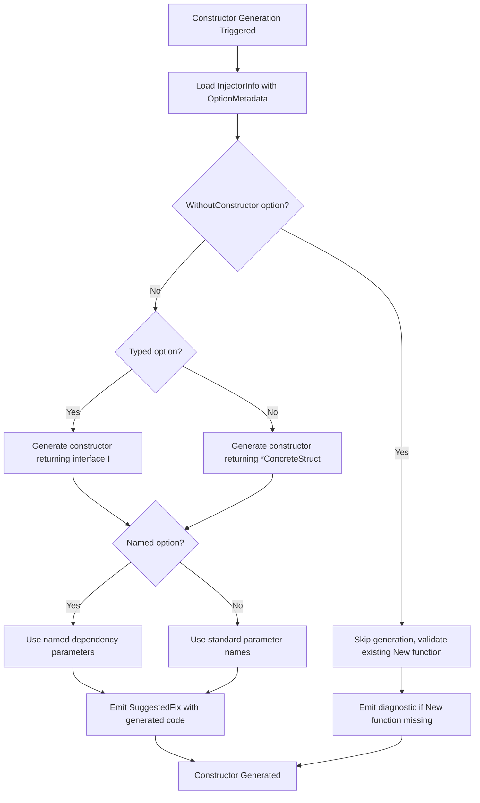
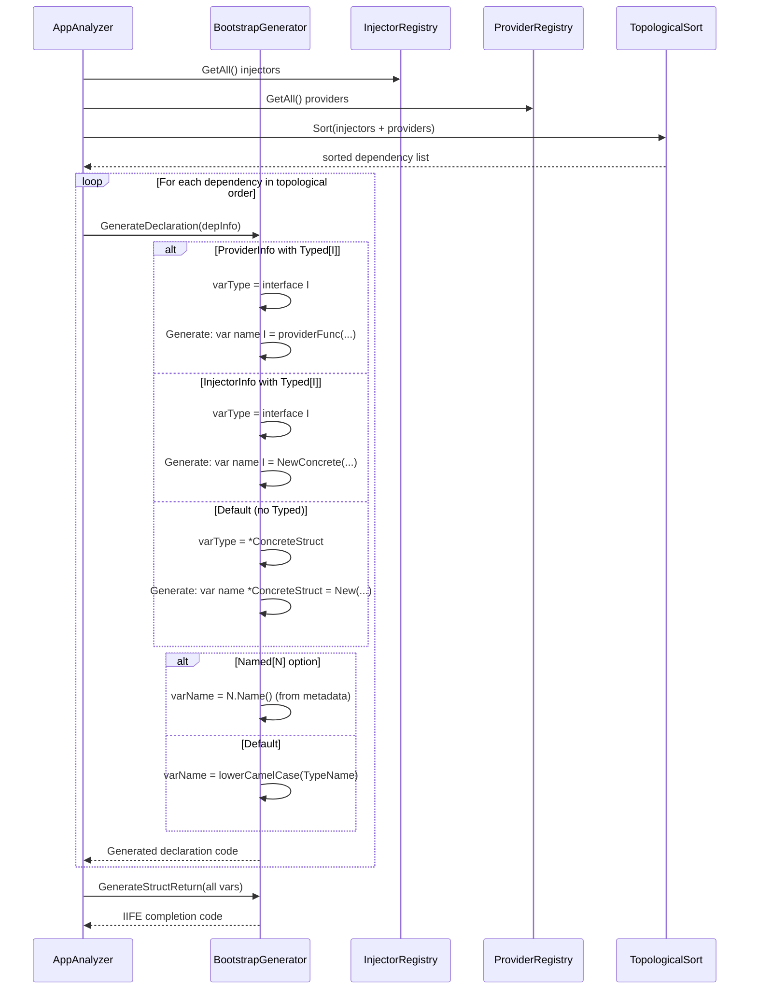

# Design Document: Annotation Refinement with Generic Type Parameters

## Overview

This feature extends braider's dependency injection annotation system to support advanced DI scenarios through generic type parameters and option interfaces. The enhancement enables interface-based DI, named dependencies, and custom constructor configurations while maintaining compile-time type safety.

**Users**: braider users developing Go applications with complex dependency injection requirements will utilize this for interface-based component registration, multiple instances of the same type distinguished by name, and custom constructor implementations.

**Impact**: Transforms the current struct-based annotation system (`annotation.Inject`, `annotation.Provide`) to generic interface-based annotations (`annotation.Injectable[T]`, `annotation.Provider[T]`) with compile-time option validation. Extends analyzer detection logic, registry structure, and code generation to support typed and named dependency resolution.

### Goals

- Provide generic annotation interfaces with type parameter constraints for compile-time option validation
- Enable interface-based dependency registration via `inject.Typed[I]` and `provide.Typed[I]` options
- Support named dependencies via `inject.Named[N]` and `provide.Named[N]` options with static name validation
- Allow custom constructor implementations via `inject.WithoutConstructor` option
- Extend code generation to produce interface-typed constructors and bootstrap variables based on options

### Non-Goals

- Runtime dependency injection or reflection-based container systems
- Dynamic name generation or computed dependency names (only hardcoded string literals allowed)
- Automatic interface implementation detection without explicit `Typed[I]` annotation

## Architecture

### Existing Architecture Analysis

The current braider analyzer follows a multi-analyzer architecture with component-based design:

- **DependencyAnalyzer**: Detects `annotation.Inject` and `annotation.Provide` structs via AST traversal, generates constructors using `SuggestedFix`, registers dependencies in global registries
- **AppAnalyzer**: Detects `annotation.App(main)` calls, generates bootstrap IIFE using topological sort of dependency graph
- **Detection Components**: `InjectDetector`, `ProvideDetector`, `StructDetector`, `FieldAnalyzer` identify DI patterns through `types.Named` type checking
- **Registries**: `InjectorRegistry`, `ProviderRegistry` store dependency metadata (`TypeName`, `Dependencies`, `Implements`)
- **Generators**: `ConstructorGenerator`, `BootstrapGenerator` produce Go code via string templates

**Key Constraints**:
- Type checking relies on `pass.TypesInfo.TypeOf()` for AST expression type resolution
- Current registries use `TypeName` as primary key (fully qualified type name)
- Constructor generation assumes `*ConcreteStruct` return type
- Bootstrap generation declares variables as concrete types

### Architecture Pattern & Boundary Map

**Architecture Integration**:
- **Selected pattern**: Component extension with option-based composition — extends existing detector/registry/generator components with option extraction and validation capabilities
- **Domain boundaries**:
  - **Detection domain** (`internal/detect`) gains `OptionExtractor`, `NamerValidator`, and `PackageLoader` for type parameter analysis and cross-package validation
  - **Registry domain** (`internal/registry`) extends `InjectorInfo`/`ProviderInfo` with option metadata fields and adds `PackageCache` for external package AST caching
  - **Generation domain** (`internal/generate`) adapts constructor and bootstrap templates based on option configuration
  - **Public API** (`pkg/annotation`) remains stable; new generic interfaces replace struct-based annotations
- **Existing patterns preserved**:
  - Multi-analyzer coordination via shared registries
  - Component-based dependency injection in `cmd/braider/main.go`
  - Type-based detection using `types.Named` and interface assertions
  - Code generation via `analysis.SuggestedFix`
- **New components rationale**:
  - `OptionExtractor` isolates complex type parameter extraction logic from core detection
  - `NamerValidator` enforces hardcoded literal requirement through AST method body analysis, supporting both same-package and external-package Namers
  - `PackageLoader` provides cached access to external package ASTs via go/packages, eliminating redundant I/O for cross-package validation
  - `PackageCache` maintains global singleton cache of loaded packages with thread-safe access, optimizing performance for projects with multiple external Namers
  - Option metadata in registries enables decoupled generation decisions without re-analyzing AST
- **Steering compliance**: Maintains component-based architecture (structure.md), uses standard go/types APIs (tech.md), preserves zero runtime overhead (product.md)



**Key Decisions**:
- Generic interface annotations (`Injectable[T]`, `Provider[T]`) replace struct-based annotations while maintaining backward compatibility via type aliases
- Option extraction operates on type parameters from `types.Named.TypeArgs()` rather than runtime reflection
- Registry extension adds optional fields (`RegisteredType`, `Name`, `OptionMetadata`) to existing `Info` structs
- Code generation adapts output based on parsed options without requiring AST re-analysis

### Technology Stack

| Layer | Choice / Version | Role in Feature | Notes |
|-------|------------------|-----------------|-------|
| Analysis Framework | `golang.org/x/tools/go/analysis` (Go 1.24) | Type parameter extraction via `types.Named.TypeArgs()` | Leverages generics support added in Go 1.18, stable in 1.24 |
| Type System | `go/types` package | Option interface validation, type constraint checking | Uses `types.Implements()` for interface satisfaction checks |
| AST Parsing | `go/ast` package | Namer method body validation (literal string detection) | Traverses function declarations to verify `return "literal"` patterns |
| Package Loading | `golang.org/x/tools/go/packages` (Go 1.24) | External package AST loading for cross-package Namer validation | Loads packages with `NeedSyntax` mode for AST access, cached globally |
| Code Generation | String templates with `analysis.SuggestedFix` | Interface-typed constructor and bootstrap code emission | Extends existing template system with option-conditional branches |

**Rationale**: Existing tech stack supports all requirements without new dependencies. Go 1.24's generics support (`TypeArgs()` API) provides type parameter extraction. AST-based literal validation aligns with analyzer philosophy of compile-time checks. See `research.md` for type parameter extraction technique investigation.

## System Flows

### Option Extraction and Validation Flow

This flow shows how generic type parameters are extracted and validated during dependency analysis.



**Key Decisions**:
- Option validation occurs during detection phase, not generation phase, to fail fast on type errors (Requirement 8.5)
- Fatal validation errors trigger context cancellation to prevent AppAnalyzer from generating invalid bootstrap code
- DependencyAnalyzer and AppAnalyzer coordinate via shared `context.Context` for error propagation
- Namer validation requires AST traversal to enforce hardcoded literal requirement (Requirement 4.3)
- Interface implementation check uses `types.Implements()` for type safety (Requirement 6.2)

### Constructor Generation with Options

This flow demonstrates how option metadata influences constructor code generation.



**Key Decisions**:
- Option checks use metadata from registry, avoiding repeated AST/type analysis (Requirement 6)
- `Typed[I]` changes return type signature, not just variable declaration (Requirement 6.2)
- `WithoutConstructor` requires validation diagnostic if manual constructor missing (Requirement 2.8)

### Bootstrap Code Generation with Typed Dependencies

This flow shows how typed and named options affect bootstrap IIFE generation.



**Key Decisions**:
- Variable type determined by `RegisteredType` field in metadata, not original concrete type (Requirement 7.1-7.2)
- Named dependencies use pre-validated name from registry, not runtime extraction (Requirement 4.2)
- Topological sort treats named dependencies as distinct nodes to handle multiple instances of same type (Requirement 7.4)

## Requirements Traceability

| Requirement | Summary | Components | Interfaces | Flows |
|-------------|---------|------------|------------|-------|
| 1.1 | Expose `Injectable[T inject.Option]` interface | Injectable interface (annotation.go) | Injectable.isInjectable(), Injectable.option() | N/A |
| 1.2 | Expose `Provider[T provide.Option]` interface | Provider interface (annotation.go) | Provider.isProvider(), Provider.option() | N/A |
| 1.3 | Extract type parameter `T` from `Injectable[T]` | OptionExtractor | ExtractOptions(pass, expr) OptionMetadata | Option Extraction Flow |
| 1.4 | Extract type parameter `T` from `Provide[T](fn)` | OptionExtractor | ExtractProvideOptions(pass, callExpr) OptionMetadata | Option Extraction Flow |
| 1.5 | Validate type parameter implements option constraint | OptionExtractor | validateConstraint(typeArg, constraintInterface) error | Option Extraction Flow |
| 2.1 | Provide `inject.Default` option | inject.Default interface (options.go) | Default.isOption(), Default.isDefault() | N/A |
| 2.2 | Provide `inject.Typed[T]` option | inject.Typed interface (options.go) | Typed.isOption(), Typed.typed() T | N/A |
| 2.3 | Provide `inject.Named[T]` option | inject.Named interface (options.go) | Named.isOption(), Named.named() T | N/A |
| 2.4 | Provide `inject.WithoutConstructor` option | inject.WithoutConstructor interface (options.go) | WithoutConstructor.isOption(), WithoutConstructor.withoutConstructor() | N/A |
| 2.5 | Generate constructor returning `*struct` for Default | ConstructorGenerator | GenerateConstructor(info) SuggestedFix | Constructor Generation Flow |
| 2.6 | Register dependency as interface `I` for Typed[I] | InjectorRegistry, OptionExtractor | Register(info + RegisteredType) | Option Extraction Flow |
| 2.7 | Register dependency with name for Named[N] | InjectorRegistry, OptionExtractor | Register(info + Name) | Option Extraction Flow |
| 2.8 | Skip constructor generation for WithoutConstructor | ConstructorGenerator | GenerateConstructor(info) (skipped) | Constructor Generation Flow |
| 3.1 | Provide `provide.Default` option | provide.Default interface (options.go) | Default.isOption(), Default.isDefault() | N/A |
| 3.2 | Provide `provide.Typed[T]` option | provide.Typed interface (options.go) | Typed.isOption(), Typed.typed() T | N/A |
| 3.3 | Provide `provide.Named[T]` option | provide.Named interface (options.go) | Named.isOption(), Named.named() T | N/A |
| 3.4 | Register provider with declared return type for Default | ProviderRegistry | Register(info + RegisteredType) | Option Extraction Flow |
| 3.5 | Register provider as interface `I` for Typed[I] | ProviderRegistry, OptionExtractor | Register(info + RegisteredType) | Option Extraction Flow |
| 3.6 | Register provider with name for Named[N] | ProviderRegistry, OptionExtractor | Register(info + Name) | Option Extraction Flow |
| 3.7 | Validate provider return type compatible with Typed[I] | OptionExtractor | validateProviderReturnType(funcSig, I) error | Option Extraction Flow |
| 4.1 | Provide `namer.Namer` interface | namer.Namer interface (namer.go) | Namer.Name() string | N/A |
| 4.2 | Extract name from `Namer.Name()` at analysis time | NamerValidator | ExtractName(pass, namerType) (string, error) | Option Extraction Flow |
| 4.3 | Require hardcoded string literal in Name() | NamerValidator | ValidateLiteralReturn(methodAST) error | Option Extraction Flow |
| 4.4 | Use extracted name for variable naming in bootstrap | BootstrapGenerator | GenerateVariableName(info) string | Bootstrap Generation Flow |
| 4.5 | Report error for duplicate (type, name) pairs | InjectorRegistry, ProviderRegistry | ValidateDuplicateNames() []error | Option Extraction Flow (correlation check) |
| 5.1 | Define base `inject.Option` interface with `isOption()` | inject.Option interface (options.go) | Option.isOption() option | N/A |
| 5.2 | Define base `provide.Option` interface with `isOption()` | provide.Option interface (options.go) | Option.isOption() option | N/A |
| 5.3 | Apply all option behaviors for mixed-in types | OptionExtractor | ExtractOptions(pass, typeArg) (supports multiple interfaces) | Option Extraction Flow |
| 5.4 | Validate custom types satisfy base Option constraint | OptionExtractor | validateConstraint(typeArg, baseOption) error | Option Extraction Flow |
| 5.5 | Report error for conflicting options | OptionExtractor | validateConflicts(metadata) error | Option Extraction Flow |
| 6.1 | Generate constructor returning `*StructType` for Default | ConstructorGenerator | GenerateConstructor(info) SuggestedFix | Constructor Generation Flow |
| 6.2 | Generate constructor returning interface `I` for Typed[I] | ConstructorGenerator | GenerateConstructor(info) SuggestedFix | Constructor Generation Flow |
| 6.3 | Generate parameter names reflecting Named[N] dependencies | ConstructorGenerator | GenerateParameters(info) string | Constructor Generation Flow |
| 6.4 | Skip constructor emission for WithoutConstructor | ConstructorGenerator | GenerateConstructor(info) (conditional skip) | Constructor Generation Flow |
| 6.5 | Validate injectable field dependencies resolvable | DependencyGraph | BuildGraph(injectors, providers) error | Option Extraction Flow |
| 7.1 | Declare variables with interface type `I` for Injectable[Typed[I]] | BootstrapGenerator | GenerateDeclaration(info) string | Bootstrap Generation Flow |
| 7.2 | Assign provider results to interface-typed variables for Provide[Typed[I]] | BootstrapGenerator | GenerateDeclaration(info) string | Bootstrap Generation Flow |
| 7.3 | Include type assertions if needed for interface assignments | BootstrapGenerator | GenerateDeclaration(info) (conditional) | Bootstrap Generation Flow |
| 7.4 | Handle typed and untyped dependencies in topological order | TopologicalSort | Sort(dependencies) []DependencyInfo | Bootstrap Generation Flow |
| 7.5 | Validate interface satisfaction at analysis time | OptionExtractor | validateInterfaceImpl(concrete, iface) error | Option Extraction Flow |
| 8.1 | Report error for `Injectable[T]` constraint violation | OptionExtractor, DiagnosticEmitter | EmitDiagnostic(pos, msg) | Option Extraction Flow |
| 8.2 | Report error for `Provide[T]` constraint violation | OptionExtractor, DiagnosticEmitter | EmitDiagnostic(pos, msg) | Option Extraction Flow |
| 8.3 | Report error for non-literal `Namer.Name()` | NamerValidator, DiagnosticEmitter | EmitDiagnostic(pos, msg) | Option Extraction Flow |
| 8.4 | Report error for duplicate named dependencies | InjectorRegistry, DiagnosticEmitter | EmitDiagnostic(pos, msg) | Option Extraction Flow (correlation check) |
| 8.5 | Cancel AppAnalyzer processing on validation errors (AC 1-3) | DependencyAnalyzer | Halt on fatal diagnostic | Option Extraction Flow |
| 8.6 | Continue processing on correlation errors (AC 4) | AppAnalyzer | Continue with non-fatal diagnostic | Option Extraction Flow |
| 9.1-9.5 | Documentation and examples | Documentation files | N/A | N/A (implementation task) |

## Components and Interfaces

### Component Summary

| Component | Domain/Layer | Intent | Req Coverage | Key Dependencies (Criticality) | Contracts |
|-----------|--------------|--------|--------------|-------------------------------|-----------|
| Injectable[T] | Public API | Generic interface for dependency injection annotation | 1.1, 1.3, 2.5-2.8 | inject.Option (P0) | Interface |
| Provider[T] | Public API | Generic interface for provider function annotation | 1.2, 1.4, 3.4-3.7 | provide.Option (P0) | Interface |
| inject.Option | Public API | Base constraint interface for inject options | 2.1-2.4, 5.1, 5.4-5.5 | None | Interface |
| provide.Option | Public API | Base constraint interface for provide options | 3.1-3.3, 5.2, 5.4-5.5 | None | Interface |
| namer.Namer | Public API | Interface for named dependency naming | 4.1 | None | Interface |
| OptionExtractor | Detection | Extracts and validates type parameters from generic annotations | 1.3-1.5, 2.6-2.7, 3.5-3.7, 5.3-5.5, 7.5, 8.1-8.2 | NamerValidator (P0), types.TypeList (P0) | Service |
| NamerValidator | Detection | Validates Namer.Name() returns hardcoded string literals | 4.2-4.3, 8.3 | PackageLoader (P0), go/ast (P0) | Service |
| PackageLoader | Detection | Loads and caches external package ASTs for validation | 4.3 | PackageCache (P0), go/packages (P0) | Service |
| InjectorRegistry | Registry | Stores injectable dependency metadata with option info | 2.6-2.7, 4.5, 6.5 | InjectorInfo (P0) | Service, State |
| ProviderRegistry | Registry | Stores provider function metadata with option info | 3.4-3.6, 4.5 | ProviderInfo (P0) | Service, State |
| PackageCache | Registry | Caches loaded external packages to avoid redundant I/O | 4.3 | sync.RWMutex (P0) | State |
| ConstructorGenerator | Generation | Generates constructor code with option-based return types | 2.5, 2.8, 6.1-6.4 | InjectorInfo (P0), templates (P1) | Service |
| BootstrapGenerator | Generation | Generates bootstrap IIFE with typed and named variables | 4.4, 7.1-7.4 | InjectorRegistry (P0), ProviderRegistry (P0), TopologicalSort (P0) | Service |

### Detection Domain

#### OptionExtractor

| Field | Detail |
|-------|--------|
| Intent | Extract type parameters from generic annotation instantiations and validate option constraints |
| Requirements | 1.3, 1.4, 1.5, 2.6, 2.7, 3.5, 3.6, 3.7, 5.3, 5.4, 5.5, 7.5, 8.1, 8.2 |

**Responsibilities & Constraints**
- Extract type argument `T` from `Injectable[T]` and `Provider[T]` using `types.Named.TypeArgs()`
- Validate type parameter implements `inject.Option` or `provide.Option` constraint via `types.Implements()`
- Determine which option interfaces type parameter satisfies (Default, Typed, Named, WithoutConstructor)
- Extract interface type from `Typed[I]` and validate concrete type implements `I`
- Extract namer type from `Named[N]` and delegate name extraction to NamerValidator
- Detect conflicting options (e.g., both Default and WithoutConstructor)
- Return structured OptionMetadata for registry storage
- Domain boundary: operates on go/types data, no AST manipulation or code generation

**Dependencies**
- Inbound: InjectDetector, ProvideDetector — option extraction after annotation detection (P0)
- Outbound: NamerValidator — name string extraction from Namer implementations (P0)
- Outbound: InjectorRegistry, ProviderRegistry — store extracted option metadata (P0)
- External: `go/types` package — type parameter access via TypeArgs(), interface checking via Implements() (P0)

**Contracts**: Service [X] / State [X]

##### Service Interface

```go
package detect

import (
    "go/ast"
    "go/types"
    "golang.org/x/tools/go/analysis"
)

// OptionMetadata contains extracted option configuration from type parameters.
type OptionMetadata struct {
    // IsDefault indicates inject.Default or provide.Default option
    IsDefault bool

    // TypedInterface contains the interface type for Typed[I] option (nil if not typed)
    TypedInterface types.Type

    // Name contains the extracted string from Named[N] option (empty if not named)
    Name string

    // WithoutConstructor indicates inject.WithoutConstructor option
    WithoutConstructor bool
}

// OptionExtractor extracts and validates type parameters from generic annotations.
type OptionExtractor interface {
    // ExtractInjectOptions extracts option metadata from Injectable[T] type parameter.
    // Returns OptionMetadata and error if validation fails (constraint violation, conflicts).
    ExtractInjectOptions(pass *analysis.Pass, fieldType ast.Expr, concreteType types.Type) (OptionMetadata, error)

    // ExtractProvideOptions extracts option metadata from Provider[T] type parameter.
    // Validates provider function return type compatibility with Typed[I] if present.
    ExtractProvideOptions(pass *analysis.Pass, callExpr *ast.CallExpr, providerFunc types.Type) (OptionMetadata, error)
}
```

**Preconditions**:
- `fieldType` or `callExpr` resolved to `*types.Named` with non-empty TypeArgs()
- `pass.TypesInfo` populated with complete type information
- Option constraint interfaces (inject.Option, provide.Option) available in type universe

**Postconditions**:
- If error returned, diagnostic reported to pass and processing must halt (fatal error for AC 8.5)
- If no error, OptionMetadata contains validated configuration safe for code generation
- Interface types in `TypedInterface` verified to be implemented by `concreteType`
- Name strings validated as hardcoded literals via NamerValidator

**Invariants**:
- `IsDefault` and `WithoutConstructor` mutually exclusive (conflict validation)
- `TypedInterface != nil` implies `types.Implements(concreteType, TypedInterface)` is true
- `Name != ""` implies literal validation passed via NamerValidator

##### State Management

**State model**: Stateless service; delegates persistence to registries

**Implementation Notes**
- **Integration**: Called by InjectDetector after detecting `Injectable[T]` embedding; called by ProvideDetector after detecting `Provide[T](fn)` call. Must integrate into existing detection pipeline in DependencyAnalyzer.Run().
- **Validation**: Type parameter extraction via `named.TypeArgs().At(0)`. Interface constraint check: `types.Implements(typeArg, constraintInterface)`. Typed interface compatibility: `types.AssignableTo(concreteType, typedInterface)`. Conflict detection: check `(IsDefault && WithoutConstructor) || (IsDefault && IsTyped)` patterns.
- **Risks**: Complex nested generics (`Named[Typed[I]]`) may fail extraction; fallback to diagnostic error. Type parameter from external package may not resolve; require import validation. See `research.md` decision on type parameter extraction strategy.

---

#### NamerValidator

| Field | Detail |
|-------|--------|
| Intent | Validate Namer.Name() method implementations return hardcoded string literals via AST analysis |
| Requirements | 4.2, 4.3, 8.3 |

**Responsibilities & Constraints**
- Locate `Name() string` method declaration for given Namer type
- Traverse method AST to find return statement
- Validate return expression is `*ast.BasicLit` with `token.STRING` kind
- Reject computed values, concatenations, variable references, function calls
- Return extracted name string or error with diagnostic position
- Domain boundary: AST traversal only, no type checking or code generation

**Dependencies**
- Inbound: OptionExtractor — name extraction for Named[N] options (P0)
- Outbound: PackageLoader — load external package ASTs for validation (P0)
- Outbound: DiagnosticEmitter — report non-literal usage errors (P0)
- External: `go/ast` package — AST traversal and node type assertions (P0)

**Contracts**: Service [X]

##### Service Interface

```go
package detect

import (
    "go/ast"
    "go/types"
    "golang.org/x/tools/go/analysis"
)

// NamerValidator validates Namer interface implementations.
type NamerValidator interface {
    // ExtractName validates that the given Namer type's Name() method returns
    // a hardcoded string literal and returns the extracted name.
    // Returns error if Name() method not found, returns non-literal, or AST traversal fails.
    ExtractName(pass *analysis.Pass, namerType types.Type) (string, error)
}
```

**Preconditions**:
- `namerType` implements `namer.Namer` interface (validated by caller)
- `pass.TypesInfo` contains method set information for `namerType`
- Source files for `namerType` package loaded in `pass.Files`

**Postconditions**:
- If error returned, diagnostic message indicates literal requirement violation
- If no error, returned string is valid Go string literal content (quotes stripped)
- Error position points to return statement or method declaration for IDE navigation

**Invariants**:
- Extracted name is non-empty string (empty literals like `""` rejected as invalid)
- Name does not contain escape sequences or special characters beyond ASCII printable

**Implementation Notes**
- **Integration**: Called from OptionExtractor when Named[N] option detected. Operates during DependencyAnalyzer phase, before code generation. Delegates external package AST loading to PackageLoader for Namers defined outside current package.
- **Validation**: Use `types.LookupFieldOrMethod(namerType, "Name")` to find method. Assert method signature matches `func() string`. For same-package Namers, traverse `pass.Files`. For external-package Namers, use `PackageLoader.LoadPackage()` to retrieve cached AST. Traverse `*ast.FuncDecl` body to locate `*ast.ReturnStmt`. Validate `ReturnStmt.Results[0]` is `*ast.BasicLit` with `Kind == token.STRING`. Strip quotes from `Value` field.
- **Caching**: PackageLoader maintains global cache of loaded packages. First Namer validation triggers package load; subsequent validations from same package reuse cached AST with no I/O overhead.
- **Risks**: Method inlined or optimized may have complex AST; reject non-obvious patterns. Package source code unavailable (compiled stdlib in minimal environments) will cause validation failure with clear diagnostic. See `research.md` Namer validation strategy decision.

---

#### PackageLoader

| Field | Detail |
|-------|--------|
| Intent | Load and cache external package ASTs using go/packages for Namer validation across package boundaries |
| Requirements | 4.3 |

**Responsibilities & Constraints**
- Load external package ASTs via `golang.org/x/tools/go/packages` on first request
- Maintain global cache of loaded packages keyed by package path
- Provide thread-safe concurrent access to cached packages
- Handle package loading errors (source unavailable, compilation errors) with clear diagnostics
- Minimize I/O overhead by caching packages for entire analyzer run
- Domain boundary: package loading only, no AST traversal or validation logic

**Dependencies**
- Inbound: NamerValidator — load packages containing external Namer definitions (P0)
- Outbound: PackageCache — store and retrieve loaded packages (P0)
- External: `golang.org/x/tools/go/packages` — package loading with AST (P0)

**Contracts**: Service [X]

##### Service Interface

```go
package detect

import (
    "golang.org/x/tools/go/packages"
)

// PackageLoader loads and caches external package ASTs for validation.
type PackageLoader interface {
    // LoadPackage loads the package at the given import path and returns
    // its AST. Uses cached package if previously loaded.
    // Returns error if package cannot be loaded (source unavailable, compilation error).
    LoadPackage(pkgPath string) (*packages.Package, error)
}
```

**Preconditions**:
- `pkgPath` is valid Go import path (e.g., "github.com/external/pkg")
- Go module or GOPATH environment properly configured for package resolution

**Postconditions**:
- If error returned, package loading failed with diagnostic reason (source unavailable, compilation error)
- If no error, returned `*packages.Package` has `Syntax` field populated with ASTs
- Subsequent calls with same `pkgPath` return cached package with no I/O

**Invariants**:
- Cached packages never modified after loading (read-only access)
- Package cache persists for entire analyzer run (global singleton pattern)
- Thread-safe concurrent access via PackageCache synchronization

**Implementation Notes**
- **Integration**: Created as global singleton at analyzer initialization. NamerValidator holds reference and calls `LoadPackage()` when Namer type package differs from `pass.Pkg.Path()`.
- **Caching Strategy**: On first `LoadPackage(pkgPath)` call, check PackageCache. If miss, invoke `packages.Load()` with `packages.NeedSyntax | packages.NeedTypes` mode, store in cache, return. If hit, return cached package immediately.
- **Error Handling**: `packages.Load()` errors indicate source unavailable (stdlib without source, network issues for remote modules). Return error with message "Cannot validate external Namer in package {pkgPath}: source code unavailable. Define Namer in same package as Injectable annotation."
- **Performance**: First Namer from new package incurs ~100-500ms load time (go/packages overhead). Subsequent Namers from same package use cache with ~0ms overhead. Acceptable for typical projects with <10 external Namer packages.
- **Risks**: Large dependency graphs with many external Namers may increase memory usage (each package's AST retained). Acceptable trade-off for validation correctness. Package with compilation errors will fail loading; emit diagnostic pointing to package issue.

---

### Registry Domain

#### PackageCache

| Field | Detail |
|-------|--------|
| Intent | Thread-safe cache for loaded external packages to avoid redundant package loading |
| Requirements | 4.3 |

**Responsibilities & Constraints**
- Store loaded `*packages.Package` instances keyed by package import path
- Provide thread-safe concurrent read/write access via `sync.RWMutex`
- Persist cache for entire analyzer run (global singleton lifetime)
- Support cache miss detection and insertion
- Domain boundary: data storage only, no package loading logic

**Dependencies**
- Inbound: PackageLoader — store and retrieve loaded packages (P0)
- External: `sync` package — RWMutex for thread-safe access (P0)

**Contracts**: State [X]

##### State Management

**State model**:
```go
package registry

import (
    "sync"
    "golang.org/x/tools/go/packages"
)

// PackageCache caches loaded external packages for Namer validation.
type PackageCache struct {
    mu    sync.RWMutex
    cache map[string]*packages.Package // key: package import path
}

// NewPackageCache creates a new package cache.
func NewPackageCache() *PackageCache {
    return &PackageCache{
        cache: make(map[string]*packages.Package),
    }
}

// Get retrieves a cached package by import path.
// Returns (package, true) if found, (nil, false) if not cached.
func (pc *PackageCache) Get(pkgPath string) (*packages.Package, bool) {
    pc.mu.RLock()
    defer pc.mu.RUnlock()
    pkg, ok := pc.cache[pkgPath]
    return pkg, ok
}

// Set stores a package in the cache.
func (pc *PackageCache) Set(pkgPath string, pkg *packages.Package) {
    pc.mu.Lock()
    defer pc.mu.Unlock()
    pc.cache[pkgPath] = pkg
}
```

**Persistence & consistency**: In-memory cache during analyzer run, no disk persistence. Global singleton instance shared across all analyzer invocations within same process. Cache never invalidated (packages immutable during analysis).

**Concurrency strategy**: `RWMutex` allows multiple concurrent reads (common case: cache hits) and serialized writes (rare case: cache miss on first load). Double-checked locking in PackageLoader prevents duplicate loads for same package.

**Implementation Notes**
- **Integration**: Global singleton initialized at analyzer startup. PackageLoader holds reference and delegates all cache operations.
- **Lifecycle**: Cache created once per `go vet` invocation. Multiple packages analyzed in same run share cache. Cache discarded when analyzer process exits.
- **Performance**: RWMutex overhead negligible (<1μs per operation). Memory overhead scales with number of unique external Namer packages (~1-10MB per package AST). Typical projects with <10 external packages: <100MB total overhead.
- **Risks**: No eviction policy; cache grows monotonically. Acceptable for analyzer's short-lived process model (seconds to minutes). Long-running analysis servers would need LRU eviction.

---

#### InjectorInfo Extension

| Field | Detail |
|-------|--------|
| Intent | Store injectable dependency metadata including option-derived configuration |
| Requirements | 2.6, 2.7, 4.5, 6.5 |

**Responsibilities & Constraints**
- Extend existing `InjectorInfo` struct with option metadata fields
- Maintain backward compatibility: new fields optional, zero values represent default behavior
- Support dual-key lookup: primary by `TypeName`, secondary by `(TypeName, Name)` for named dependencies
- Validate uniqueness of `(TypeName, Name)` pairs during registration
- Store `RegisteredType` (interface or concrete) for bootstrap variable type resolution
- Domain boundary: data model only, no business logic

**Dependencies**
- Inbound: OptionExtractor — provides OptionMetadata for storage (P0)
- Inbound: DependencyAnalyzer — registers info after detection (P0)
- Outbound: ConstructorGenerator, BootstrapGenerator — consume metadata for generation (P0)

**Contracts**: State [X]

##### State Management

**State model**:
```go
package registry

import "go/types"

// InjectorInfo contains information about an Injectable struct.
type InjectorInfo struct {
    // Existing fields (unchanged)
    TypeName        string   // Fully qualified type name
    PackagePath     string   // Import path
    PackageName     string   // Package name
    LocalName       string   // Type name without package
    ConstructorName string   // Constructor function name
    Dependencies    []string // Fully qualified dependency types
    Implements      []string // Fully qualified interface types
    IsPending       bool     // Constructor generation status

    // NEW: Option-derived fields
    RegisteredType types.Type // Interface type for Typed[I], concrete type otherwise
    Name           string      // Dependency name from Named[N], empty if unnamed
    OptionMetadata OptionMetadata // Parsed option configuration
}
```

**Persistence & consistency**: In-memory registry during analysis run, no disk persistence. Mutation synchronized via `sync.RWMutex`. Uniqueness constraint enforced at registration time.

**Concurrency strategy**: Existing `RWMutex` in `InjectorRegistry` covers new fields. No additional synchronization required.

**Implementation Notes**
- **Integration**: Modify existing `InjectorRegistry.Register()` to validate `(TypeName, Name)` uniqueness before insertion. Add `GetByName(typeName, name)` method for named dependency lookup. Maintain `GetAll()` contract returning sorted slice.
- **Validation**: Check `len(Name) > 0` for named dependencies. Ensure `RegisteredType != nil` (defaults to concrete type if no Typed[I]). Duplicate check: iterate existing injectors, compare `TypeName` and `Name` fields.
- **Scoping**: Named dependencies are **globally unique** across all packages. The composite key `(TypeName, Name)` must be unique within the entire dependency graph, not just within a single package. This ensures unambiguous dependency resolution during bootstrap generation.
- **Risks**: Large number of named dependencies increases duplicate check cost; acceptable for typical project size. See `research.md` registry key structure decision.

---

#### ProviderInfo Extension

| Field | Detail |
|-------|--------|
| Intent | Store provider function metadata including option-derived configuration |
| Requirements | 3.4, 3.5, 3.6, 4.5 |

**Responsibilities & Constraints**
- Extend existing `ProviderInfo` struct with option metadata fields (same as InjectorInfo)
- Support named provider lookup via `(TypeName, Name)` composite key
- Store `RegisteredType` for bootstrap variable type resolution
- Validate uniqueness of `(TypeName, Name)` pairs
- Domain boundary: data model only, no business logic

**Dependencies**
- Inbound: OptionExtractor — provides OptionMetadata for storage (P0)
- Inbound: DependencyAnalyzer — registers info after detection (P0)
- Outbound: BootstrapGenerator — consumes metadata for generation (P0)

**Contracts**: State [X]

##### State Management

**State model**:
```go
package registry

import "go/types"

// ProviderInfo contains information about a Provider function.
type ProviderInfo struct {
    // Existing fields (unchanged)
    TypeName        string
    PackagePath     string
    PackageName     string
    LocalName       string
    ConstructorName string
    Dependencies    []string
    Implements      []string
    IsPending       bool

    // NEW: Option-derived fields
    RegisteredType types.Type // Interface type for Typed[I], return type otherwise
    Name           string      // Provider name from Named[N], empty if unnamed
    OptionMetadata OptionMetadata // Parsed option configuration
}
```

**Implementation Notes**
- **Integration**: Same as InjectorInfo — Add `GetByName()` method, validate `(TypeName, Name)` uniqueness before insertion
- **Validation**: Check `len(Name) > 0` for named providers. Ensure `RegisteredType != nil` (defaults to return type if no Typed[I])
- **Scoping**: Named providers are **globally unique** across all packages. The composite key `(TypeName, Name)` must be unique within the entire dependency graph
- **Backward Compatibility**: New fields are optional, zero values represent default behavior (unchanged from existing ProviderInfo)

---

### Generation Domain

#### ConstructorGenerator Extension

| Field | Detail |
|-------|--------|
| Intent | Generate constructor functions with option-based return types and parameter names |
| Requirements | 2.5, 2.8, 6.1, 6.2, 6.3, 6.4 |

**Responsibilities & Constraints**
- Generate constructor returning `*ConcreteStruct` for Default option (existing behavior)
- Generate constructor returning interface type `I` for Typed[I] option
- Skip constructor generation for WithoutConstructor option, emit validation diagnostic instead
- Use named dependency parameter names for Named[N] dependencies in constructor signature
- Preserve existing constructor if already present on disk (idempotency)
- Domain boundary: code string generation only, no AST manipulation or registry updates

**Dependencies**
- Inbound: DependencyAnalyzer — invokes generation after registration (P0)
- Inbound: InjectorRegistry — reads InjectorInfo with OptionMetadata (P0)
- Outbound: SuggestedFixBuilder — builds analysis.SuggestedFix for code insertion (P0)
- External: String templates — format constructor code (P1)

**Contracts**: Service [X]

##### Service Interface

```go
package generate

import (
    "golang.org/x/tools/go/analysis"
    "github.com/miyamo2/braider/internal/registry"
)

// ConstructorGenerator generates constructor function code.
type ConstructorGenerator interface {
    // GenerateConstructor generates constructor code based on InjectorInfo and options.
    // Returns nil SuggestedFix if WithoutConstructor option set (with validation diagnostic).
    // Returns SuggestedFix with interface-typed return for Typed[I] option.
    GenerateConstructor(pass *analysis.Pass, info *registry.InjectorInfo) *analysis.SuggestedFix
}
```

**Preconditions**:
- `info.OptionMetadata` populated and validated by OptionExtractor
- `info.RegisteredType` is non-nil and reflects correct return type
- For WithoutConstructor, manual `New<TypeName>` function exists (validated by diagnostic)

**Postconditions**:
- Generated code compiles without errors (correct import statements, type references)
- Return type matches `info.RegisteredType` exactly
- Parameter names match dependency names from `info.Dependencies` metadata
- No SuggestedFix emitted if WithoutConstructor (diagnostic emitted instead)

**Invariants**:
- Constructor name always `New<UpperCamelTypeName>` (existing convention)
- Parameter order matches topological dependency order

**Implementation Notes**
- **Integration**: Called from DependencyAnalyzer.Run() after InjectorRegistry.Register(). Check `info.OptionMetadata.WithoutConstructor` first; if true, emit diagnostic and return nil. Select template based on `info.OptionMetadata.IsTyped()`. Use `info.RegisteredType` for return type rendering, not `info.TypeName`.
- **Validation**: Ensure `info.RegisteredType` renders correctly via `types.TypeString(registeredType, qualifier)`. For Typed[I], verify interface type not empty/invalid. For Named[N] dependencies, look up dependency names from registry.
- **Risks**: Interface type from different package requires correct import management; integrate with existing import tracking. See `research.md` constructor return type determination decision.

---

#### BootstrapGenerator Extension

| Field | Detail |
|-------|--------|
| Intent | Generate bootstrap IIFE with interface-typed variables and named variable names |
| Requirements | 4.4, 7.1, 7.2, 7.3, 7.4 |

**Responsibilities & Constraints**
- Generate variable declarations using `RegisteredType` instead of concrete type
- Use `Name` field from metadata for variable naming if present (named dependencies)
- Include type assertions only if required for interface assignment safety
- Preserve topological sort order considering named dependencies as distinct nodes
- Generate struct return with all dependency variables (existing behavior)
- Domain boundary: code string generation only, consumes registry data without mutation

**Dependencies**
- Inbound: AppAnalyzer — invokes generation after App annotation detection (P0)
- Inbound: InjectorRegistry, ProviderRegistry — reads all dependencies with metadata (P0)
- Inbound: TopologicalSort — provides initialization order (P0)
- Outbound: SuggestedFixBuilder — builds IIFE insertion fix (P0)
- External: String templates — format bootstrap code (P1)

**Contracts**: Service [X]

##### Service Interface

```go
package generate

import (
    "golang.org/x/tools/go/analysis"
    "github.com/miyamo2/braider/internal/registry"
)

// BootstrapGenerator generates main function IIFE bootstrap code.
type BootstrapGenerator interface {
    // GenerateBootstrap generates IIFE code with typed and named variables.
    // Uses RegisteredType for variable types and Name for variable names.
    GenerateBootstrap(pass *analysis.Pass, injectors []*registry.InjectorInfo, providers []*registry.ProviderInfo) *analysis.SuggestedFix
}
```

**Preconditions**:
- `injectors` and `providers` topologically sorted by AppAnalyzer
- Each info struct has `OptionMetadata`, `RegisteredType`, `Name` populated
- Dependency graph acyclic (validated by TopologicalSort)

**Postconditions**:
- Variable declarations match `RegisteredType` exactly (interface or concrete)
- Named dependencies use `Name` field for variable identifier
- IIFE returns struct with all variables as fields
- Generated code compiles and maintains type safety

**Invariants**:
- Variable names unique within IIFE scope (name conflict validation in registry)
- Initialization order respects dependency edges

**Implementation Notes**
- **Integration**: Called from AppAnalyzer.Run() after collecting all dependencies. Iterate sorted dependency list; for each, render declaration using `info.RegisteredType` via `types.TypeString()`. If `info.Name != ""`, use name as variable identifier; otherwise use `lowerCamelCase(info.LocalName)`.
- **Validation**: Ensure variable name valid Go identifier (no keywords, special chars). Check for shadowing or collisions with existing variables. For interface assignments, Go compiler handles type safety; explicit type assertion unnecessary unless assignment from `any` or interface conversion.
- **Risks**: Named dependencies with conflicting names detected at registry level (correlation error, continue processing per AC 8.6). Interface variables may be nil if provider returns nil; no nil checks in generated code (user responsibility). See `research.md` bootstrap generation order decision.

---

### Public API Domain

#### Injectable[T] Interface

| Field | Detail |
|-------|--------|
| Intent | Generic marker interface for dependency injection with compile-time option validation |
| Requirements | 1.1, 1.3, 2.5-2.8 |

**Contracts**: Interface [X]

##### Interface Contract

```go
package annotation

import "github.com/miyamo2/braider/pkg/annotation/inject"

// Injectable marks a struct as a dependency to be injected.
// Type parameter T must implement inject.Option constraint.
//
// Example:
//   type MyService struct {
//       annotation.Injectable[inject.Default]
//       repo MyRepository
//   }
type Injectable[T inject.Option] interface {
    isInjectable()
    option() T
}
```

**Implementation Notes**: Interface never implemented by user code; serves as type constraint and marker. Existing `annotation.Inject` can be aliased to `Injectable[inject.Default]` for backward compatibility. See `research.md` generic interface vs. struct-based decision.

---

#### Provider[T] Interface

| Field | Detail |
|-------|--------|
| Intent | Generic marker interface for provider function annotation with compile-time option validation |
| Requirements | 1.2, 1.4, 3.4-3.7 |

**Contracts**: Interface [X]

##### Interface Contract

```go
package annotation

import "github.com/miyamo2/braider/pkg/annotation/provide"

// Provider marks a function as a dependency provider.
// Type parameter T must implement provide.Option constraint.
//
// Example:
//   var _ = annotation.Provide[provide.Typed[MyRepository]](NewMyRepository)
type Provider[T provide.Option] interface {
    isProvider()
    option() T
}

// Provide annotates a provider function with options.
func Provide[T provide.Option](providerFunc any) Provider[T]
```

**Implementation Notes**: `Provide[T](fn)` function returns dummy `Provider[T]` instance; actual value unused, serves as AST marker for analyzer. Existing implementation in annotation.go sufficient; no changes required.

---

#### inject.Option Interfaces

| Field | Detail |
|-------|--------|
| Intent | Base constraint and option interfaces for Injectable configuration |
| Requirements | 2.1-2.4, 5.1, 5.4-5.5 |

**Contracts**: Interface [X]

##### Interface Contract

```go
package inject

import "github.com/miyamo2/braider/pkg/annotation/namer"

// Option configures annotation.Injectable behavior.
type Option interface {
    isOption() option
}

// Default configures default Injectable behavior (constructor returns *struct).
type Default interface {
    Option
    isDefault()
}

// Typed configures Injectable to register as interface type T.
type Typed[T any] interface {
    Option
    typed() T
}

// Named configures Injectable to register with specific name.
type Named[T namer.Namer] interface {
    Option
    named() T
}

// WithoutConstructor skips constructor generation.
type WithoutConstructor interface {
    Option
    withoutConstructor()
}
```

**Implementation Notes**: Existing implementation in `pkg/annotation/inject/options.go` complete; no changes required. Marker methods prevent external implementations. See `research.md` interface constraint pattern decision.

---

#### provide.Option Interfaces

| Field | Detail |
|-------|--------|
| Intent | Base constraint and option interfaces for Provider configuration |
| Requirements | 3.1-3.3, 5.2, 5.4-5.5 |

**Contracts**: Interface [X]

##### Interface Contract

```go
package provide

import "github.com/miyamo2/braider/pkg/annotation/namer"

// Option configures annotation.Provider behavior.
type Option interface {
    isOption() option
}

// Default configures default Provider behavior (register with return type).
type Default interface {
    Option
    isDefault()
}

// Typed configures Provider to register as interface type T.
type Typed[T any] interface {
    Option
    typed() T
}

// Named configures Provider to register with specific name.
type Named[T namer.Namer] interface {
    Option
    named() T
}
```

**Implementation Notes**: Existing implementation in `pkg/annotation/provide/options.go` complete; no changes required.

---

#### namer.Namer Interface

| Field | Detail |
|-------|--------|
| Intent | Provide naming contract for named dependencies |
| Requirements | 4.1 |

**Contracts**: Interface [X]

##### Interface Contract

```go
package namer

// Namer provides a Name method for naming dependencies.
// Name must return a hardcoded string literal.
type Namer interface {
    Name() string
}
```

**Implementation Notes**: Existing implementation in `pkg/annotation/namer/namer.go` complete; no changes required. Hardcoded literal requirement enforced by NamerValidator at analysis time, not runtime.

---

## Data Models

### Domain Model

**Aggregates and Boundaries**:
- **Dependency Aggregate**: Injector or Provider with associated option metadata, constructor references, and dependency edges
- **Registry Aggregate**: Collection of dependency aggregates with uniqueness constraints on `(TypeName, Name)` pairs
- **Option Aggregate**: Type parameter with validated constraint satisfaction and extracted configuration metadata

**Entities**:
- `InjectorInfo`: Entity representing injectable dependency with identity `(TypeName, Name)`
- `ProviderInfo`: Entity representing provider function with identity `(TypeName, Name)`
- `OptionMetadata`: Value object containing parsed option configuration

**Business Rules**:
- Uniqueness invariant: no two dependencies can share `(TypeName, Name)` pair
- Type safety invariant: `RegisteredType` must be implemented by concrete type
- Literal requirement: `Namer.Name()` must return hardcoded string literal
- Option compatibility: conflicting options (e.g., Default + WithoutConstructor) rejected

### Logical Data Model

**Structure Definition**:

```
InjectorInfo (extended)
├── TypeName: string (PK)
├── Name: string (PK component, empty if unnamed)
├── PackagePath: string
├── PackageName: string
├── LocalName: string
├── ConstructorName: string
├── RegisteredType: types.Type (interface or concrete)
├── Dependencies: []string (FK to TypeName)
├── Implements: []string
├── IsPending: bool
└── OptionMetadata: OptionMetadata

OptionMetadata (value object)
├── IsDefault: bool
├── TypedInterface: types.Type (nullable)
├── Name: string (empty if unnamed)
└── WithoutConstructor: bool

ProviderInfo (extended)
├── TypeName: string (PK)
├── Name: string (PK component, empty if unnamed)
├── PackagePath: string
├── PackageName: string
├── LocalName: string
├── ConstructorName: string (provider function name)
├── RegisteredType: types.Type (interface or return type)
├── Dependencies: []string (FK to TypeName)
├── Implements: []string
├── IsPending: bool
└── OptionMetadata: OptionMetadata
```

**Consistency & Integrity**:
- **Transaction boundaries**: Single analysis pass per package; registry updates atomic within pass
- **Cascading rules**: Deleting dependency not supported (registry immutable after construction)
- **Temporal aspects**: No versioning; registry rebuilt each analysis run

**Indexes**:
- Primary index: `map[TypeName]*InjectorInfo` (existing)
- Secondary index: `map[(TypeName,Name)]*InjectorInfo` (new, for named dependencies)
- Query patterns: lookup by TypeName (default), lookup by (TypeName, Name) (named)

### Data Contracts & Integration

**Internal Data Transfer** (registry to generator):
- `InjectorInfo` and `ProviderInfo` structs passed by pointer
- `types.Type` values require qualifier function for package-relative rendering
- No serialization required (in-memory only during analysis run)

**No External APIs or Events** for this feature (analyzer-internal only)

## Error Handling

### Error Strategy

Errors categorized into fatal validation errors (halt processing) and non-fatal correlation errors (report and continue).

**Error Propagation Mechanism**: DependencyAnalyzer and AppAnalyzer share a `context.Context` for coordinating error states. When fatal validation errors occur in DependencyAnalyzer, the context is cancelled to signal AppAnalyzer to halt processing.

```go
// DependencyAnalyzer error handling
ctx, cancel := context.WithCancel(pass.Context)
defer cancel()

if validationError != nil {
    pass.Report(diagnostic)
    cancel() // Signal AppAnalyzer to halt
    return
}

// AppAnalyzer checks context before processing
select {
case <-ctx.Done():
    // DependencyAnalyzer encountered fatal errors, skip processing
    return nil, nil
default:
    // Proceed with bootstrap generation
}
```

### Error Categories and Responses

**Validation Errors (Fatal — halt DependencyAnalyzer):**
- **Type parameter constraint violation** → Diagnostic: "Type parameter T in Injectable[T] must implement inject.Option, found: <type>"
- **Interface implementation violation** → Diagnostic: "Concrete type <struct> does not implement interface <I> specified in Typed[I]"
- **Non-literal Namer.Name()** → Diagnostic: "Namer.Name() must return hardcoded string literal; found: <expr>"
- **Conflicting options** → Diagnostic: "Conflicting options detected: cannot use both Default and WithoutConstructor"

**Correlation Errors (Non-fatal — report and continue AppAnalyzer):**
- **Duplicate named dependency** → Diagnostic: "Duplicate dependency name '<name>' for type <TypeName> at <location1> and <location2>"

**System Errors:**
- **AST traversal failure** → Diagnostic: "Failed to analyze <method>: <reason>" (fallback to safe error)
- **Type info unavailable** → Diagnostic: "Type information incomplete for <expr>; ensure package compiles"

### Monitoring

- Error diagnostics reported via `pass.Report()` with position information for IDE integration
- Fatal errors trigger context cancellation via `cancel()`, preventing AppAnalyzer execution
- AppAnalyzer checks `ctx.Done()` channel before processing to detect upstream failures
- Non-fatal errors logged but allow bootstrap generation to proceed (may produce incomplete code)

## Testing Strategy

### Unit Tests

- `OptionExtractor.ExtractInjectOptions()`: Test type parameter extraction for each option type (Default, Typed, Named, WithoutConstructor), mixed-in options, constraint violations, interface implementation validation
- `NamerValidator.ExtractName()`: Test hardcoded literal detection, rejection of concatenation/variables/function calls, method not found, invalid signature
- `InjectorRegistry.Register()`: Test uniqueness validation for `(TypeName, Name)` pairs, duplicate detection, named and unnamed coexistence
- `ConstructorGenerator.GenerateConstructor()`: Test return type variation (concrete vs. interface), WithoutConstructor skip logic, named parameter generation
- `BootstrapGenerator.GenerateBootstrap()`: Test interface-typed variable declarations, named variable naming, topological sort preservation

### Integration Tests

- **Injectable[Typed[I]] flow**: Struct with `Injectable[inject.Typed[MyInterface]]` → constructor returns `MyInterface` → bootstrap declares `var myService MyInterface`
- **Named dependency flow**: Structs with `Injectable[inject.Named[NameA]]` and `Injectable[inject.Named[NameB]]` (same type) → separate variables in bootstrap, unique names
- **Mixed options flow**: Struct with custom option type implementing both `Typed[I]` and `Named[N]` → constructor returns interface, variable uses custom name
- **Provider with Typed flow**: `Provide[provide.Typed[IRepo]](NewRepo)` → bootstrap assigns to `var repo IRepo`
- **Error handling flow**: Invalid constraint → diagnostic reported → AppAnalyzer skipped

### E2E Tests (analysistest)

- **testdata/refine_annotation/typed_inject**: Package with Injectable[Typed[I]] struct, verify constructor signature and bootstrap code
- **testdata/refine_annotation/named_inject**: Package with multiple Named[N] structs, verify distinct variables and no name collision
- **testdata/refine_annotation/without_constructor**: Package with WithoutConstructor option, verify no constructor generated, manual constructor used
- **testdata/refine_annotation/provide_typed**: Package with Provide[Typed[I]] function, verify bootstrap interface assignment
- **testdata/refine_annotation/error_cases**: Packages with constraint violations, non-literal names, duplicate names → verify diagnostics

## Supporting References

### Type Parameter Extraction Code Pattern

For implementers, the core type parameter extraction pattern from `research.md`:

```go
// Extract type arguments from Injectable[T] or Provider[T]
func extractTypeArgs(pass *analysis.Pass, expr ast.Expr) (types.Type, error) {
    typ := pass.TypesInfo.TypeOf(expr)
    named, ok := typ.(*types.Named)
    if !ok {
        return nil, fmt.Errorf("not a named type")
    }

    typeArgs := named.TypeArgs()
    if typeArgs == nil || typeArgs.Len() == 0 {
        return nil, fmt.Errorf("no type arguments")
    }

    return typeArgs.At(0), nil // First type parameter
}

// Validate type implements constraint interface
func validateConstraint(typeArg types.Type, constraint types.Type) error {
    if !types.Implements(typeArg, constraint.Underlying().(*types.Interface)) {
        return fmt.Errorf("type %s does not implement %s", typeArg, constraint)
    }
    return nil
}
```

See `research.md` for complete investigation notes and decision rationale.
