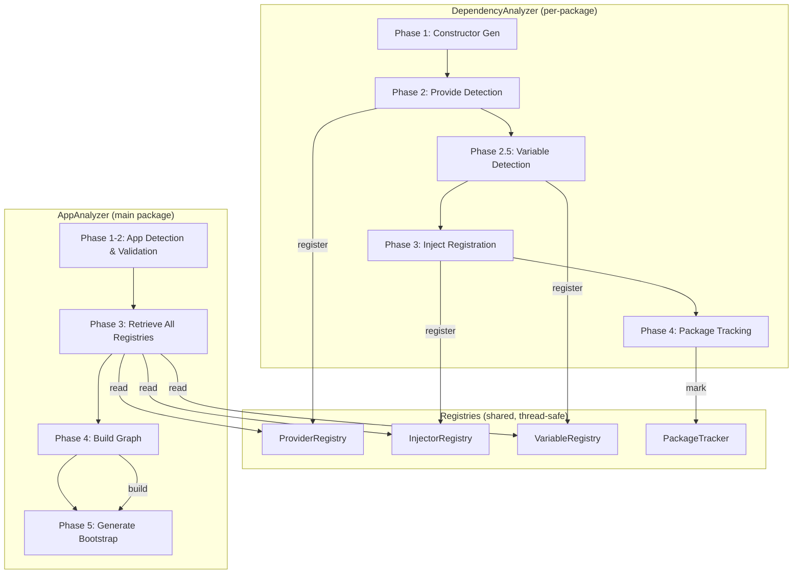
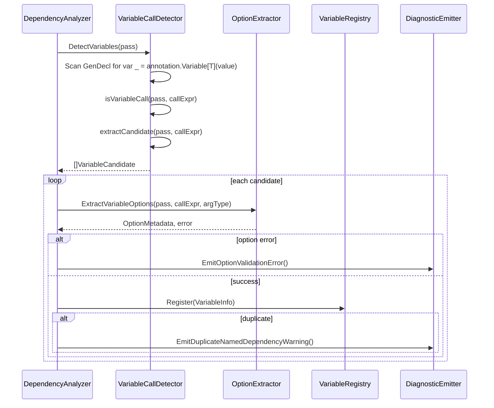
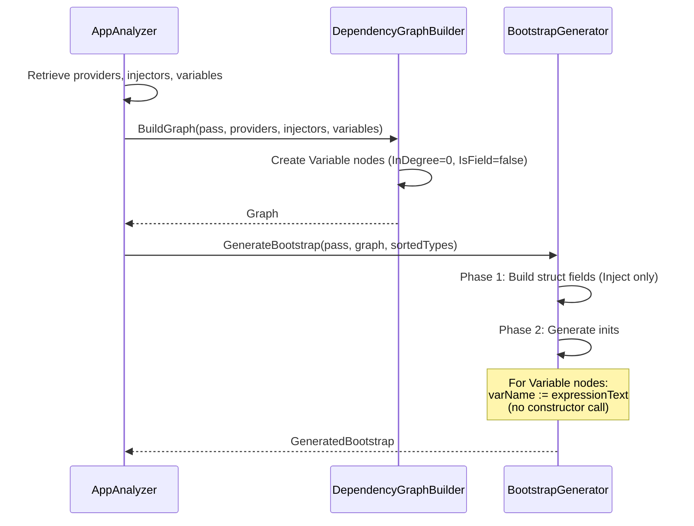

# Design Document — variable-annotation

## Overview

**Purpose**: The `variable-annotation` feature adds `annotation.Variable[T variable.Option](value)` to braider, enabling pre-existing values (e.g., `os.Stdout`, configuration objects, third-party singletons) to participate in the DI graph without constructor invocation.

**Users**: Go developers using braider for compile-time DI will use Variable annotations to inject existing values into their dependency graph alongside Injectable structs and Provide functions.

**Impact**: Extends the existing detection → registration → graph → bootstrap pipeline with a new annotation type. No changes to existing annotation semantics or generated code for projects that do not use Variable.

### Goals

- Full pipeline support for Variable annotations: detect `var _ = annotation.Variable[T](value)`, register to a global registry, include in dependency graph, generate expression assignments in bootstrap IIFE
- Option parity with Provide: support `variable.Default`, `variable.Typed[I]`, and `variable.Named[N]`
- Cross-package support: Variable annotations declared in any package are resolved during bootstrap generation
- Idempotent code generation: hash computation includes Variable entries to prevent unnecessary regeneration

### Non-Goals

- Complex expression support: composite literals (`&Config{}`), function calls (`NewConfig()`), or multi-statement expressions are out of scope — use `annotation.Provide` for those
- Runtime expression evaluation: the expression is captured as static source text at analysis time
- Variable-to-Variable dependencies: Variables have zero dependencies by definition
- `WithoutConstructor` option for Variable: meaningless since Variables never generate constructors

## Architecture

### Existing Architecture Analysis

braider uses a two-analyzer design (`braider_dependency` + `braider_app`) sharing state through global registries. The Variable annotation follows the same pipeline:

1. **Detection** (DependencyAnalyzer): scan for `var _ = annotation.Variable[T](value)` pattern
2. **Option extraction**: extract Default/Typed/Named from type parameter `T`
3. **Registration**: store in a global `VariableRegistry`
4. **Graph building** (AppAnalyzer): create zero-dependency Variable nodes
5. **Bootstrap generation**: emit expression assignments instead of constructor calls

### Architecture Pattern & Boundary Map



**Architecture Integration**:
- Selected pattern: Extension of existing detection → registration → graph → bootstrap pipeline
- Domain boundaries: Variable detection and registry are isolated components; they share state only through the graph builder
- Existing patterns preserved: Component-based DI in `main.go`, interface-driven detectors, thread-safe registries, AST inspector pattern
- New components rationale: `VariableCallDetector` (detection differs from Provide — expression vs function argument) and `VariableRegistry` (stores expression metadata not present in ProviderInfo)
- Steering compliance: Follows component-based architecture, SuggestedFix code generation, and analysistest patterns

### Technology Stack

| Layer | Choice / Version | Role in Feature | Notes |
|-------|------------------|-----------------|-------|
| Language | Go 1.24 | All implementation | Standard library `go/format` for expression text extraction |
| Framework | `golang.org/x/tools/go/analysis` | Analyzer extension | Same AST inspector pattern as existing detectors |
| Testing | `analysistest` | Integration tests | testdata with `.golden` files for bootstrap validation |

## System Flows

### Variable Detection Flow



### Bootstrap Generation Flow (Variable Path)



## Requirements Traceability

| Requirement | Summary | Components | Interfaces | Flows |
|-------------|---------|------------|------------|-------|
| 1.1–1.6 | Variable call detection | VariableCallDetector | `DetectVariables(pass)` | Detection Flow |
| 2.1–2.5 | Variable option extraction | OptionExtractor (extended) | `ExtractVariableOptions()` | Detection Flow |
| 3.1–3.6 | Variable registry | VariableRegistry | `Register()`, `GetAll()`, `Get()`, `GetByName()` | Detection Flow |
| 4.1–4.6 | Dependency graph integration | DependencyGraphBuilder, InterfaceRegistry | `BuildGraph()` extended | Bootstrap Flow |
| 5.1–5.6 | Bootstrap code generation | BootstrapGenerator, hash.go, imports.go | `GenerateBootstrap()` | Bootstrap Flow |
| 6.1–6.5 | Error handling & diagnostics | DiagnosticEmitter | `EmitVariableTypeError()` etc. | Detection Flow |
| 7.1–7.3 | Cross-package support | VariableCallDetector, BootstrapGenerator | Expression qualification | Both Flows |

## Components and Interfaces

| Component | Domain/Layer | Intent | Req Coverage | Key Dependencies | Contracts |
|-----------|--------------|--------|--------------|------------------|-----------|
| VariableCallDetector | detect | Detect `annotation.Variable[T](value)` calls | 1, 7 | analysis.Pass | Service |
| VariableRegistry | registry | Thread-safe storage for VariableInfo | 3 | — | State |
| OptionExtractor (ext) | detect | Extract Variable options (Default/Typed/Named) | 2 | NamerValidator | Service |
| DependencyGraphBuilder (ext) | graph | Add Variable nodes to dependency graph | 4 | InterfaceRegistry, VariableRegistry | Service |
| InterfaceRegistry (ext) | graph | Register Variable Typed[I] implementations | 4.3 | VariableRegistry | Service |
| BootstrapGenerator (ext) | generate | Emit expression assignments for Variables | 5, 7 | graph.Node.ExpressionText | Service |
| ComputeGraphHash (ext) | generate | Include ExpressionText in hash | 5.5–5.6 | — | — |
| CollectImports (ext) | generate | Collect imports from Variable expression packages | 5.3, 7.3 | graph.Node.ExpressionPkgs | — |
| DependencyAnalyzer (ext) | analyzer | Phase 2.5: Variable detection and registration | 1, 2, 3, 6 | VariableCallDetector, VariableRegistry | — |
| AppAnalyzer (ext) | analyzer | Pass Variable data to graph builder | 4, 5 | VariableRegistry | — |
| DiagnosticEmitter (ext) | report | Variable-specific error diagnostics | 6 | — | Service |

### Detection Layer

#### VariableCallDetector

| Field | Detail |
|-------|--------|
| Intent | Detect `var _ = annotation.Variable[T](value)` declarations in source code |
| Requirements | 1.1, 1.2, 1.3, 1.4, 1.5, 1.6, 7.1 |

**Responsibilities & Constraints**
- Scan `*ast.GenDecl` nodes for Variable annotation calls, following the same pattern as `ProvideCallDetector`
- Extract the argument expression, resolve its type via `pass.TypesInfo.TypeOf()`, and format the expression text via `go/format.Node()`
- Must not match non-Variable annotation calls (Provide, Injectable, App)

**Dependencies**
- Inbound: `DependencyAnalyzer` — calls `DetectVariables()` in Phase 2.5 (P0)
- External: `go/format` — for expression text extraction (P0)

**Contracts**: Service [x]

##### Service Interface

```go
// VariableCandidate represents a detected Variable annotation call.
type VariableCandidate struct {
    CallExpr       *ast.CallExpr   // The annotation.Variable[T](value) call expression
    ArgumentExpr   ast.Expr        // The value argument expression (e.g., os.Stdout)
    ArgumentType   types.Type      // Resolved type of the argument expression
    TypeName       string          // Fully qualified type name (e.g., "os.File")
    PackagePath    string          // Import path of the argument type's package
    ExpressionText string          // Formatted source text of the argument expression
    ExpressionPkgs []string        // Package paths referenced by the expression
    IsQualified    bool            // Whether expression is already package-qualified (SelectorExpr)
    Implements     []string        // Interface types the argument type implements
}

// VariableCallDetector identifies annotation.Variable[T](value) call expressions.
type VariableCallDetector interface {
    // DetectVariables returns all annotation.Variable[T](value) calls in the package.
    DetectVariables(pass *analysis.Pass) []VariableCandidate
}
```

- Preconditions: `pass` must have valid `TypesInfo` and file set
- Postconditions: returned candidates have non-empty `TypeName`, `ExpressionText`, and resolved `ArgumentType`
- Invariants: only `var _ = annotation.Variable[T](...)` patterns are matched; other annotation calls are excluded

**Implementation Notes**
- Integration: follows `ProvideCallDetector` pattern — `processGenDecl()` → `isVariableCall()` → `extractCandidate()`
- AST detection: check for `IndexExpr.X.(*ast.SelectorExpr).Sel.Name == "Variable"` and return type from `AnnotationPath`
- Expression extraction: use `go/format.Node()` on the argument AST expression to produce canonical source text
- Expression package collection: walk the argument expression AST to find `*ast.SelectorExpr` with package-level identifiers; use `pass.TypesInfo.Uses` to resolve their packages

#### OptionExtractor Extension

| Field | Detail |
|-------|--------|
| Intent | Extract Variable option metadata from `annotation.Variable[T]` type parameter |
| Requirements | 2.1, 2.2, 2.3, 2.4, 2.5 |

**Responsibilities & Constraints**
- Add `ExtractVariableOptions()` method to the `OptionExtractor` interface
- Add `variableOptionsPath` constant: `"github.com/miyamo2/braider/pkg/annotation/variable"`
- Extend `isDefaultOptionDirect()`, `extractTypedInterfaceDirect()`, and `extractNamerTypeDirect()` to accept Variable option package paths
- No `WithoutConstructor` check for Variable (not applicable)

**Dependencies**
- Inbound: `DependencyAnalyzer` — calls after Variable detection (P0)
- Outbound: `NamerValidator` — validates Named[N] string literal (P0)

**Contracts**: Service [x]

##### Service Interface (extension)

```go
// Add to existing OptionExtractor interface:
type OptionExtractor interface {
    ExtractInjectOptions(pass *analysis.Pass, fieldType ast.Expr, concreteType types.Type) (OptionMetadata, error)
    ExtractProvideOptions(pass *analysis.Pass, callExpr *ast.CallExpr, providerFunc types.Type) (OptionMetadata, error)
    // NEW
    ExtractVariableOptions(pass *analysis.Pass, callExpr *ast.CallExpr, argumentType types.Type) (OptionMetadata, error)
}
```

- Preconditions: `callExpr` is a validated `annotation.Variable[T](value)` call; `argumentType` is the resolved type of the value argument
- Postconditions: `OptionMetadata` populated with Default/Typed/Named as applicable; error returned on validation failure (non-literal Namer, interface incompatibility)
- Invariants: `WithoutConstructor` is never set for Variable options

**Implementation Notes**
- The implementation mirrors `ExtractProvideOptions()` — extract type arguments from the call expression's return type, then delegate to `extractMetadataFromOptionType()`. The `concreteType` is the Variable argument's type (for Typed[I] interface check).
- `isDefaultOptionDirect()` change: add `|| pkg.Path() == variableOptionsPath`
- `extractTypedInterfaceDirect()` change: add `|| pkg.Path() == variableOptionsPath`
- `extractNamerTypeDirect()` change: add `|| pkg.Path() == variableOptionsPath`

### Registry Layer

#### VariableRegistry

| Field | Detail |
|-------|--------|
| Intent | Thread-safe global storage for detected Variable annotations |
| Requirements | 3.1, 3.2, 3.3, 3.4, 3.5, 3.6 |

**Responsibilities & Constraints**
- Store `VariableInfo` entries in nested map: `map[TypeName]map[Name]*VariableInfo`
- Thread-safe via `sync.RWMutex` (same pattern as `ProviderRegistry`)
- Detect and reject duplicate `(TypeName, Name)` pairs

**Dependencies**
- Inbound: `DependencyAnalyzer` — writes during Phase 2.5 (P0)
- Inbound: `AppAnalyzer` — reads during Phase 3 (P0)

**Contracts**: State [x]

##### State Management

```go
// VariableInfo contains information about a Variable annotation.
type VariableInfo struct {
    TypeName       string          // Fully qualified type name (e.g., "os.File")
    PackagePath    string          // Import path (e.g., "os")
    PackageName    string          // Package name (e.g., "os")
    LocalName      string          // Type name without package (e.g., "File")
    ExpressionText string          // Formatted source text (e.g., "os.Stdout")
    ExpressionPkgs []string        // Package paths referenced by expression
    IsQualified    bool            // Whether expression is already package-qualified
    Dependencies   []string        // Always empty (Variables have no dependencies)
    Implements     []string        // Interface types the argument type implements
    RegisteredType types.Type      // Interface type for Typed[I], argument type otherwise
    Name           string          // Name from Named[N], empty if unnamed
    OptionMetadata detect.OptionMetadata
}
```

- State model: nested map `map[string]map[string]*VariableInfo` keyed by `(TypeName, Name)`
- Persistence: in-memory (analyzer lifetime)
- Concurrency: `sync.RWMutex` — concurrent reads via `RLock`, exclusive writes via `Lock`

```go
// VariableRegistry stores all discovered Variable annotations globally.
type VariableRegistry struct {
    mu        sync.RWMutex
    variables map[string]map[string]*VariableInfo
}

func NewVariableRegistry() *VariableRegistry
func (r *VariableRegistry) Register(info *VariableInfo) error
func (r *VariableRegistry) GetAll() []*VariableInfo
func (r *VariableRegistry) Get(typeName string) *VariableInfo
func (r *VariableRegistry) GetByName(typeName, name string) (*VariableInfo, bool)
```

- `VariableInfo` implements `dependencyInfo` interface:

```go
func (i *VariableInfo) GetTypeName() string    { return i.TypeName }
func (i *VariableInfo) GetDependencies() []string { return i.Dependencies } // always []string{}
func (i *VariableInfo) GetName() string         { return i.Name }
```

### Graph Layer

#### DependencyGraphBuilder Extension

| Field | Detail |
|-------|--------|
| Intent | Include Variable nodes in the dependency graph with zero dependencies |
| Requirements | 4.1, 4.2, 4.3, 4.4, 4.5, 4.6 |

**Responsibilities & Constraints**
- Extend `BuildGraph()` signature to accept `[]*registry.VariableInfo`
- Create Variable nodes with `IsField=false`, zero dependencies, and `ExpressionText` populated
- Variable nodes have `InDegree=0` — they are always initialized first in topological order

**Contracts**: Service [x]

##### Service Interface (extension)

```go
// Updated BuildGraph signature:
func (b *DependencyGraphBuilder) BuildGraph(
    pass *analysis.Pass,
    providers []*registry.ProviderInfo,
    injectors []*registry.InjectorInfo,
    variables []*registry.VariableInfo,  // NEW parameter
) (*Graph, error)
```

**Implementation Notes**
- Add Variable node creation loop between provider and injector node creation:

```go
// Add variable nodes (IsField = false, no constructor, expression-based)
for _, variable := range variables {
    nodeKey := makeNodeKey(variable.TypeName, variable.Name)
    node := &Node{
        TypeName:        variable.TypeName,
        PackagePath:     variable.PackagePath,
        PackageName:     variable.PackageName,
        LocalName:       variable.LocalName,
        ConstructorName: "",  // No constructor for Variables
        Dependencies:    []string{},
        InDegree:        0,
        IsField:         false,  // Variables are local vars in IIFE
        RegisteredType:  variable.RegisteredType,
        Name:            variable.Name,
        ExpressionText:  variable.ExpressionText,
        ExpressionPkgs:  variable.ExpressionPkgs,
        IsQualified:     variable.IsQualified,
    }
    graph.Nodes[nodeKey] = node
}
```

- Edge building for Variables: `buildEdges()` called with `variables` — since `GetDependencies()` returns empty, no edges are created (Variables depend on nothing).

> **CAUTION (Design Review Finding #2):** `InterfaceRegistry.Build()` must also accept `variables []*registry.VariableInfo` and register their `Implements` entries. Without this change, `Variable[variable.Typed[io.Writer]](os.Stdout)` will fail with `UnresolvedInterfaceError` because the interface-to-implementation mapping will be missing. The updated signature and processing loop are shown below:

```go
// Updated InterfaceRegistry.Build() signature:
func (r *InterfaceRegistry) Build(
    pass *analysis.Pass,
    providers []*registry.ProviderInfo,
    injectors []*registry.InjectorInfo,
    variables []*registry.VariableInfo,  // NEW parameter
) error {
    // Process providers (existing)
    for _, provider := range providers {
        for _, iface := range provider.Implements {
            r.interfaces[iface] = append(r.interfaces[iface], provider.TypeName)
        }
    }

    // Process injectors (existing)
    for _, injector := range injectors {
        for _, iface := range injector.Implements {
            r.interfaces[iface] = append(r.interfaces[iface], injector.TypeName)
        }
    }

    // Process variables (NEW — required for Typed[I] resolution)
    for _, variable := range variables {
        for _, iface := range variable.Implements {
            r.interfaces[iface] = append(r.interfaces[iface], variable.TypeName)
        }
    }

    return nil
}
```

#### Node Extension

```go
// Updated Node struct:
type Node struct {
    TypeName        string
    PackagePath     string
    PackageName     string
    PackageAlias    string
    LocalName       string
    ConstructorName string
    Dependencies    []string
    InDegree        int
    IsField         bool
    RegisteredType  types.Type
    Name            string
    ExpressionText  string    // NEW: formatted expression for Variable nodes (empty for others)
    ExpressionPkgs  []string  // NEW: package paths referenced by expression
    IsQualified     bool      // NEW: whether expression is already package-qualified
}
```

### Generate Layer

#### BootstrapGenerator Extension

| Field | Detail |
|-------|--------|
| Intent | Emit expression assignments for Variable nodes instead of constructor calls |
| Requirements | 5.1, 5.2, 5.3, 5.4, 7.3 |

**Implementation Notes**
- In Phase 2 (initialization code generation), add branching logic:

> **CAUTION (Design Review Finding #1):** The existing `bootstrap.go` Phase 2 (lines 187-189) unconditionally checks `if len(node.ConstructorName) == 0` and returns an error. The `ExpressionText` check **must** be placed **before** this existing validation, and the existing `ConstructorName` error check **must** be moved into the `else` branch. If the ordering is reversed, all Variable nodes will incorrectly trigger `"injectable struct %s requires a constructor"` errors.

```go
for _, typeName := range sortedTypes {
    node := g.Nodes[typeName]
    if node == nil {
        continue
    }

    // Determine variable name
    varName := node.Name
    if varName == "" {
        varName = DeriveFieldName(typeName)
    }

    if node.ExpressionText != "" {
        // Variable node: expression assignment (MUST be checked BEFORE ConstructorName validation)
        expressionText := node.ExpressionText
        if !node.IsQualified && node.PackagePath != currentPackage {
            // Local reference from another package — add qualifier
            qualifier := node.PackageAlias
            if qualifier == "" {
                qualifier = node.PackageName
            }
            expressionText = qualifier + "." + expressionText
        }
        inits = append(inits, fmt.Sprintf("\t%s := %s", varName, expressionText))
    } else {
        // Provider/Injector node: constructor call (existing logic — moved into else branch)
        if len(node.ConstructorName) == 0 {
            return nil, fmt.Errorf("injectable struct %s requires a constructor", typeName)
        }
        // ... existing constructor call logic ...
    }
}
```

#### Hash Computation Extension

| Field | Detail |
|-------|--------|
| Intent | Include Variable expression text in hash for idempotency detection |
| Requirements | 5.5, 5.6 |

**Implementation Notes**
- In `ComputeGraphHash()`, after writing `IsField` flag, conditionally write `ExpressionText`:

```go
// ExpressionText (for Variable nodes — affects generated code)
if node.ExpressionText != "" {
    h.Write([]byte(node.ExpressionText))
    h.Write([]byte{0})
}
```

- When `ExpressionText` is empty (Provider/Injector nodes), no bytes are written — existing hash values are unchanged.

#### Import Collection Extension

| Field | Detail |
|-------|--------|
| Intent | Include packages referenced by Variable expressions in import set |
| Requirements | 5.3, 7.3 |

**Implementation Notes**
- In `CollectImports()`, after processing `RegisteredType` packages, also process `ExpressionPkgs`:

```go
// Also include packages referenced by expression (for Variable nodes)
for _, exprPkgPath := range node.ExpressionPkgs {
    if exprPkgPath != "" && exprPkgPath != currentPackage {
        importSet[exprPkgPath] = true
    }
}
```

> **CAUTION (Design Review Finding #3):** `detectPackageCollisions()` must also iterate over `ExpressionPkgs` for alias generation. A Variable expression may reference packages entirely different from the node's own `PackagePath`/`PackageName` (e.g., a Variable of type `*os.File` with expression `config.DefaultStdout` references both `os` and `config`). To support collision detection for expression packages, `ExpressionPkgs` should be stored as a map (`map[string]string` mapping package path to package name) rather than `[]string`, or a helper function should resolve package names from paths. The `addPackage()` closure in `detectPackageCollisions()` must be called for each expression package entry:

```go
// In detectPackageCollisions(), after processing node packages and RegisteredType:
// Also include packages from expression (for Variable nodes)
for exprPkgPath, exprPkgName := range node.ExpressionPkgs {
    addPackage(exprPkgName, exprPkgPath)
}
```

If `ExpressionPkgs` remains `[]string`, the package name must be resolved separately (e.g., stored alongside in a parallel `ExpressionPkgNames []string` field or looked up from the graph context). The recommended approach is to change `ExpressionPkgs` in `Node`, `VariableInfo`, and `VariableCandidate` from `[]string` to `map[string]string` (path → name) so collision detection has all the information it needs without additional lookups.

### Analyzer Layer

#### DependencyAnalyzer Extension

| Field | Detail |
|-------|--------|
| Intent | Add Phase 2.5 for Variable detection and registration |
| Requirements | 1, 2, 3, 6 |

**Implementation Notes**
- Add two new fields to `DependencyAnalyzeRunner`:

```go
type DependencyAnalyzeRunner struct {
    // ... existing fields ...
    variableCallDetector  detect.VariableCallDetector   // NEW
    variableRegistry      *registry.VariableRegistry    // NEW
}
```

- Add two new parameters to `DependencyAnalyzer()` function and `NewDependencyAnalyzeRunner()`
- Phase 2.5 implementation in `Run()`:

```go
// Phase 2.5: Detect and register Variable annotations
variables := r.variableCallDetector.DetectVariables(pass)
for _, variable := range variables {
    // Extract option metadata
    var metadata detect.OptionMetadata
    if variable.CallExpr != nil && r.optionExtractor != nil {
        var err error
        metadata, err = r.optionExtractor.ExtractVariableOptions(pass, variable.CallExpr, variable.ArgumentType)
        if err != nil {
            r.diagnosticEmitter.EmitOptionValidationError(reporter, variable.CallExpr.Pos(), err.Error())
            r.bootstrapCancel(err)
            continue
        }
    }

    // Determine registered type
    var registeredType types.Type
    if metadata.TypedInterface != nil {
        registeredType = metadata.TypedInterface
    } else {
        registeredType = variable.ArgumentType
    }

    // Register to VariableRegistry
    if err := r.variableRegistry.Register(&registry.VariableInfo{
        TypeName:        variable.TypeName,
        PackagePath:     variable.PackagePath,
        PackageName:     extractPackageName(variable.ArgumentType),
        LocalName:       extractLocalName(variable.TypeName),
        ExpressionText:  variable.ExpressionText,
        ExpressionPkgs:  variable.ExpressionPkgs,
        IsQualified:     variable.IsQualified,
        Dependencies:    []string{},
        Implements:      variable.Implements,
        RegisteredType:  registeredType,
        Name:            metadata.Name,
        OptionMetadata:  metadata,
    }); err != nil {
        // Emit duplicate warning
        r.diagnosticEmitter.EmitDuplicateNamedDependencyWarning(...)
    }
}
```

#### AppAnalyzer Extension

| Field | Detail |
|-------|--------|
| Intent | Retrieve Variable entries and pass to graph builder |
| Requirements | 4, 5, 7.2 |

**Implementation Notes**
- Add `variableRegistry *registry.VariableRegistry` field to `AppAnalyzeRunner`
- Add parameter to `AppAnalyzer()` function and `NewAppAnalyzeRunner()`
- In `run()`, Phase 3:

```go
// Phase 3: Retrieve all providers, injectors, and variables
providers := r.provideRegistry.GetAll()
injectors := r.injectRegistry.GetAll()
variables := r.variableRegistry.GetAll()  // NEW
```

- In Phase 4, pass variables to graph builder:

```go
depGraph, err := r.graphBuilder.BuildGraph(pass, providers, injectors, variables)
```

### Report Layer

#### DiagnosticEmitter Extension

| Field | Detail |
|-------|--------|
| Intent | Emit Variable-specific diagnostic messages |
| Requirements | 6.1, 6.2, 6.3, 6.4, 6.5 |

**Implementation Notes**
- The existing `EmitOptionValidationError()`, `EmitDuplicateNamedDependencyWarning()`, and `EmitGraphBuildError()` methods already cover most Variable error cases since they use generic messages.
- For Requirement 6.5 (name mismatch hint), extend `UnresolvableTypeError` handling in the graph builder or add a new diagnostic method:

```go
// EmitUnresolvableDependencyWithHint reports unresolvable dependency with named variable hint.
EmitUnresolvableDependencyWithHint(reporter Reporter, pos token.Pos, typeName string, availableNames []string)
```

### Wiring (cmd/braider/main.go)

Add Variable components to the instantiation chain:

```go
// Step 1: Registries and shared context
variableRegistry := registry.NewVariableRegistry()  // NEW

// Step 4: Complex detectors
variableCallDetector := detect.NewVariableCallDetector()  // NEW

// Step 7: Instantiate analyzers
dependencyAnalyzer := analyzer.DependencyAnalyzer(
    // ... existing params ...
    variableCallDetector,   // NEW
    variableRegistry,       // NEW
)

appAnalyzer := analyzer.AppAnalyzer(
    // ... existing params ...
    variableRegistry,       // NEW
)
```

## Data Models

### VariableCandidate (detect layer)

| Field | Type | Purpose |
|-------|------|---------|
| `CallExpr` | `*ast.CallExpr` | The `annotation.Variable[T](value)` call expression |
| `ArgumentExpr` | `ast.Expr` | The value argument expression AST node |
| `ArgumentType` | `types.Type` | Resolved type of the argument expression |
| `TypeName` | `string` | Fully qualified type name |
| `PackagePath` | `string` | Import path of the argument type's package |
| `ExpressionText` | `string` | Formatted source text of the argument expression |
| `ExpressionPkgs` | `[]string` | Package paths referenced by the expression |
| `IsQualified` | `bool` | Whether expression is already package-qualified |
| `Implements` | `[]string` | Interface types the argument type implements |

### VariableInfo (registry layer)

| Field | Type | Purpose |
|-------|------|---------|
| `TypeName` | `string` | Fully qualified type name |
| `PackagePath` | `string` | Import path |
| `PackageName` | `string` | Package name (from `go/types.Package`) |
| `LocalName` | `string` | Type name without package |
| `ExpressionText` | `string` | Formatted source text |
| `ExpressionPkgs` | `[]string` | Package paths referenced by expression |
| `IsQualified` | `bool` | Whether expression is already package-qualified |
| `Dependencies` | `[]string` | Always `[]string{}` |
| `Implements` | `[]string` | Interface types |
| `RegisteredType` | `types.Type` | Interface type for Typed[I], argument type otherwise |
| `Name` | `string` | Name from Named[N], empty if unnamed |
| `OptionMetadata` | `detect.OptionMetadata` | Parsed option configuration |

### Node Extension (graph layer)

| Field | Type | Purpose | Existing? |
|-------|------|---------|-----------|
| `ExpressionText` | `string` | Expression source text for Variable nodes | NEW |
| `ExpressionPkgs` | `[]string` | Package paths for import collection | NEW |
| `IsQualified` | `bool` | Whether expression is already qualified | NEW |

## Error Handling

### Error Categories and Responses

| Error | Requirement | Diagnostic Level | Message Pattern |
|-------|-------------|-----------------|-----------------|
| Unresolvable expression type | 6.1 | Error | `"cannot resolve type of Variable argument at <pos>"` |
| Namer validation failure | 6.2 | Error | `"option validation error: failed to extract name from Namer: <reason>"` |
| Type incompatibility with Typed[I] | 6.3 | Error | `"option validation error: concrete type <T> does not implement interface <I>"` |
| Duplicate named Variable | 6.4 | Warning | `"duplicate dependency name \"<name>\" for type <T> (first: <pkg1>, duplicate: <pkg2>)"` |
| Name mismatch hint | 6.5 | Error | `"unresolvable dependency type: <T>; did you mean <T>#<name>?"` |

All errors except 6.4 (warning) cancel bootstrap generation via `bootstrapCancel()`, consistent with existing Provide error handling.

## Testing Strategy

### Unit Tests

- **VariableCallDetector**: Detect basic Variable calls, reject non-Variable calls (Provide, Injectable), handle missing arguments, handle unresolvable types
- **VariableRegistry**: Register/retrieve, duplicate detection, thread-safety, `GetAll()` sorting, `GetByName()` lookup
- **OptionExtractor.ExtractVariableOptions()**: Default, Typed[I], Named[N], mixed options, validation errors
- **ComputeGraphHash**: Verify existing hashes unchanged when ExpressionText is empty, verify hash changes when ExpressionText is added/modified

### Integration Tests

New testdata cases under `internal/analyzer/testdata/bootstrapgen/`:

| Test Case | Description | Key Validation |
|-----------|-------------|----------------|
| `variable_basic` | `Variable[variable.Default](os.Stdout)` | Expression assignment in bootstrap |
| `variable_typed` | `Variable[variable.Typed[io.Writer]](os.Stdout)` | Interface registration + expression |
| `variable_named` | `Variable[variable.Named[N]](os.Stdout)` | Named registration + composite key |
| `variable_cross_package` | Variable in non-main package | Cross-package qualification |
| `variable_mixed` | Variable + Provide + Injectable coexisting | Topological ordering, struct fields |
| `variable_typed_named` | `Variable[interface{variable.Typed[I]; variable.Named[N]}](v)` | Mixed options |

Each test case:
1. DependencyAnalyzer pass with `analysistest.Run` (no golden — validate diagnostics)
2. AppAnalyzer pass with `analysistest.RunWithSuggestedFixes` (golden — validate generated code)

### Idempotency Tests

- `variable_idempotent`: Pre-existing bootstrap with matching hash → no regeneration
- `variable_hash_change`: Modify Variable expression → hash mismatch → regeneration
